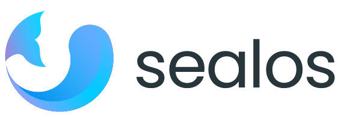

  <a href="https://sealos.io" target="_blank" rel="noopener">
    <picture>
      <source media="(prefers-color-scheme: dark)" srcset="./docs/img/sealos-left-dark.png" />
      <source media="(prefers-color-scheme: light)" srcset="./docs/img/sealos-left.png" />
      
    </picture>
  </a>
  
# 🚀 Develop, deploy, and scale in one seamless cloud platform ☁️

Sealos['siːləs] is a cloud operating system distribution based on the Kubernetes kernel, designed for a seamless development lifecycle.
Spin up full-stack environments in seconds, effortlessly push releases, and scale production seamlessly.

 <a href="https://sealos.io">Website</a> •
  <a href="https://sealos.io/docs">Docs</a> •
  <a href="https://discord.gg/wdUn538zVP">Discord</a> •
  <a href="https://twitter.com/Sealos_io">Twitter</a> •
  <a href="./README_zh.md">简体中文</a>

 

| Global | China |
| ------------- | ------------- |
| Default: US-West  | Default: Hangzhou  |
| [![Deploy on Sealos][deploy-badge]][deploy-link]  | [![Deploy on Sealos - China][deploy-badge]][deploy-link-cn] |

https://github.com/user-attachments/assets/cc8599da-6c3e-4503-bb53-55e13bf61ef6

## Get started

### Create your Development Environment in Sealos with just one click

1. Open Sealos Devbox.
   
   
   
2. Create a development environment, choosing from a range of languages and frameworks.
   
   
   
3. Access your environment from a selection of IDEs, such as VSCode and Cursor.
   
   
   
   

### Create your Database on Sealos

1. Open Sealos database.
   
   

2. Create your database.

   

3. View your database and access details.

   

### Deploy your Docker Image on Sealos

1. Open Sealos App Launchpad.

   

2. Deploy the Docker image using a Kubernetes Deployment and expose it with an Ingress.

   

3. View your app details and access your service.

   

## Self hosting

- Install Sealos cloud: 
   - Self host guide (coming soon) | Chinese: [集群部署](https://sealos.run/docs/self-hosting/install)
- Install Kubernetes and kubernetes lifecycle managemant: 
   - One command install kubernetes HA cluster (coming soon) | Chinese: [安装K8s集群](https://sealos.run/docs/k8s/quick-start/deploy-kubernetes)

## 💡 Core features

- 🚀 **Application Management**: Easy management and quick release of publicly accessible distributed applications in the templates marketplace.
- 🗄️ **Database Management**: Create high-availability databases in seconds, offering support for MySQL, PostgreSQL, MongoDB, and Redis.
- 🌥️ **Cloud Universality**: Equally effective in both public and private cloud, enabling a seamless transition of traditional applications to the cloud.

## 🌟 Advantages

- 💰 **Efficient & Economical**: Pay solely for the containers you utilize; automatic scaling prevents resource squandering and substantially reduces costs.
- 🌐 **High Universality & Ease of Use**: Concentrate on your core business activities without worrying about system complexities; negligible learning costs involved.
- 🛡️ **Agility & Security**: The distinctive multi-tenancy sharing model ensures both effective resource segmentation and collaboration, all under a secure framework.

## 🏘️ Community & support

+ 🌐 Visit the [Sealos Website](https://sealos.io/) for full documentation and useful links.
+ 💬 Join our [Discord Server](https://discord.gg/wdUn538zVP) to chat with the Sealos team and other Sealos users. This is a good place to learn about Sealos and Kubernetes, ask questions, and share your experiences.
+ 🐦 Tweet at @Sealos_io on [X/Twitter](https://twitter.com/Sealos_io) and follow us.
+ 🐞 Create [GitHub Issues](https://github.com/labring/sealos/issues/new/choose) for bug reports and feature requests.

## 🚧 Roadmap

Sealos maintains a [public roadmap](https://github.com/orgs/labring/projects/4/views/9). It gives a high-level view of the main priorities for the project, the maturity of different features and projects, and how to influence the project direction.

## 👩‍💻 Contributing & Development

Have a look through [existing issues](https://github.com/labring/sealos/issues?q=is%3Aissue+is%3Aopen+sort%3Aupdated-desc) and [Pull Requests](https://github.com/labring/sealos/pulls?q=is%3Apr+is%3Aopen+sort%3Aupdated-desc) that you could help with. If you'd like to request a feature or report a bug, please [create a GitHub Issue](https://github.com/labring/sealos/issues/new/choose) using one of the templates provided.

📖 [See contribution guide →](./CONTRIBUTING.md)

🔧 [See development guide →](./DEVELOPGUIDE.md)

## Links

- [FastGPT](https://github.com/labring/FastGPT) is a free, open-source, and powerful AI knowledge base platform, offers out-of-the-box data processing, model invocation, RAG retrieval, and visual AI workflows. Easily build complex LLM applications.
- [Buildah](https://github.com/containers/buildah) The functionalities of Buildah are extensively utilized in Sealos 4.0 to ensure that cluster images are compatible with OCI standard.

[deploy-badge]: https://raw.githubusercontent.com/labring-actions/templates/main/Deploy-on-Sealos.svg
[deploy-link]: https://os.sealos.io
[deploy-link-cn]: https://cloud.sealos.run

<!-- ## License -->

<!--  -->

## License

> ⚠️ **License Change Alert**  
> As of 2025-08-01, Sealos adopts the **[Sealos Commercial Use License v1.0](LICENSE.md)**.This change aims to better support the sustainable development of the project while safeguarding the rights and interests of community users.