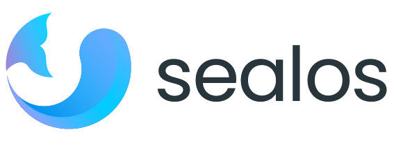

<h2 align="center">
  
  <picture>
    <source media="(prefers-color-scheme: dark)" srcset="./docs/4.0/img/sealos-left-dark.png" />
    <source media="(prefers-color-scheme: light)" srcset="./docs/4.0/img/sealos-left.png" />
    
  </picture>
  
A Cloud Operating System designed for managing cloud-native applications

</h2>

 

https://github.com/user-attachments/assets/a7b7ed5c-0e31-4158-8a76-3b161ed70a70

  <a href="https://sealos.io/docs/Intro">Docs</a> |
  <a href="./README_zh.md">简体中文</a> | 
  <a href="https://github.com/orgs/labring/projects/4/views/9">Roadmap</a>

Sealos['siːləs] is a cloud operating system distribution based on the Kubernetes kernel. Using the cloud like using a personal computer, reducing the cost of the cloud to 1/10 of the original.

## 🚀 Deploy your app on Sealos

[Quick Start](https://cloud.sealos.io) 

* [Easily Deploy Nginx in 30 Seconds on Sealos](https://sealos.io/docs/quick-start/use-app-launchpad)
* [Start a mysql/pgsql/mongo highly available database in 30 seconds on Sealos](https://sealos.io/docs/quick-start/use-database)
* [Running WordPress on Sealos](https://sealos.io/docs/examples/blog-platform/install-wordpress)
* [Running the Uptime Kuma dial test system on Sealos](https://docs.sealos.io/docs/examples/dial-testing-system/install-uptime-kuma)
* [Running a low-code platform on Sealos](https://docs.sealos.io/docs/category/low-code-platform)

🔍 Some Screen Shots of Sealos:

| Templates | App Launchpad |
| :---: | :---: |
|  |  |
| Database | Serverless |
|  |  |

## Install

* Install Sealos cloud: [Self hosting](https://sealos.io/self-hosting)
* Install Kubernetes and kubernetes lifecycle managemant: [One command install kubernetes HA cluster](https://sealos.io/docs/self-hosting/lifecycle-management/quick-start/deploy-kubernetes#install-single-node-kubernetes)

## 💡 Core features

- 🚀 **Application Management**: Easy management and quick release of publicly accessible distributed applications in the templates marketplace.
- 🗄️ **Database Management**: Create high-availability databases in seconds, offering support for MySQL, PostgreSQL, MongoDB, and Redis.
- 🌥️ **Cloud Universality**: Equally effective in both public and private cloud, enabling a seamless transition of traditional applications to the cloud.

## 🌟 Advantages

- 💰 **Efficient & Economical**: Pay solely for the containers you utilize; automatic scaling prevents resource squandering and substantially reduces costs.
- 🌐 **High Universality & Ease of Use**: Concentrate on your core business activities without worrying about system complexities; negligible learning costs involved.
- 🛡️ **Agility & Security**: The distinctive multi-tenancy sharing model ensures both effective resource segmentation and collaboration, all under a secure framework.

## 🏘️ Community & support

+ 🌐 Visit the [Sealos website](https://sealos.io/) for full documentation and useful links.
+ 💬 Join our [Discord server](https://discord.gg/qzBmGGZGk7) is to chat with Sealos developers and other Sealos users. This is a good place to learn about Sealos and Kubernetes, ask questions, and share your experiences.
+ 🐦 Tweet at @sealosio on [Twitter](https://twitter.com/sealosio) and follow us.
+ 🐞 Create [GitHub Issues](https://github.com/labring/sealos/issues/new/choose) for bug reports and feature requests.

## 🚧 Roadmap

Sealos maintains a [public roadmap](https://github.com/orgs/labring/projects/4/views/9). It gives a high-level view of the main priorities for the project, the maturity of different features and projects, and how to influence the project direction.

## 👩‍💻 Contributing & Development

Have a look through [existing Issues](https://github.com/labring/sealos/issues?q=is%3Aissue+is%3Aopen+sort%3Aupdated-desc) and [Pull Requests](https://github.com/labring/sealos/pulls?q=is%3Apr+is%3Aopen+sort%3Aupdated-desc) that you could help with. If you'd like to request a feature or report a bug, please [create a GitHub Issue](https://github.com/labring/sealos/issues/new/choose) using one of the templates provided.

📖 [See contribution guide →](./CONTRIBUTING.md)

🔧 [See development guide →](./DEVELOPGUIDE.md)

## Links

- [Laf](https://github.com/labring/laf) is a function as a service application on sealos.
- [Buildah](https://github.com/containers/buildah) The functionalities of Buildah are extensively utilized in Sealos 4.0 to ensure that cluster images are compatible with OCI standard.

<!-- ## License -->

<!--  -->
