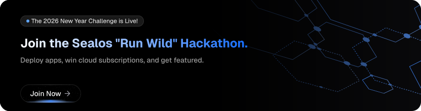

  <a href="https://memu.pro/hackathon/rules/sealos" target="_blank" rel="noopener">
    <picture>
      <source media="(prefers-color-scheme: dark)" srcset="./docs/img/hackathon2026-dark.svg" />
      <source media="(prefers-color-scheme: light)" srcset="./docs/img/hackathon2026-light.svg" />
      
    </picture>
  </a>

   

  <a href="https://sealos.io" target="_blank" rel="noopener">
    <picture>
      <source media="(prefers-color-scheme: dark)" srcset="./docs/img/sealos-left-dark.png" />
      <source media="(prefers-color-scheme: light)" srcset="./docs/img/sealos-left.png" />
      
    </picture>
  </a>
  
# 🚀 Develop, deploy, and scale in one seamless cloud platform ☁️

Sealos['siːləs] is an AI-native Cloud Operating System built on Kubernetes that unifies the entire application lifecycle, from development in cloud IDEs to production deployment and management. It is perfect for building and scaling modern AI applications, SaaS platforms, managed databases (MySQL, PostgreSQL, Redis, MongoDB) and complex microservice architectures.

 <a href="https://sealos.io">Website</a> •
  <a href="https://sealos.io/docs">Docs</a> •
  <a href="https://discord.gg/wdUn538zVP">Discord</a> •
  <a href="https://twitter.com/Sealos_io">Twitter</a> •
  <a href="./README_zh.md">简体中文</a>

 

[![Deploy on Sealos][deploy-badge]][deploy-link]

https://github.com/user-attachments/assets/cc8599da-6c3e-4503-bb53-55e13bf61ef6

## Get started

### Create your Development Environment in Sealos with just one click

1. Open Sealos Devbox.

 

2. Create a development environment, choosing from a range of languages and frameworks.

 

3. Access your environment from a selection of IDEs, such as VSCode and Cursor.

    

    

### Create your Database on Sealos

1. Open Sealos database.

 

2. Create your database.

 

3. View your database and access details.

 

### Deploy your Docker Image on Sealos

1. Open Sealos App Launchpad.

 

2. Deploy the Docker image using a Kubernetes Deployment and expose it with an Ingress.

 

3. View your app details and access your service.

 

## 💡 Core features

-   Integrated Cloud IDEs: Zero-setup, collaborative development in the cloud. Eliminate local environment inconsistencies with DevBox.
-   Managed Databases & Storage: Production-ready PostgreSQL, MySQL, MongoDB, Redis, and built-in S3-compatible Object Storage.
-   Extensive App Store: Deploy complex applications with a single click. No YAML configuration, no container orchestration complexity - just point, click, and deploy.
-   Full Kubernetes Power: Access the full power of Kubernetes without the complexity. K8s-native from day one.
-   Enterprise Multi-Tenancy: Workspace-based isolation with granular RBAC and per-workspace resource quotas for secure collaboration.
-   AI-Native Infrastructure: Build and scale anything with AI simply by describing them.

## 🏘️ Community & support

-   🌐 Visit the [Sealos Website](https://sealos.io/) for full documentation and useful links.
-   💬 Join our [Discord Server](https://discord.gg/wdUn538zVP) to chat with the Sealos team and other Sealos users. This is a good place to learn about Sealos and Kubernetes, ask questions, and share your experiences.
-   🐦 Tweet at @Sealos_io on [X/Twitter](https://twitter.com/Sealos_io) and follow us.
-   🐞 Create [GitHub Issues](https://github.com/labring/sealos/issues/new/choose) for bug reports and feature requests.

## 🚧 Roadmap

Sealos maintains a [public roadmap](https://github.com/orgs/labring/projects/4/views/9). It gives a high-level view of the main priorities for the project, the maturity of different features and projects, and how to influence the project direction.

## 👩‍💻 Contributing & Development

Have a look through [existing issues](https://github.com/labring/sealos/issues?q=is%3Aissue+is%3Aopen+sort%3Aupdated-desc) and [Pull Requests](https://github.com/labring/sealos/pulls?q=is%3Apr+is%3Aopen+sort%3Aupdated-desc) that you could help with. If you'd like to request a feature or report a bug, please [create a GitHub Issue](https://github.com/labring/sealos/issues/new/choose) using one of the templates provided.

📖 [See contribution guide →](./CONTRIBUTING.md)

🔧 [See development guide →](./DEVELOPGUIDE.md)

## Links

-   [FastGPT](https://github.com/labring/FastGPT) is a free, open-source, and powerful AI knowledge base platform, offers out-of-the-box data processing, model invocation, RAG retrieval, and visual AI workflows. Easily build complex LLM applications.
-   [Buildah](https://github.com/containers/buildah) The functionalities of Buildah are extensively utilized in Sealos 4.0 to ensure that cluster images are compatible with OCI standard.

[deploy-badge]: https://sealos.io/Deploy-on-Sealos.svg
[deploy-link]: https://os.sealos.io

## 📄 License

Sealos is licensed under the [Sealos Sustainable Use License](./LICENSE.md), a custom license that allows:

-   ✅ Internal business use and personal non-commercial use
-   ❌ Providing cloud services to third parties

**Not a standard open source license** - please review the [full license terms](./LICENSE.md) before use.

**Contributing**: By contributing, you agree to our [Contributor License Agreement](./CONTRIBUTOR_LICENSE_AGREEMENT.md) and license change terms.

<!-- ## License -->

<!--  -->
