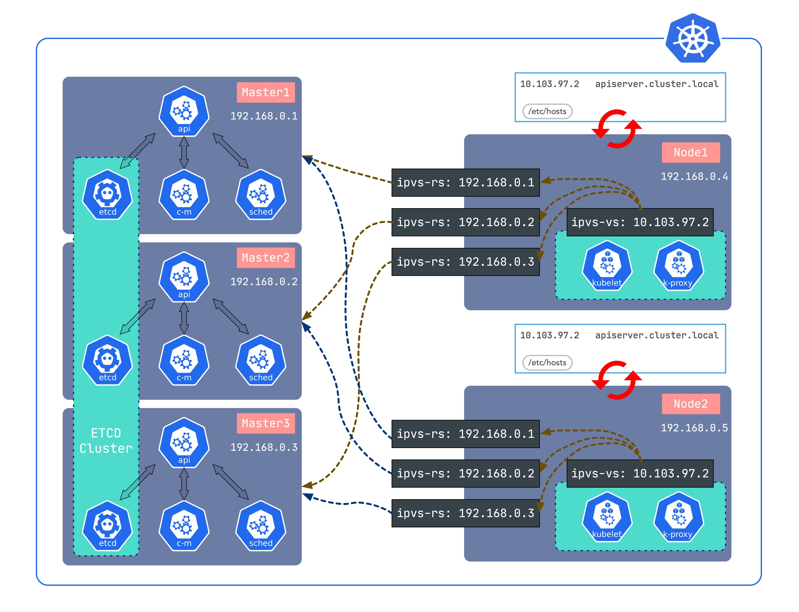

[](https://github.com/fanux/sealos)
[](https://cloud.drone.io/fanux/sealos)
[](https://goreportcard.com/report/github.com/fanux/sealos)



# 快速开始

[官方文档](https://sealyun.com/docs)

> 环境信息

主机名|IP地址
---|---
master0|192.168.0.2 
master1|192.168.0.3 
master2|192.168.0.4 
node0|192.168.0.5 

服务器密码：123456

> 只需要准备好服务器，在任意一台服务器上执行下面命令即可

```sh
# 下载并安装sealos, sealos是个golang的二进制工具，直接下载拷贝到bin目录即可
wget https://github.com/fanux/sealos/releases/download/v3.0.1/sealos && \
    chmod +x sealos && mv sealos /usr/bin 

# 安装一个三master的kubernetes集群
sealos init --passwd 123456 \
	--master 192.168.0.2  --master 192.168.0.3  --master 192.168.0.4  \
	--node 192.168.0.5 \
	--pkg-url https://sealyun.oss-cn-beijing.aliyuncs.com/413bd3624b2fb9e466601594b4f72072-1.17.0/kube1.17.0.tar.gz \
	--version v1.17.0
```
> 参数含义

参数名|含义|示例
---|---|---
passwd|服务器密码|123456
master|k8s master节点IP地址| 192.168.0.2
node|k8s node节点IP地址|192.168.0.3
pkg-url|离线资源包地址，支持下载到本地，或者一个远程地址|/root/kube1.16.0.tar.gz
version|[资源包](http://store.lameleg.com)对应的版本|v1.16.0

[更多详情](https://sealyun.com)
