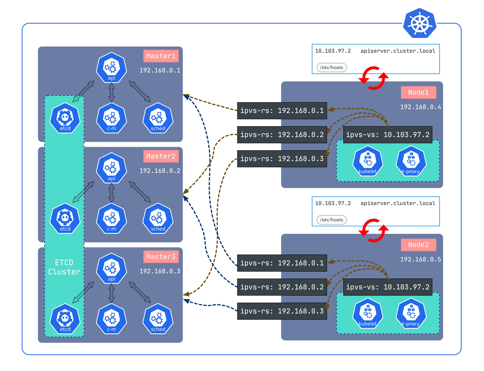

[](https://github.com/fanux/sealos)
  [](https://github.com/fanux/sealos/actions)

# Introduction
Build a production kubernetes HA cluster.



* Every node config a ipvs proxy for masters LB, so we needn't haproxy or keepalived any more.
* Then run a [lvscare](https://github.com/fanux/lvscare) as a staic pod to check apiserver is aviliable. `/etc/kubernetes/manifests/sealyun-lvscare.yaml`
* If any master is down, lvscare will remove the ipvs realserver, when master recover it will add it back.
* Sealos will send package and apply install commands, so we needn't ansible.

# Supported Environment

## Linux Distributions 

- Ubuntu 16.04， 18.04， 20.04 ,  x86_64/ arm64
- Centos/RHEL 7.6+,  x86_64/ arm64
- 99% systemd manage linux system。 x86_64/ arm64

## kubernetes Versions

- 1.16+
- 1.17+
- 1.18+
- 1.19+
- 1.20+

Looking for more supported versions，[sealyun.com](https://www.sealyun.com)。
sealos is currently supported the latest k8s 1.20+

## Requirements and Recommendations

- Minimum resource requirements 
   - 2 vCpu
   - 4G RAM
   - 40G+ Storage

- OS requirements
   - SSH can access to all nodes.
   - hostname is uniq ，and satisfied kubernetes requirements。
   - Time synchronization for all nodes.
   - network Iface has a stranger name, change it to (eth.*|en.*|em.*)
   - kubernetes1.20+, use containerd for default cri. user should not to install containerd or docker-ce. sealos will do it
   - kubernetes1.19-, use docker for default cri. user should not to install docker-ce. sealos will do it for you
 - Networking and DNS requirements：
   - Make sure the DNS address in /etc/resolv.conf is available. Otherwise, it may cause some issues of DNS in cluster。 
   - if you use aliyun/huawei cloud to deploy kubernetes 。 default pod cidr is confilct with dns cidr， we recommand you install kubernetes init flag to add  `--podcidr`  to aviod this problem。
   - sealos default to disable firewalld ，It's recommended that you turn off the firewall. if you want to use firewalld , remember to allow kubernetes port traffic。

# Quick Start
## PreInstall
* Install and start docker
* Download [kubernetes offline package](http://store.lameleg.com) copy it to /root. 
* Download [latest sealos](https://github.com/fanux/sealos/releases) on release page.
* Support kuberentes 1.14.0+ 

## Install
Multi master HA:
```
sealos init --master 192.168.0.2 \
    --master 192.168.0.3 \
    --master 192.168.0.4 \              
    --node 192.168.0.5 \                 
    --user root \                        
    --passwd your-server-password \      
    --version v1.14.1 \
    --pkg-url /root/kube1.14.1.tar.gz     
```

OR single master:
```
sealos init --master 192.168.0.2 \
    --node 192.168.0.5 \                 
    --user root \                        
    --passwd your-server-password \      
    --version v1.14.1 \
    --pkg-url /root/kube1.14.1.tar.gz 
```

OR using ssh private key:
```
sealos init --master 172.16.198.83 \
    --node 172.16.198.84 \
    --pkg-url https://sealyun.oss-cn-beijing.aliyuncs.com/free/kube1.15.0.tar.gz \
    --pk /root/kubernetes.pem # this is your ssh private key file \
    --version v1.15.0
```

Thats all!

```
--master   masters list
--node     nodes list
--user     host user name
--passwd   host passwd
--pkg-url  you offline package location
--version  kubernetes version
```

Check cluster:
```
[root@iZj6cdqfqw4o4o9tc0q44rZ ~]# kubectl get node
NAME                      STATUS   ROLES    AGE     VERSION
izj6cdqfqw4o4o9tc0q44rz   Ready    master   2m25s   v1.14.1
izj6cdqfqw4o4o9tc0q44sz   Ready    master   119s    v1.14.1
izj6cdqfqw4o4o9tc0q44tz   Ready    master   63s     v1.14.1
izj6cdqfqw4o4o9tc0q44uz   Ready    <none>   38s     v1.14.1
[root@iZj6cdqfqw4o4o9tc0q44rZ ~]# kubectl get pod --all-namespaces
NAMESPACE     NAME                                              READY   STATUS    RESTARTS   AGE
kube-system   calico-kube-controllers-5cbcccc885-9n2p8          1/1     Running   0          3m1s
kube-system   calico-node-656zn                                 1/1     Running   0          93s
kube-system   calico-node-bv5hn                                 1/1     Running   0          2m54s
kube-system   calico-node-f2vmd                                 1/1     Running   0          3m1s
kube-system   calico-node-tbd5l                                 1/1     Running   0          118s
kube-system   coredns-fb8b8dccf-8bnkv                           1/1     Running   0          3m1s
kube-system   coredns-fb8b8dccf-spq7r                           1/1     Running   0          3m1s
kube-system   etcd-izj6cdqfqw4o4o9tc0q44rz                      1/1     Running   0          2m25s
kube-system   etcd-izj6cdqfqw4o4o9tc0q44sz                      1/1     Running   0          2m53s
kube-system   etcd-izj6cdqfqw4o4o9tc0q44tz                      1/1     Running   0          118s
kube-system   kube-apiserver-izj6cdqfqw4o4o9tc0q44rz            1/1     Running   0          2m15s
kube-system   kube-apiserver-izj6cdqfqw4o4o9tc0q44sz            1/1     Running   0          2m54s
kube-system   kube-apiserver-izj6cdqfqw4o4o9tc0q44tz            1/1     Running   1          47s
kube-system   kube-controller-manager-izj6cdqfqw4o4o9tc0q44rz   1/1     Running   1          2m43s
kube-system   kube-controller-manager-izj6cdqfqw4o4o9tc0q44sz   1/1     Running   0          2m54s
kube-system   kube-controller-manager-izj6cdqfqw4o4o9tc0q44tz   1/1     Running   0          63s
kube-system   kube-proxy-b9b9z                                  1/1     Running   0          2m54s
kube-system   kube-proxy-nf66n                                  1/1     Running   0          3m1s
kube-system   kube-proxy-q2bqp                                  1/1     Running   0          118s
kube-system   kube-proxy-s5g2k                                  1/1     Running   0          93s
kube-system   kube-scheduler-izj6cdqfqw4o4o9tc0q44rz            1/1     Running   1          2m43s
kube-system   kube-scheduler-izj6cdqfqw4o4o9tc0q44sz            1/1     Running   0          2m54s
kube-system   kube-scheduler-izj6cdqfqw4o4o9tc0q44tz            1/1     Running   0          61s
kube-system   kube-sealyun-lvscare-izj6cdqfqw4o4o9tc0q44uz      1/1     Running   0          86s
```

## Clean
```
sealos clean 
```
Or clean a master or node
```shell script
sealos clean --master 192.168.0.2
sealos clean --node 192.168.0.3
```

## Add nodes
```shell script
sealos join --master 192.168.0.2 # join master
sealos join --node 192.168.0.3  --node 192.168.0.4 # join master
```
Also can use 192.168.0.3-192.168.0.3 to specify multi IPs

## Using config file
For example, we need add a certSANs `sealyun.com`:
```
sealos config -t kubeadm >>  kubeadm-config.yaml.tmpl
```
See the config template file `cat kubeadm-config.yaml.tmpl`, edit it add `sealyun.com`:
```
apiVersion: kubeadm.k8s.io/v1beta1
kind: InitConfiguration
localAPIEndpoint:
  advertiseAddress: {{.Master0}}
  bindPort: 6443
---
apiVersion: kubeadm.k8s.io/v1beta1
kind: ClusterConfiguration
kubernetesVersion: {{.Version}}
controlPlaneEndpoint: "{{.ApiServer}}:6443"
imageRepository: {{.Repo}}
networking:
  # dnsDomain: cluster.local
  podSubnet: {{.PodCIDR}}
  serviceSubnet: {{.SvcCIDR}}
apiServer:
  certSANs:
  - sealyun.com # add to certSANs
  - 127.0.0.1
  - {{.ApiServer}}
  {{range .Masters -}}
  - {{.}}
  {{end -}}
  {{range .CertSANS -}}
  - {{.}}
  {{end -}}
  - {{.VIP}}
  extraArgs:
    feature-gates: TTLAfterFinished=true
  extraVolumes:
  - name: localtime
    hostPath: /etc/localtime
    mountPath: /etc/localtime
    readOnly: true
    pathType: File
controllerManager:
  extraArgs:
    feature-gates: TTLAfterFinished=true
    experimental-cluster-signing-duration: 876000h
  extraVolumes:
  - hostPath: /etc/localtime
    mountPath: /etc/localtime
    name: localtime
    readOnly: true
    pathType: File
scheduler:
  extraArgs:
    feature-gates: TTLAfterFinished=true
  extraVolumes:
  - hostPath: /etc/localtime
    mountPath: /etc/localtime
    name: localtime
    readOnly: true
    pathType: File
---
apiVersion: kubeproxy.config.k8s.io/v1alpha1
kind: KubeProxyConfiguration
mode: "ipvs"
ipvs:
  excludeCIDRs:
  - "{{.VIP}}/32"
```

Then using --kubeadm-config flag:
```
sealos init --kubeadm-config kubeadm-config.yaml.tmpl \
    --master 192.168.0.2 \
    --master 192.168.0.3 \
    --master 192.168.0.4 \              
    --node 192.168.0.5 \                 
    --user root \                        
    --passwd your-server-password \      
    --version v1.14.1 \
    --pkg-url /root/kube1.14.1.tar.gz 
```

[简体中文](README_zh.md)

[More offline packages](https://sealyun.com)

