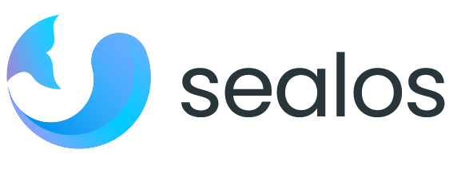

<h2 align="center">

<picture>
  <source media="(prefers-color-scheme: dark)" srcset="./docs/img/sealos-left-dark.png" />
  <source media="(prefers-color-scheme: light)" srcset="./docs/img/sealos-left.png" />
  
</picture>

一款以 Kubernetes 为内核的云操作系统发行版

</h2>

 

https://github.com/user-attachments/assets/2fc03676-3310-4f81-8f1c-dd1ab225dde0

  <a href="https://sealos.run/docs/Intro">文档</a> |
  <a href="./README.md">English</a> | 
  <a href="https://github.com/orgs/labring/projects/4/views/9">发展规划</a>

Sealos 是一款以 Kubernetes 为内核的**云操作系统发行版**。它以云原生的方式，抛弃了传统的云计算架构，转向以 Kubernetes 为云内核的新架构，使企业能够**像使用个人电脑一样**简单地使用云。

## 🚀 在 Sealos 上快速部署分布式应用

[在线使用](https://cloud.sealos.run)

* [在 Sealos 上 30 秒内轻松部署 Nginx](https://sealos.run/docs/quick-start/use-app-launchpad)
* [在 Sealos 上 30 秒启动 mysql/pgsql/mongo 高可用数据库](https://sealos.run/docs/quick-start/use-database)
* [在 Sealos 上 运行 WordPress](https://sealos.run/docs/examples/blog-platform/install-wordpress)
* [在 Sealos 上 运行 Uptime Kuma 拨测系统](https://sealos.run/docs/examples/dial-testing-system/install-uptime-kuma)
* [在 Sealos 上 运行低代码平台](https://sealos.run/docs/category/low-code-platform)
* [在 Sealos 上 运行搭建聊天应用](https://sealos.run/docs/examples/social-communication/install-tailchat)

🔍 您可以通过以下的屏幕截图进一步了解 Sealos，关于 Sealos 更为详细的介绍与说明，请参阅 [什么是 Sealos](https://sealos.run/docs/Intro)。

| 模板市场 | 应用管理 |
| :---: | :---: |
|  |  |
| 数据库管理 | 函数计算 |
|  |  |

## 💡 核心功能

- 🚀 **应用管理**：在模板市场中轻松管理并快速发布可公网访问的分布式应用。
- 🗄️ **数据库管理**：秒级创建高可用数据库，支持 MySQL、PostgreSQL、MongoDB 和 Redis。
- 🌥️ **公私一致**：即是公有云也是私有云，支持传统应用无缝迁移到云环境。

## 🌟 优势

- 💰 **高效 & 经济**：仅需为容器付费，自动伸缩杜绝资源浪费，大幅度节省成本。
- 🌐 **通用性强，无心智负担**：专注于业务本身，无需担心复杂性，几乎没有学习成本。
- 🛡️ **灵活 & 安全**：多租户共享机制在确保安全的同时，实现资源隔离与高效协作。

## 🏘️ 社区与支持

- 🌐 访问 [Sealos官网](https://sealos.run/) 获取完整的文档和实用链接。

- 📱 扫码加入社区微信交流群👇

  

- 💬 加入我们的 [Discord服务器](https://discord.gg/qzBmGGZGk7)，与 Sealos 开发者和终端用户进行交流。这是了解 Sealos 和 Kubernetes 以及提问和分享经验的理想之地。

- 🐦 在 [Twitter](https://twitter.com/Sealos_io) 上关注我们。

- 🐞 请将任何 Sealos 的 Bug、问题和需求提交到 [GitHub Issue](https://github.com/labring/sealos/issues/new/choose)。

## 🚧 发展规划

Sealos 维护了一个[公开的发展路线图](https://github.com/orgs/labring/projects/4/views/9)，为项目的主要优先事项、不同功能和项目的成熟度，以及如何影响项目方向提供了高级视图。

## 👩‍💻 贡献与开发

翻阅[现有的 Issue](https://github.com/labring/sealos/issues?q=is%3Aissue+is%3Aopen+sort%3Aupdated-desc) 和 [Pull Requests](https://github.com/labring/sealos/pulls?q=is%3Apr+is%3Aopen+sort%3Aupdated-desc)，看看您是否能提供帮助。如果您想要新增需求或报告 Bug，请使用我们提供的模板[创建一个 GitHub Issue](https://github.com/labring/sealos/issues/new/choose)。

📖 [查看贡献指南 →](./CONTRIBUTING.md)

🔧 [查看开发指南 →](./DEVELOPGUIDE.md)

## 🔗 链接

- [Laf](https://github.com/labring/laf) 是 Sealos 上的一款函数计算应用，让写代码像写博客一样简单，随时随地发布上线。
- [Buildah](https://github.com/containers/buildah) 在 Sealos 4.0 中，我们广泛地利用了 Buildah 的能力，以确保集群镜像与 OCI 标准兼容。

<!-- ## License -->

<!--  -->

## 📢 **许可证**

> ⚠️ **重要许可证变更通知**  
> 自 **2025年8月1日**起，Sealos 项目正式采用 **[Sealos 商业使用许可证 v1.0](LICENSE.md)**。本次变更旨在更好地支持项目的可持续发展，同时保障社区用户的权益。