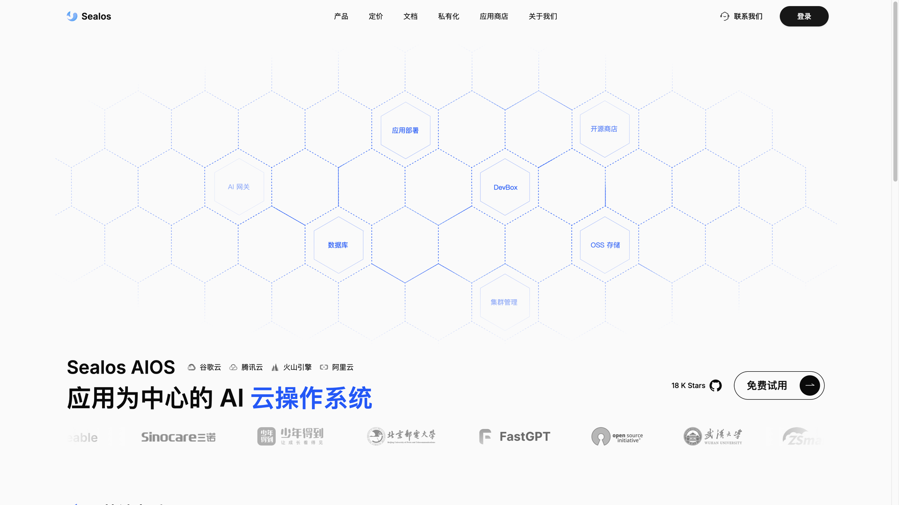
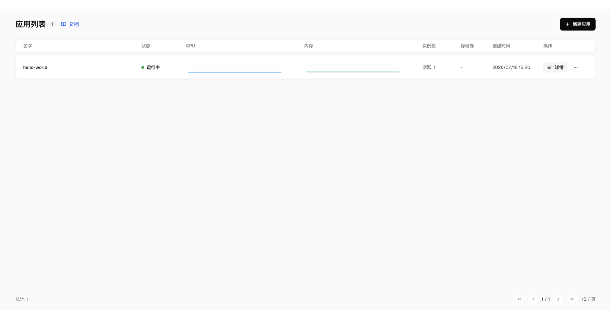
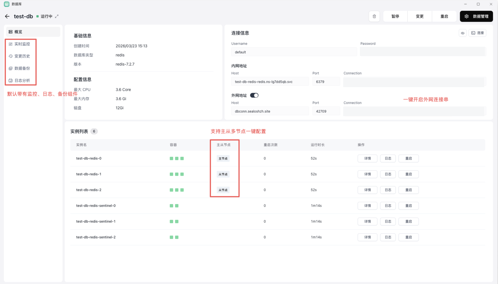
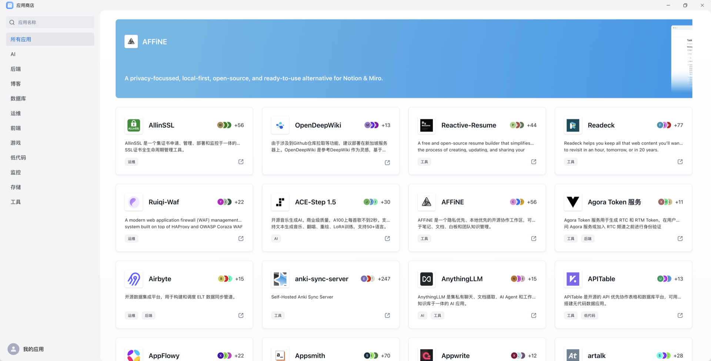
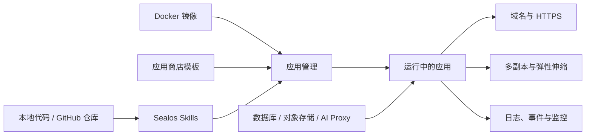

<div align="center">

  <a href="https://sealos.run/" target="_blank" rel="noopener">
    <picture>
      <source media="(prefers-color-scheme: dark)" srcset="./docs/img/sealos-left-dark.png" />
      <source media="(prefers-color-scheme: light)" srcset="./docs/img/sealos-left.png" />
      
    </picture>
  </a>

  <h1>从代码或 Docker 镜像，到可持续扩展的在线服务</h1>

  <p><strong>Sealos 是一个以应用为中心、基于 Kubernetes 构建的云操作系统。</strong></p>

  <p>
    它为开发者和团队提供极低运维门槛的应用上线与运行平台：已有 Docker 镜像可以直接部署，已有代码可以通过 Sealos Skills 完成分析、构建、部署和上线验证；应用上线后，还可以继续使用数据库、对象存储、HTTPS、多副本和弹性伸缩等能力。
  </p>

  [](https://github.com/labring/sealos/stargazers)
  [](https://hits.sh/github.com/labring/sealos/README_zh/)
  [](https://github.com/labring/sealos/releases)
  [](https://github.com/labring/sealos/actions)
  [](https://hub.docker.com/r/labring/kubernetes)
  [](./LICENSE.md)

  [中国官网](https://sealos.run/) ·
  [立即使用](https://hzh.sealos.run/) ·
  [中文文档](https://sealos.run/docs) ·
  [Sealos Skills](https://sealos.io/sealos-skills/) ·
  [English](./README.md)

</div>

<br />



Sealos 给你的不是一台需要从头管理的服务器，也不是把 Docker 和 Kubernetes 的复杂度原样交给你，而是让应用在云上运行的一整套能力。平台负责计算、网络、存储和容器编排等基础设施工作，你可以把更多精力放在产品本身。

## 从你现在已有的东西开始

| 你现在有 | 推荐路径 | 你将完成什么 |
| --- | --- | --- |
| Docker 镜像 | [应用管理](https://sealos.run/docs/getting-started/deploy-docker-image) | 配置资源、端口、环境变量和存储，获得可通过 HTTPS 访问的在线服务 |
| 本地代码或 GitHub 仓库 | [Sealos Skills](https://sealos.io/sealos-skills/) | 分析项目，构建或复用镜像，生成部署配置，部署并验证运行结果 |
| 应用需要数据库 | [云数据库](https://sealos.run/products/database) | 创建数据库实例，配置资源和存储，获取连接方式，并持续管理监控、日志和备份 |
| 想直接使用的开源应用 | [应用商店](https://sealos.run/products/appstore) | 从模板中选择数据库、AI、博客、开发工具等应用并完成部署 |

### 已有 Docker 镜像

打开应用管理，填写镜像地址、应用端口和资源规格即可开始部署。标准 Web 服务可以直接获得平台分配的域名和 HTTPS，也可以继续配置环境变量、持久化存储、实例数和弹性伸缩。



📖 [使用 Docker 镜像部署应用](https://sealos.run/docs/getting-started/deploy-docker-image)

### 已有代码

[Sealos Skills](https://github.com/labring/sealos-skills) 是采用 MIT 许可证的开源部署插件。它可以让 Codex、Claude Code 等 AI 编码工具检查本地项目或 GitHub 仓库，识别框架、端口、数据库和环境变量，随后构建或复用镜像、生成 Sealos 部署文件，并验证应用是否正常运行。

```bash
# 安装 Sealos 插件
npx plugins add https://github.com/labring/sealos-skills
```

安装完成后，在 Codex App 或 Codex CLI 中运行：

```text
$sealos deploy ~/project
```

📖 [查看 Sealos Skills 的完整流程](https://sealos.io/sealos-skills/)

### 应用需要数据库

Sealos 提供统一的托管数据库入口，覆盖 MySQL、PostgreSQL、MongoDB、Redis 等常见数据库。你不需要先自行安装数据库和配套组件，可以直接选择数据库类型，配置 CPU、内存、存储和实例拓扑，然后获得应用可用的连接信息。

- **创建与连接**：统一完成实例创建、资源配置和存储配置，优先使用内网地址连接同一工作空间中的应用，也可以按需开启外网连接。
- **运行与观察**：集中查看实例状态、资源监控和运行日志，出现响应变慢、连接异常或资源不足时可以更快定位问题。
- **备份与恢复**：查看和管理数据库备份，在变更或故障后按实际备份策略执行恢复。
- **扩容与变更**：应用增长后可以继续调整资源、存储和实例配置，不必重新搭建另一套数据库环境。



平台降低的是数据库基础设施的部署和日常管理门槛；表结构设计、SQL 优化、账号权限、备份策略、恢复演练和业务数据安全仍然需要你的团队持续负责。

📖 [了解 Sealos 云数据库](https://sealos.run/products/database) · [查看数据库使用指南](https://sealos.run/docs/guides/databases)

### 想直接安装现成应用

应用商店提供覆盖 AI、数据库、博客、开发工具、监控和存储等场景的应用模板。你可以先通过模板快速验证需求，再根据实际业务调整资源和配置。



## 核心能力

| 能力 | 解决的问题 |
| --- | --- |
| **应用上线与运行** | 从 Docker 镜像创建服务，配置域名、HTTPS、环境变量、配置文件、持久化存储、实例数和弹性伸缩 |
| **应用商店** | 通过模板部署常用开源应用，减少重复的安装和环境配置工作 |
| **托管数据库** | 创建和连接 MySQL、PostgreSQL、MongoDB、Redis 等数据库，集中管理资源、存储、监控、日志、备份和后续变更 |
| **对象存储** | 使用兼容 S3 的对象存储保存文件，并按业务需要配置静态托管、域名和访问方式 |
| **云端开发与 AI** | 使用 DevBox 创建云端开发环境，通过 Sealos Skills 从代码完成部署，通过 AI Proxy 统一接入模型服务 |
| **团队与运行管理** | 使用工作空间隔离资源和费用，分配成员权限，并通过日志、事件、监控和工单持续处理运行问题 |

## 从上线到扩容


```mermaid
flowchart LR
  A["本地代码 / GitHub 仓库"] --> B["Sealos Skills"]
  C["Docker 镜像"] --> D["应用管理"]
  E["应用商店模板"] --> D
  B --> D
  D --> F["运行中的应用"]
  F --> G["域名与 HTTPS"]
  F --> H["多副本与弹性伸缩"]
  F --> I["日志、事件与监控"]
  J["数据库 / 对象存储 / AI Proxy"] --> F
```

应用上线后不需要因为业务增长而迁移到另一套平台。你可以继续调整 CPU、内存、GPU、实例数和存储，也可以根据负载配置弹性伸缩。平台负责基础设施层的调度和编排，但应用代码质量、业务配置、数据策略、业务监控和必要的应用运维仍然由你的团队负责。

## 选择适合你的产品形态

Sealos 官方文档按开源版、公有云和私有云区分产品能力与交付方式。三种形态并不具有完全相同的功能范围。

| 产品形态 | 适合谁 | 主要特点 |
| --- | --- | --- |
| **开源版** | 希望体验 Sealos 核心能力或管理 Kubernetes 集群的开发者 | 可自行部署，具体能力和使用限制以功能清单及许可证为准 |
| **公有云** | 希望直接上线应用，不想先采购和维护服务器的个人开发者与团队 | 在线使用应用管理、数据库、对象存储、应用商店、DevBox、AI Proxy 等能力，按实际资源用量计费 |
| **企业私有云** | 有数据本地化、离线部署、统一管理或企业集成要求的组织 | 部署在企业自己的基础设施中，提供私有化交付、离线环境和企业管理能力 |

- [查看完整功能清单](https://sealos.run/docs/guides/feature-list)
- [立即使用中国公有云](https://hzh.sealos.run/)
- [了解企业私有云](https://sealos.run/private-cloud)

## 项目成熟度与支持

- **持续演进**：Sealos 项目始于 2018 年，版本、提交记录和研发活动均可在 GitHub 公开查看。
- **公开研发**：通过 [Roadmap](https://github.com/orgs/labring/projects/4/views/9)、[Issues](https://github.com/labring/sealos/issues)、[Pull Requests](https://github.com/labring/sealos/pulls)、[Actions](https://github.com/labring/sealos/actions) 和 [Releases](https://github.com/labring/sealos/releases) 了解项目进展。
- **安全与治理**：项目提供 [安全报告流程](./SECURITY.md)、[贡献指南](./CONTRIBUTING.md)、[行为准则](./CODE_OF_CONDUCT.md) 和 [维护者名单](./MAINTAINERS.md)。
- **工单支持**：公有云用户可以通过控制台工单提交平台、资源、计费、账号和产品问题，并持续跟踪处理记录。

准备把生产项目部署到 Sealos 前，请先确认目标可用区、资源规格、备份策略、监控要求和适用的服务条款。Sealos 降低基础设施运维门槛，但不会替代应用自身的工程质量和运维责任。

## 文档与支持

- [中文文档中心](https://sealos.run/docs)
- [应用管理指南](https://sealos.run/docs/guides/app-management)
- [账号、可用区与工作空间](https://sealos.run/docs/guides/account-workspace)
- [数据库指南](https://sealos.run/docs/guides/databases)
- [对象存储指南](https://sealos.run/docs/guides/object-storage)
- [费用与账单](https://sealos.run/docs/billing)
- [工单与支持](https://sealos.run/docs/guides/support-tickets)
- [Kubernetes 集群管理](https://sealos.run/docs/advanced/k8s)

## 中国用户交流与支持

遇到产品使用、应用部署或云上运行问题，可以加入 Sealos 生态交流群与其他用户交流；产品、资源、计费和账号问题请通过控制台工单提交，以便持续跟踪处理记录。关注微信公众号 `Sealos` 可以获取官方发布的产品动态和内容更新。

<table>
  <tr>
    <td align="center">
      <a href="https://applink.feishu.cn/client/chat/chatter/add_by_link?link_token=56auc8e6-eaaa-4772-ba19-7cfc154faf3a">
        
      </a>
      <br />
      <a href="https://applink.feishu.cn/client/chat/chatter/add_by_link?link_token=56auc8e6-eaaa-4772-ba19-7cfc154faf3a"><strong>点击加入 Sealos 生态交流群</strong></a>
    </td>
    <td align="center">
      
      <br />
      <strong>微信公众号：Sealos</strong>
      <br />
      微信扫码或搜索名称关注
    </td>
  </tr>
</table>

## 参与开源社区

- 在 [GitHub Discussions](https://github.com/labring/sealos/discussions) 交流使用经验和想法。
- 通过 [GitHub Issues](https://github.com/labring/sealos/issues/new/choose) 报告 Bug 或提交功能建议。
- 查看 [开放的 Issues](https://github.com/labring/sealos/issues?q=is%3Aissue+is%3Aopen+sort%3Aupdated-desc) 和 [Pull Requests](https://github.com/labring/sealos/pulls?q=is%3Apr+is%3Aopen+sort%3Aupdated-desc) 参与项目。
- 提交代码前请阅读 [贡献指南](./CONTRIBUTING.md) 和 [贡献者许可协议](./CONTRIBUTOR_LICENSE_AGREEMENT.md)。

## 许可证

Sealos 采用 [Sealos Sustainable Use License](./LICENSE.md)。该许可证允许内部商业用途和个人非商业用途，但禁止使用 Sealos 向第三方提供公有云、私有云或托管云服务，无论免费或收费。

**这不是标准的开源许可证。** 使用、修改或分发 Sealos 前，请阅读 [完整许可证条款](./LICENSE.md)。提交贡献即表示你同意 [贡献者许可协议](./CONTRIBUTOR_LICENSE_AGREEMENT.md) 及其中的许可证变更条款。
