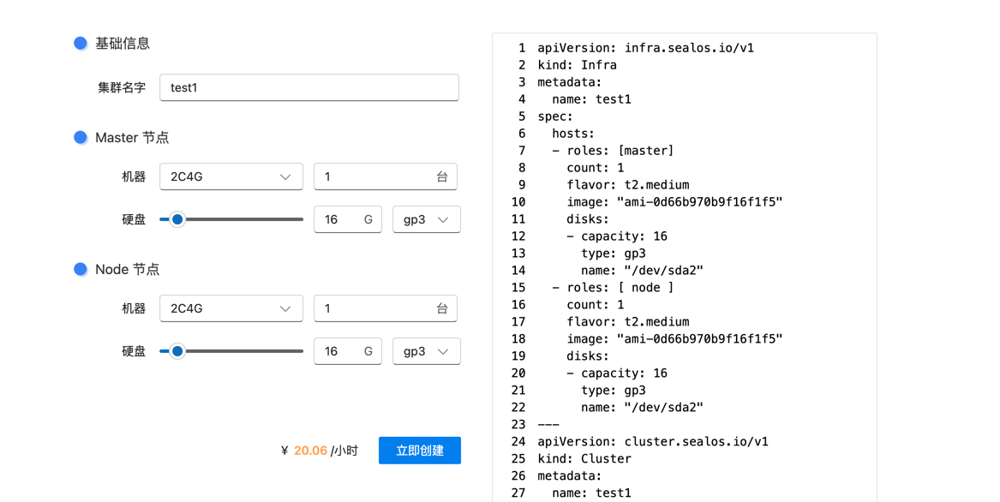
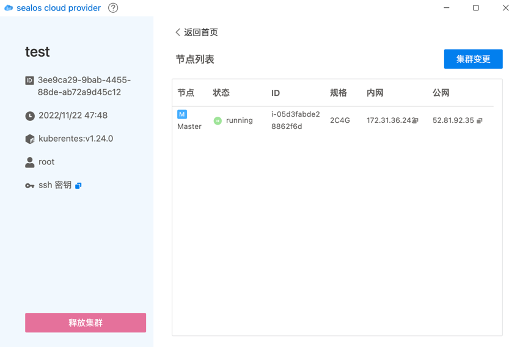
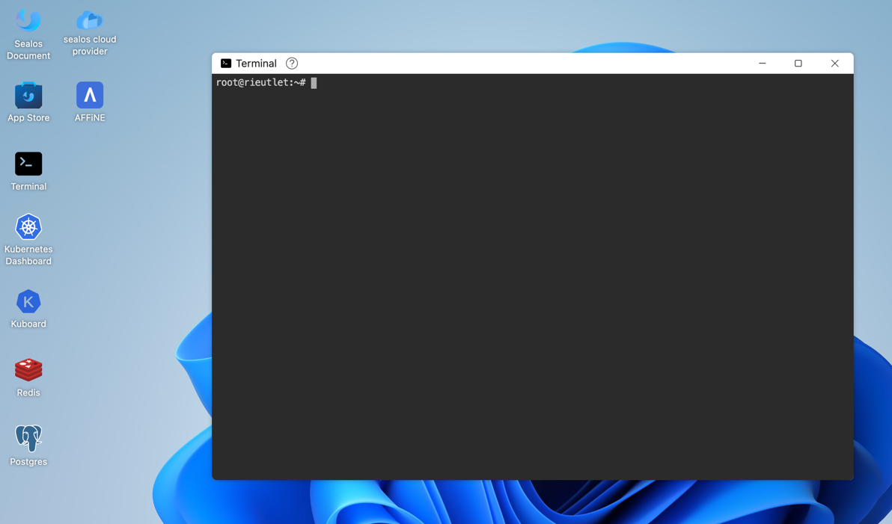

# Infra 模块介绍

用户可以通过 infra 轻松实现在各大公有云平台上启动一个自定义的 kubernetes 集群。
对应的产品名称叫 sealos cloud provider，未来会支持阿里云、腾讯云、华为云、AWS、GCP、Azure、Baremetal。

## 产品使用

登录 [sealos cloud](https://cloud.sealos.io)



用户只需要指定机器类型和机器数量等信息，即可分钟级别启动一个 kubernetes 集群。可自定义希望在集群中运行的组件，比如 calico dashboard mysql 甚至 sealos cloud 等。

 

并轻松实现对该集群的管理和变更。

通过 master 节点的公网 IP 和 ssh 密钥即可访问集群.

复制 ssh 信息保存到 .ssh/cloud.key 文件中, 然后：
```shell
chmod 0400 .ssh/cloud.key
ssh -i ~/.ssh/cloud.key root@master-ip
# 登录成功后即可访问集群
kubectl get pod -A
```

## 通过命令行使用

### 在 sealos cloud 上使用 cloud terminal 创建 infra



创建一个文件，里面包含 infra 和 cluster, infra 会帮助你在公有云上启动虚拟机，而 cluster 会在这些虚拟机上安装 kubernetes 集群。

test.yaml:
```yaml
apiVersion: infra.sealos.io/v1
kind: Infra
metadata:
  name: infra-apply-test
spec:
  hosts:
  - roles: [master] # required
    count: 1 # Required
    flavor: "t2.large"
    image: "ami-0d66b970b9f16f1f5"
  - roles: [ node ] # required
    count: 1 # Required
    flavor: "t2.medium"
    image: "ami-0d66b970b9f16f1f5"
---
apiVersion: cluster.sealos.io/v1
kind: Cluster
metadata:
  name: infra-apply-test
spec:
  infra: infra-apply-test
  images:
    - labring/kubernetes:v1.24.0
    - labring/calico:v3.22.1
```

直接在 cloud terminal 中执行：
```shell
kubectl apply -f test.yaml
```

获取集群访问信息, 里面包含了各服务器的公网地址以及 ssh 访问密钥信息：
```shell
kubectl get infra infra-apply-test  -oyaml
```

和上面使用产品一样，可以通过 ssh 访问集群的 master0 节点，然后使用所有的 kubectl 命令。


### 在本地使用 sealos cloud provider


## 部署教程

## 开发教程

## 源码解析

