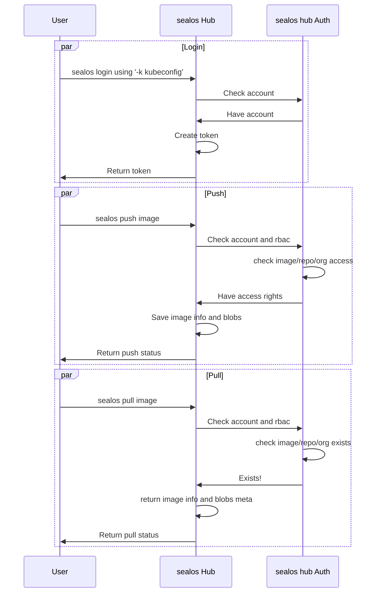

# How to deploy the registry service

sealos registry design:

## Pre-Requirements

1. [sealos Cloud](../../cloud/README.md) for auth.
2. [sealos cluster](installl_base-server.md) for registry.

### A running sealos kubernetes cluster

with at least svc(s) below:

1. kubernetes
2. calico
3. service-hub(@see [service-hub](../../service/hub/README.md))

### Base applications requirements

1. At least one storage Provider, here we use aliyun OSS and CDN. Or, you can use openebs.
    * `AliOSS`: read [this](https://github.com/docker/docker.github.io/tree/master/registry/storage-drivers/oss.md)
    * `openebs` : `sealos run labring/openebs:v1.9.0`

2. One Domain name with admin access
    * `ACMEDNS`, `Akamai`, `AzureDNS`, `CloudFlare`, `Google`, `Route53`, `DigitalOcean`, `RFC2136`
    * Any cert-manager supported `dns01` webhooks: [github-link](https://github.com/topics/cert-manager-webhook)

   Articles below assume the usage of sealos cloud's [godaddy](https://github.com/snowdrop/godaddy-webhook) webhook as
   example.

   *Please Prepare domain access key&secret for further usage*

### Choice what network gateway to use:

1. [APISIX](manifests/apisix/README.md) :point_left: Recommended
2. [Ingress-NGINX](manifests/ingress-nginx/README.md)

### Modification of config.yml

1. Example(@see [deploy.yaml](./manifests/deploy.yaml))

2. Read docker registry docs about [config](https://docs.docker.com/registry/configuration/)

3. Edit `auth`, use your own auth server.

4. The image: [`registry:2`](https://hub.docker.com/_/registry) does not support `AliCDN`, if you need use image:
   `ghcr.dockerproxy.com/labring/registry:main` which is build
   from [distribution](https://github.com/distribution/distribution)

### Troublesome and Tips

1. registry config
    * **http.secret** If you are building a cluster of registries behind a load balancer, you MUST ensure the secret is
      the same for all
      registries.
