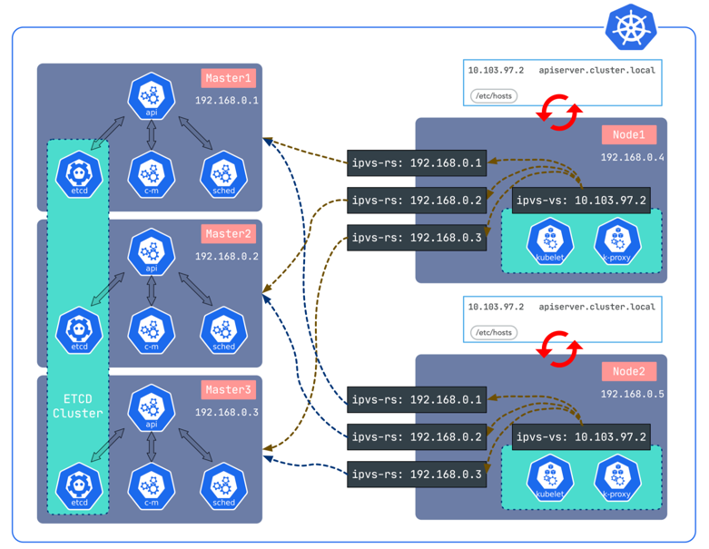

# What is sealos

sealos It is a cloud operating system distribution with kubernetes as the core.
sealos hopes to be a general cloud operating system, so that users can use the cloud with a very low threshold whether it is a private cloud or a public cloud. 
sealos can reduce the maintenance cost and usage threshold of the cloud sufficiently low. 
The goal of sealos is to allow enterprises to fully own public cloud capabilities such as AWS under their own control, 
which can run in the enterprise's own computer room or on other public cloud infrastructures. 
sealos is equivalent to using cloud-native capabilities and architecture to fully realize a substitute for AWS, but there will be differences in product form. 
If there is a database service on AWS, users can start the database service. 
In sealos, everything is an application, and users only need to install a database application to use the database, which is as simple as installing a software on a PC. 
sealos is a multi-tenant cloud operating system that can fully meet the simultaneous use and collaboration of large-scale users, and can provide very good isolation.

# Superiority

> Simple
 
The installation and use of a stand-alone operating system is relatively simple. 
Most companies pay very little cost per year on the Linux distribution. 
They can be used on basic installations, and there will not be too many problems during use. 
Compared with the cloud, it is found that such an ideal situation has not been achieved. 
Enterprises will spend a lot of money every year whether they use public clouds or self-built private clouds. 
The reason is that easy-to-use cloud operating system distributions are not popular. 
sealos can run a custom cloud operating system with simple commands, and then use the cloud like software on a PC, 
which is equivalent to replacing all stand-alone applications on the PC with various distributed applications. 
Through sealos, users can easily run various distributed applications that developers need, such as databases, message queues, and AI capabilities.
 
> Open, Compatible

Sealos is completely open source and can run on physical machines, virtual machines and major public cloud vendors. 
Enterprises do not have to worry about strong binding issues at all, and can switch freely in various environments.

# Features

## kubernetes lifecycle management

The boot module of sealos can help users manage the life cycle of the entire cluster very well. 
A bare kubernetes cluster with no components can be installed with sealos. 
You can also use sealos to assemble various upper-layer distributed applications, such as database message queues, 
on top of kubernetes through cluster mirroring capabilities. 
A single node kubernetes development environment can be installed with sealos. 
You can also use sealos to build a production high-availability cluster with thousands of nodes. 
You can use sealos to freely scale the cluster, backup and restore, release the cluster, etc. 
You can also use sealos very well to run kubernetes even in an offline environment.



- [x] Support ARM, v1.20 and above offline packages support containerd and docker integration
- [x] 99-year certificate, support cluster backup, upgrade
- [x] does not depend on ansible haproxy keepalived, a binary tool, 0 dependencies
- [x] Offline installation, you can use different cluster images for different kubernetes versions
- [x] High availability LocalLB implemented by ipvs, occupying less resources, stable and reliable, similar to the implementation of kube-proxy
- [x] Compatible with almost all systems that support systemd x86_64 architecture environment
- [x] Easy to add and delete cluster nodes
- [x] Tens of thousands of users use sealos in the online environment, stable and reliable
- [x] Support cluster mirroring, freely combine and customize the cluster you need, such as openebs storage +database+minio object storage
 
## Run various distributed applications on kubernetes

Various distributed applications on kubernetes can be run through the `sealos run` command, 
such as databases, message queues, AI capabilities and even enterprise-level SaaS software.

```shell
# MySQL cluster
$ sealos run labring/mysql-operator:8.0.23-14.1

# Clickhouse cluster
$ sealos run labring/clickhouse:0.18.4

# Redis cluster
$ sealos run labring/redis-operator:3.1.4
```

## CustomCluster

For cluster images that the sealos ecosystem does not have, users can build and customize their own cluster images in a very convenient way.


[build an ingress cluster image](https://www.sealos.io/docs/getting-started/build-example-cloudimage)

You can also customize a completely own kubernetes:

Sealfile:
```shell
FROM kubernetes:v1.25.0
COPY flannel-chart .
COPY mysql-chart .
CMD ["helm install flannel flannel-chart", "helm install mysql mysql-chart"]
```

```shell
sealos build -t my-kuberentes:v1.25.0 .
sealos run my-kuberentes:v1.25.0 ...
```

## sealos cloud

With sealos cloud, users have a completely own public cloud capability, but this public cloud is a bit special：

1. sealos cloud is very simple and can be run with one click 
2. sealos cloud is very powerful, and sealos cloud has many capabilities of public cloud, such as database message queue service, but sealos cloud is fully implemented using cloud native architecture. 
3. sealos cloud can run on major public cloud platforms or in the user's own computer room. The public cloud and private cloud have a completely consistent experience 
4. sealos cloud supports multi-tenancy and all development of large enterprises with tens of thousands of people Both can use a sealos cloud at the same time without affecting each other.


Various distributed software can be as easy as using PC software! Even students who can't spell kubernetes words can have a very good experience.

# scenes to be used

> enterprises use public cloud

Public cloud customers can directly use [sealos public cloud](https:cloud.sealos.io) sealos public cloud supports direct use by opening a browser, 
creating user-specific databases and other services, and running business directly on sealos cloud without user creation 
The kubernetes cluster sealos allows users to create a completely user-exclusive sealos cloud on the public cloud, which is completely isolated from other users. 
The sealos public cloud supports adaptation to major cloud manufacturers, free choice, and no perception of public cloud. sealos cloud has the ultimate product experience!

> enterprise private cloud

sealos cloud supports deployment to the user's own computer room. 
The form is exactly the same as the public cloud version, and the usage method is exactly the same. 
It supports localization and offline deployment. Capabilities can be freely tailored to meet the various needs of enterprises. 
Private cloud is also a multi-tenant design to meet the needs of the entire enterprise for cloud, including metering, etc.

> application delivery

sealos can really guarantee consistency at the cluster latitude, build a cluster image test without any problem and run it in the customer environment. 
sealos fully supports one-click delivery, without any process-oriented operation, and the delivery document can be reduced to one command. 
Applications and clusters are packaged as a whole, including all dependencies, and can be delivered in minutes even in an offline environment

> various cloud native practices

Learning kubernetes requires a practical environment... 
Need to build a cloud native development environment... 
Need to install and deploy kubernetes... 
Need a highly available online environment... 
Need to deploy and run various distributed applications on top of kubernetes...

# FAQ

> is sealos a kubernetes installation tool

Installation and deployment is one of the most basic functions of sealos. 
Just like a stand-alone operating system also has a boot module, 
the boot module of sealos can well manage the life cycle management issues of the entire kubernetes in any scenario.

> What is the difference and connection between cloud operating system and cloud platform?
 
A cloud platform is usually a concrete thing, or a running thing, and a cloud operating system is a collection of abstract and concrete technology exhibitions. 
You can build your own cloud platform through the cloud operating system. 
If the cloud platform If it is an instance, the cloud operating system is a class, or a running cloud operating system is a cloud platform. 
The cloud operating system is relatively abstract. The most important ability is to abstract resources downward and apply management upward. 
The specific capabilities are provided by applications on the cloud operating system, such as distributed database messages, etc.

> I don't know if kubernetes can use sealos very friendly?

Yes, just like you can easily use ubuntu without understanding the linux kernel, the key depends on the role of the user. 
For example, a DBA only needs to install a database application on sealos to perform database management SQL tuning. etc. without caring about the existence of kubernetes.

> What is the difference between sealos and rancher kubesphere?

Different positioning, the design concept of sealos is "to break down the whole into parts, assemble freely, and simplify the road", 
using the ability of kubernetes to provide users with what they really want in a very simple way. 
That is to say, what users want is not necessarily kubernetes. What mass users need is a specific capability, which may be different. 
The characteristics of the operating system are that it is what the user needs, it is extremely flexible, and it does not bring extra burden to the user. 
For example, windows is a game console for a gamer, a tool for writing code for programmers, and a tool for retouching pictures for artists. 
The form of the operating system depends on who the user is and what applications are installed. 
The same is true for the sealos cloud operating system. Sealos itself can manage distributed applications through sealos core, sealos hub, and sealos desktop, 
and all the remaining capabilities can be extended to the application layer. Distributed applications are first-class citizens on sealos, and everything is an application.

> is sealos cloud a ui for kubernetes

GUI is something on the iceberg, and correspondingly requires a lot of capabilities at the bottom layer. 
For example, sealos has written a lot of controllers to manage users, cluster images, applications, metering, etc. 
Similarly UserInterface API > CLI > GUI, the API of sealos is the apiserver of kubernetes, which is fully compatible with kubernetes.

> What are the differences and advantages between sealos appstore and other product stores?
 
Applications in sealos are first-class citizens, with different levels of emphasis. 
When using sealos, more attention is paid to the application itself. All applications use the packaging technology of "cluster mirroring" to manage distributed applications like docker. 
appstore is a docker registry.

> Is the sealos cloud operating system heavy?

Sealos cloud, any application is optional, so that it can be assembled freely according to requirements. 
So the system size depends entirely on how many applications are installed, if only one kubernetes itself is very small, no more than 500M in size.

> What are the benefits of ditching the IaaS PaaS SaaS architecture?

The IaaS layer is equivalent to writing all the hardware in the previous data center in software, such as routers, switches, virtual machines, etc. 
In the past, these things were needed from the perspective of demand, but after the birth of kubernetes, 
you will find that our purpose is to make distributed The application just needs to run fine, rather than having to run on IaaS. 
For example, from the perspective of the network, the demand level is to be able to pass and block, instead of having to run in an independent subnet of the simulation, 
so that the network design can be very simple. And what is the essential difference between PaaS and SaaS? From the perspective of containers, 
they are just a bunch of containers, so there is no need to distinguish them. 
Based on this thinking, we can completely abandon the three-tier architecture and turn to the cloud kernel architecture to make the system more cohesive and streamlined. 
The openstack system of the IaaS PaaS SaaS architecture is a typical representative, which makes the whole system very complicated, 
while sealos is based on the cloud kernel design. An entry-level engineer can build a cloud of his own with one command. 
Only by being abstract enough can we be inclusive. 
Just like the early stand-alone operating system was also a layered architecture and later transformed into a kernel architecture.


