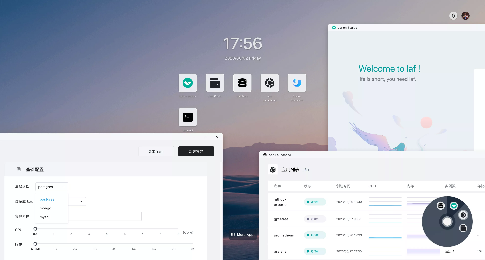

# What is Sealos?

The vastness and complexity of the cloud-native ecosystem undoubtedly leaves many businesses in disarray, yearning for an efficient, ready-to-use distribution, which this ecosystem sorely lacks. The cloud-native market is in dire need of a cloud operating system to further reduce barriers and costs.

The advent of Sealos opens a new window for enterprises. It provides a novel choice for businesses and developers alike, necessitating only the installation of a cloud operating system, regardless of public or private cloud use. It allows various applications to operate stably and securely, tackling all sorts of dependency issues they might require.

Sealos adheres to the philosophy that **cloud usage can be as simple as Linux**. You can commence usage right after installation, as you would with Linux, without entanglement in excessive complexities. The sole difference is that while Linux is installed on a single server, Sealos is installed across an entire data center.

In Sealos's architecture, **there's no essential difference between public and private clouds**. They should be separate instances of the same codebase, the only distinction lying in their configuration and installed applications. Installing it on an intranet renders it a private cloud, while offering services on the public internet converts it into a public cloud.

We firmly believe that with the continuous development and advancement of Sealos, the future of cloud computing will be more open, more straightforward. The benefits of cloud computing should belong to all providers of computational power, and the value of the cloud should be shared by all participants of cloud computing. **They will be able to enjoy the various conveniences of cloud computing in a more economical fashion in a diversified market environment.**

## Overview

Sealos is a **cloud operating system distribution** based on the Kubernetes kernel. It adopts a cloud-native approach, discarding traditional cloud computing architecture, and shifting towards a new architecture with Kubernetes as the cloud kernel. This allows enterprises to use the cloud **as effortlessly as they would use a personal computer**.

Users will be able to install any high-availability distributed application on Kubernetes with the click of a button, similar to using a personal computer. It practically requires no professional delivery or operational costs. Simultaneously, utilizing unique cluster imaging capabilities, users can package any distributed application into an OCI image, freely combine a variety of distributed applications, and easily customize their desired cloud. The powerful and flexible app store function can meet the diverse needs of various users.

## Scenarios & Advantages

Sealos is a powerful business operating platform, providing flawless support for various applications such as Java, Go, Python, PHP, and more, unrestricted by the programming language. The platform offers a stable operating environment for applications and resolves backend dependency issues like databases, object storage, and messaging queues. Further, it can flexibly handle application configuration management, service discovery, public network exposure, and automatic scaling issues.

### Public Cloud

If your business requires operation within a public cloud environment, you can directly use the [public cloud services provided by Sealos](https://cloud.sealos.io).

#### Capabilities of Sealos

- **Application Management**: Rapid deployment of any distributed application with public network access capabilities.
- **Database Management**: Instant creation of highly available databases, supporting MySQL, PostgreSQL, MongoDB, and Redis.
- **Easy Public Network Access**: Businesses are automatically allocated secondary domain names, making public network access easy, and custom domain binding is also supported.

#### Advantages of Sealos

- **Resource Saving, Cost Reduction**: You only pay for containers. The automatic scaling fundamentally solves the problem of resource wastage, saving substantial costs.
- **High Universality, No Cognitive Load**: Users can focus exclusively on their business, without being troubled by irrelevant complexities. Regardless of the user's proficiency with Kubernetes, Sealos can be used with ease.
- **Balance of Flexibility and Security**: Its unique multi-tenant sharing mechanism can achieve effective isolation and collaboration of resources while ensuring security.

### Private Cloud

The Sealos cloud operating system is **100% open source and free**. You can find all source code on [GitHub](https://github.com/labring/sealos), which means all features of the **Sealos Public Cloud** can also be deployed in a private cloud environment to meet more diversified business needs.

### Strong Application Delivery Capability

- Sealos has excellent Kubernetes life cycle management capabilities, and you can freely customize the Kubernetes environment.
- Sealos can package an entire cluster and deliver it to the customer environment with a single click. All services and businesses can be delivered as a whole.
- Unlike Docker, which mainly focuses on single-machine imaging, Sealos goes further, packaging the **entire cluster** or a distributed application.