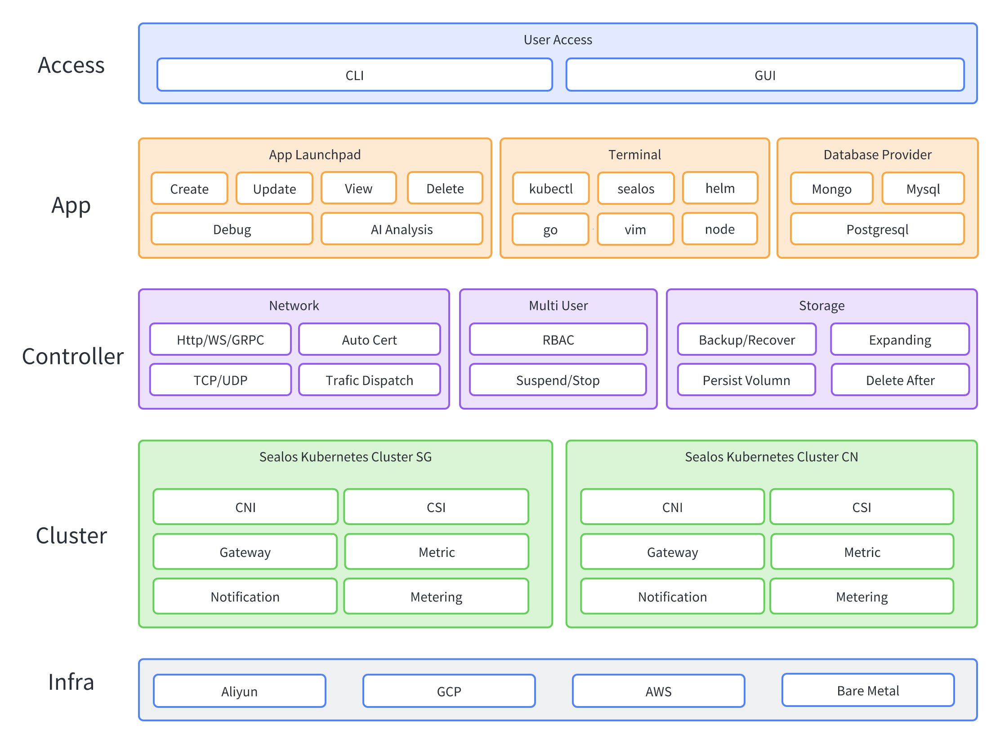

# Architecture Description

Sealos is built using the approach of application separation and application interconnection, where different applications can be deployed independently or combined with other applications to provide services.

All services are authenticated using `kubeconfig` as the application identity, ensuring a consistent user experience whether in a browser, using the `sealos` command line locally, or even with a third-party client.

## Overall Architecture

<picture>
  <source media="(prefers-color-scheme: dark)" srcset="./images/architecture_dark.png" />
  <source media="(prefers-color-scheme: light)" srcset="./images/architecture_light.png" />
  
</picture>

## Application Architecture

Applications on Sealos adopt a front-end and back-end separation architecture, and the front-end can provide `SSR` capabilities, allowing applications to provide services independently to the outside world without being bound to the Sealos monolith.

Using the following diagram as an example: 

**App Launchpad** is a application deployment tool provided by Sealos, and **Terminal** is a terminal application for the Sealos system, providing command-line services consistent like a single-machine operating system terminal.
For various applications on Sealos, they can interact directly with `Kubernetes` services, or interact with various CRD controllers such as Terminal Controller and Ingress-Nginx Controller, etc.
Applications can also call each other, for example, a database created by a user in the **Database** application can directly invoke the **Terminal** application and automatically connect to the database for debugging.

For more information, please refer to the [link](../../platform-components) documentation.

<picture>
  <source media="(prefers-color-scheme: dark)" srcset="./images/application_dark.png" />
  <source media="(prefers-color-scheme: light)" srcset="./images/application_light.png" />
  
</picture>