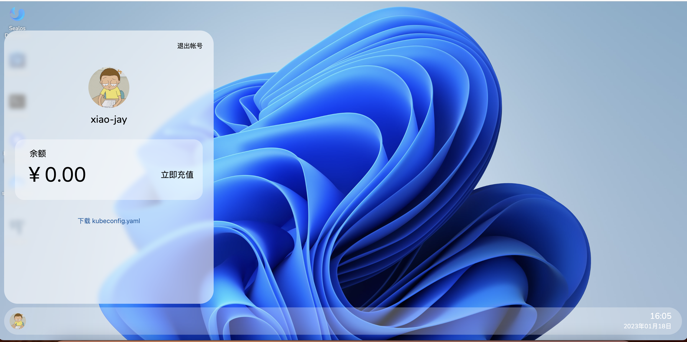
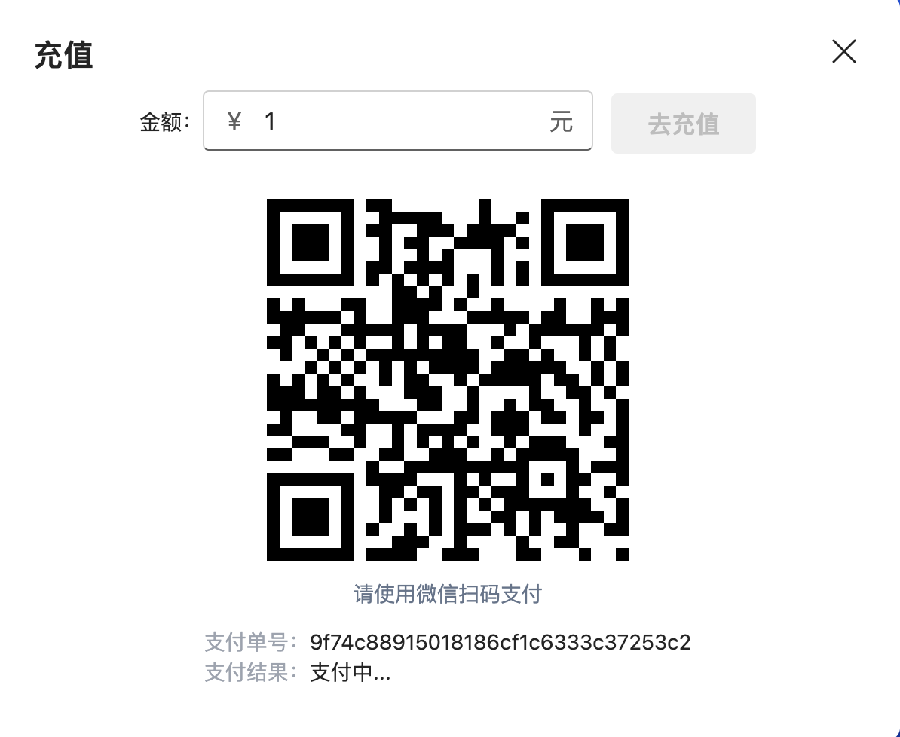
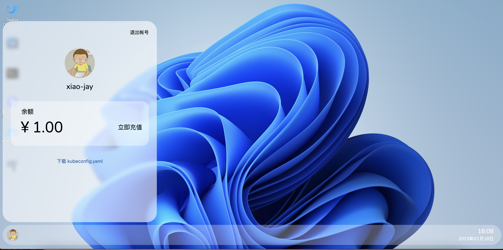

# Sealos Account

Click on the avatar in the lower left corner to view your own account.

## 1、Recharge Introduction

Only supported weChat recharge at present, click to recharge immediately and the recharge amount, and WeChat can scan the code to pay.

After the payment is completed, the recharge interface can be closed.

**Payment result:**

## 2、Deduction introduction

When the user uses resources (such as cpu, memory), the amount needs to be deducted from the account

**Price List:**

| resource name | unit | price (per hour) |
|---------------| -- | -------------- |
| cpu           | 1 core | 0.067元       |
| memory        | 1Gi | 0.033元        |
| disk          | 1Gi | 0.0021         |

If the user is in arrears, it will affect the normal use. If there is too much arrears, the user resources will be automatically cleared.