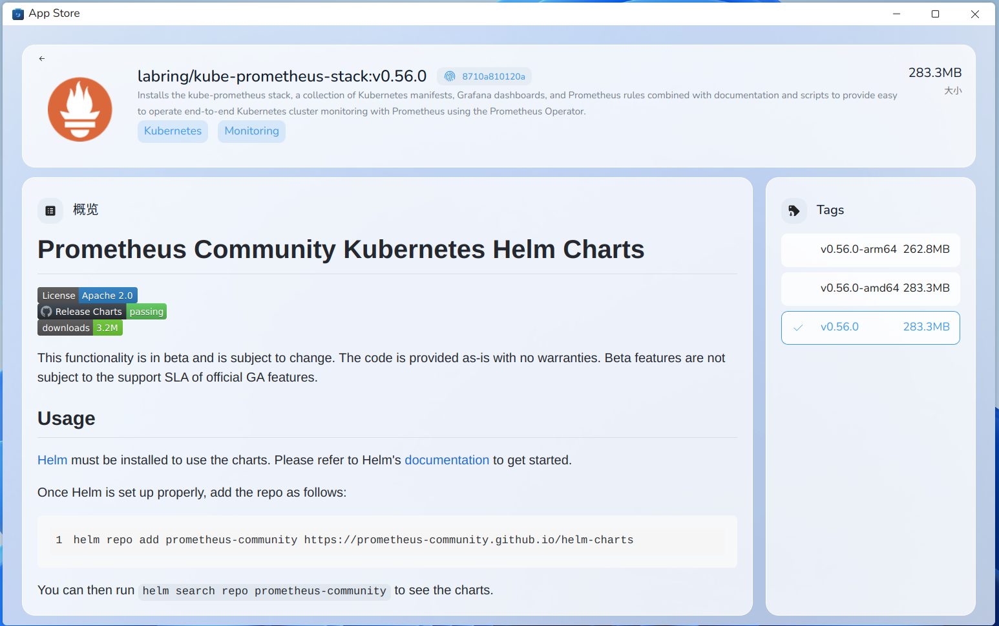

# sealos app store

sealos app store displays image information stored in sealos registry `hub.sealos.cn`.



look at [use-sealos-registry.md](use-sealos-registry.md) to get more details.

## Create and manage your organization

Currently, we only support organization creation by applying an organization cr yaml file.

Here is an example, you can edit this yaml in the terminal app in sealos cloud:

```yaml
apiVersion: imagehub.sealos.io/v1
kind: Organization
metadata:
  name: your-organization-name
spec:
  name: your-organization-name # same as metadata.name
  creator: your-uuid # find at sealos cloud page
  manager: [ your-uuid ] # you can add other users as manager
```

We will support GUI to manage organizations in the future.

## How to display your image information in sealos app store

By default, if you push an image to sealos registry `hub.sealos.cn`, sealos will generate an image cr and apply it to
sealos cloud.

You can customize the image cr by writing an image cr into the image, and the `README.md` will be parsed as an element of the image cr.

You need to construct your image files in the following structure:

```text
├── etc
├── metadata
│           └── config.yaml
└── README.md
```

An example of the image cr yaml named as `config.yaml` is like this:

```yaml
apiVersion: imagehub.sealos.io/v1
kind: Image
metadata:
  name: labring.cert-manager.v1.8.0 # stay unique
spec:
  detail:
    description: Cloud native certificate management. X.509 certificate management for Kubernetes and OpenShift
    docs: # will be generated by README.md in your image. 
    icon: https://cert-manager.io/images/cert-manager-logo-icon.svg # we only support image url at this stage.
    keywords: # keywords of your image
      - Network
  name: labring/cert-manager:v1.8.0
```
