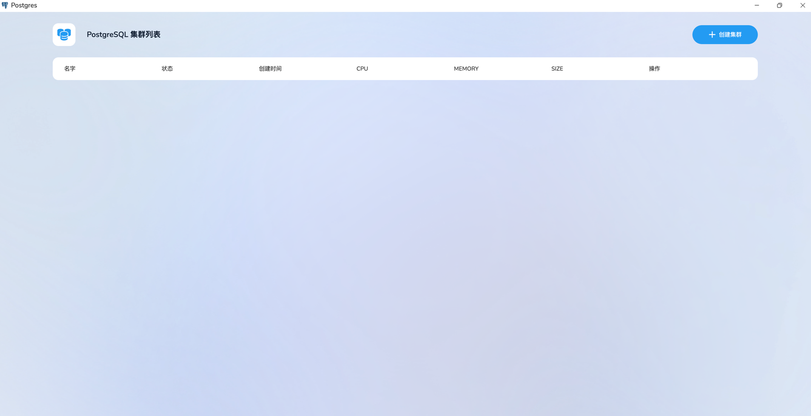
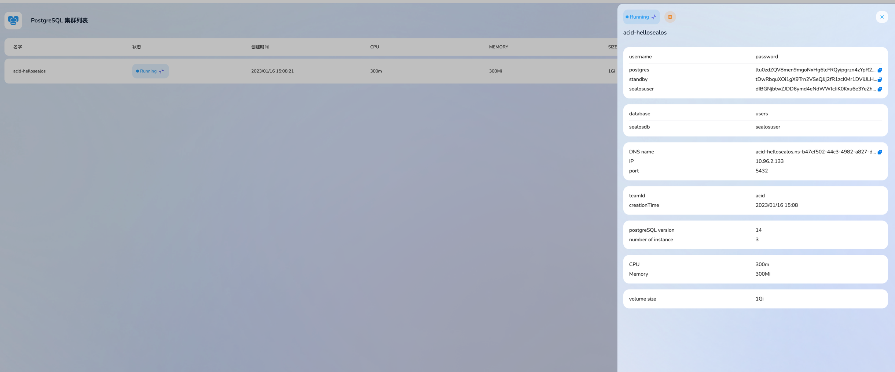
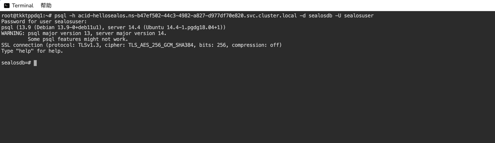

# Sealos Postgres Sql User Guide


Sealos postgres sql allows users to easily start a postgres sql cluster on
public cloud platforms. It is based on the openebs storage engine, and is in-depth customized on top of the postgres-operator developed by the open-source organization zalando. Sealos postgres provides functions such as one-click startup, deployment, backup, data transfer, and data recovery of distributed databases.
## Advantage


* **One-click Deployment**，You only need to configure the number of nodes, node capacity, and other basic configurations to quickly start a highly available postgres sql cluster.
* **Low Cost**，It is 15% cheaper than other public cloud storage cluster services.
* **Easy Usage**，Data backup, data recovery, data migration and other operations can be completed by clicking the corresponding button.
* **Resource Elasticity**，Support rapid expansion of the number of nodes and node capacity.
* **High Reliability**，The database architecture supports functions such as master-slave backup, automatic data synchronization, automatic data backup, and automatic data recovery.
* **High Usability**，It can be connected to database operation platforms such as bytebase to provide a visual database operation interface.

## How to Use


Log in to [sealos cloud](https://cloud.sealos.io), click the postgres sql icon on the desktop to enter the postgres sql cluster management interface


You can manage and create your own postgres cluster on this page.

Click the "create cluster" button, and you only need to configure the postgres sql version, number of nodes, node capacity, and database user permissions to quickly create a postgres sql cluster.


## Create a Cluster via Terminal


Create a postgres sql cluster using the terminal application on [sealos cloud](https://cloud.sealos.io)

Create a file that contains the basic configuration when the postgres cluster is created, and sealos will automatically start the corresponding PG Cluster.
Here is an example:

```yaml
kind: "postgresql"
apiVersion: "acid.zalan.do/v1"

metadata:
  name: "acid-hellosealos"
  labels:
    team: acid

spec:
  teamId: "acid" #Default, do not modify
  postgresql:
    version: "14" #pgcluster version
  numberOfInstances: 3 
  volume:
    size: 1Gi #instance store disk capacity

  users:
    sealosuser: [superuser,createdb] #Users and corresponding permissions

  databases:
    sealosdb: sealosuser #databases that users can access

  resources: #resource allocation
    requests:
      cpu: 300m
      memory: 300Mi
    limits:
      cpu: 300m
      memory: 300Mi
```
Execute directly in cloud terminal：
```cmd
kubectl apply -f pgtest.yaml
```
Your own PG Cluster is created。

## Obtain the Password to Log in


Once PG is created, it will generate a corresponding password for each user by default. The password can be obtained by obtaining the secret, and then used after base64 transcoding.
```cmd
kubectl get scret ${UserName}.${CRDName}.credentials.postgresql.acid.zalan.do -o yaml
```
The username and password can also be copied manually through the cluster management interface.


## Connect to PG Cluster using psql


Open the terminal, execute the following command, and fill in the cluster name created when applying to the cluster, the user's private uid, and the database user and password to connect to the database:
```cmd
psql -h ${pgclusterName}.${uid}.svc.cluster.local -d ${dbname} -U ${username}
```



You can also deploy your own business on sealos to access pgsql.
