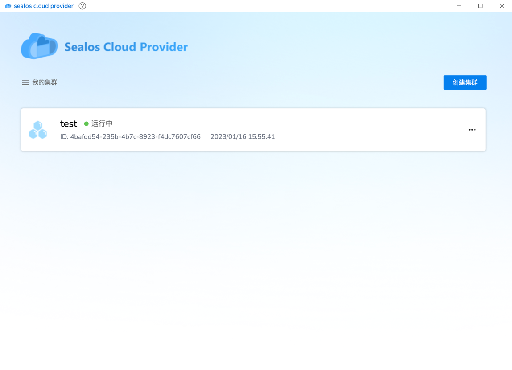
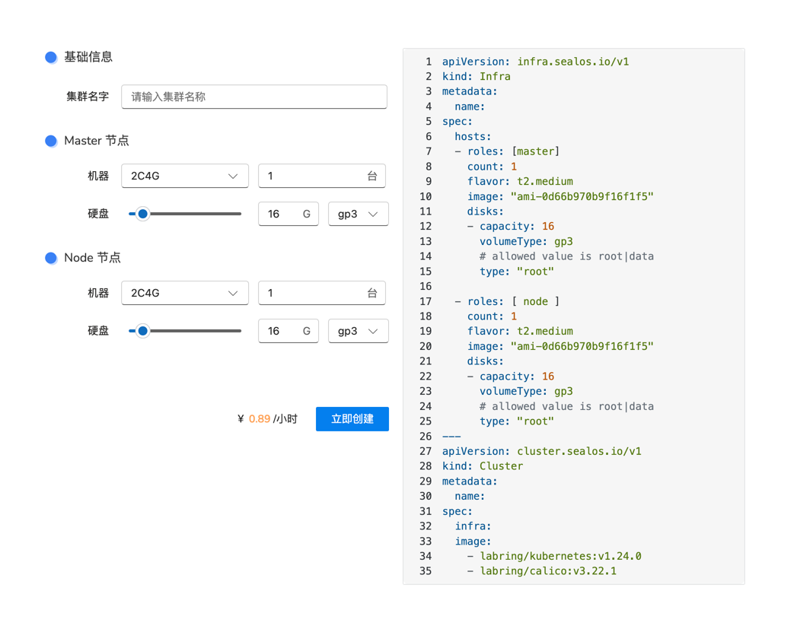
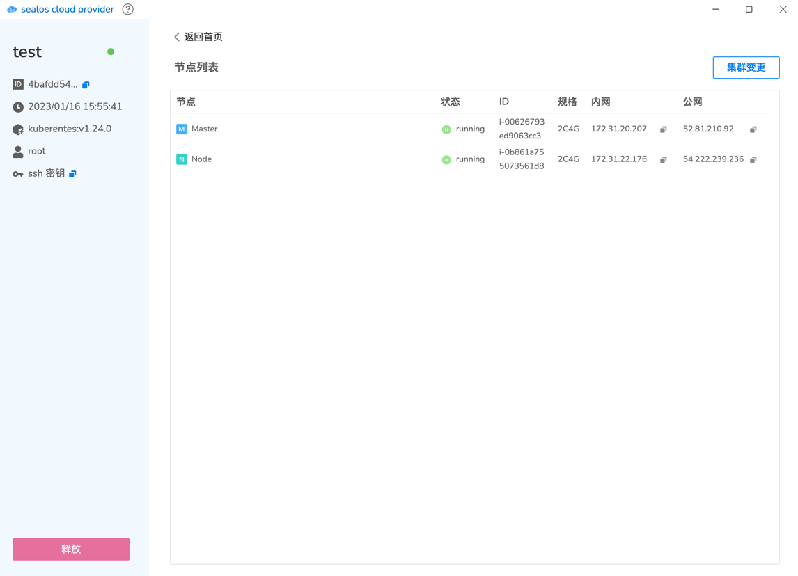
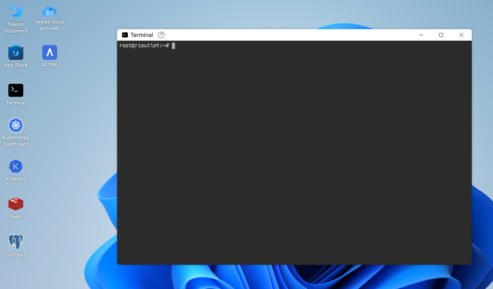
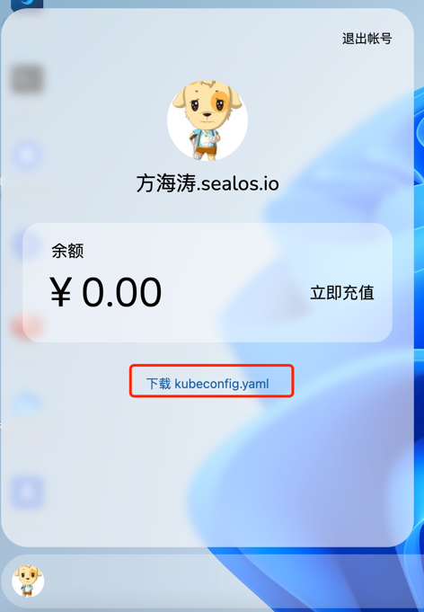

# sealos Cloud Provider

sealos Cloud Provider (SCP)
Allows users to easily launch a custom kubernetes cluster on all major public cloud platforms.
It currently supports AWS, and will support Ali Cloud, Tencent Cloud, Huawei Cloud, GCP, Azure, and Baremetal in the future.

## Product Advantages

* High speed, build custom kubernetes clusters on the cloud in minutes
* Flexible configuration, freely scalable clusters by editing configuration files
* Inexpensive, 10% cheaper than starting a cloud server directly
* Easy to use, the product experience is as simple as installing and using an application on a PC
* API is fully compatible with kubernetes CRD design, supports remote calls, and supports docking to any other system, such as CI/CD systems to automatically create/destroy clusters
* Support for custom clusters, with the ability to freely choose which version of kubernetes to install and the upper addon through cluster image capabilities, and support for all cluster images in existing sealos repositories
* Cross-platform, free to switch cloud vendors, multiple cloud vendors resources unified management


## Use by scp UI

Log in to [sealos cloud](https://cloud.sealos.io), click the sealos cloud provider icon on the desktop, and enter the Create Cluster interface.



You can start a kubernetes cluster in minutes by specifying the node type, number of nodes, disk capacity, disk type, and other configurations in this interface. You can customize the components you want to run in the cluster, such as calico dashboard mysql or even sealos cloud.



In this interface, you can view cluster id, creation time, ssh key, as well as intranet and public IP and operation status of each node. It also supports modifying the cluster and releasing the cluster with one click, so that you can easily manage and change the cluster life cycle.



Once the cluster is running successfully, you can access the cluster through the public IP of the master node and ssh key.

Copy the ssh private key and save it to the .ssh/cloud.key file, then
```shell
chmod 0400 .ssh/cloud.key  #Change key file permissions
ssh -i ~/.ssh/cloud.key root@master-ip  #Log in the master node as the user root
# Access the cluster after successful login
kubectl get pod -A
```

## Use by command line

### Create infra on sealos cloud using cloud terminal



Create a yaml file containing infra and cluster, which can freely define the cluster specifications and configuration. infra will help you start virtual machines on the public cloud, while cluster will install a kubernetes cluster running the specified cluster images on those virtual machines.

test.yaml:
```yaml
apiVersion: infra.sealos.io/v1
kind: Infra
metadata:
  name: infra-apply-test
spec:
  hosts:
  - roles: [master] # Required
    count: 1 # Required
    flavor: "t2.large"
    image: "ami-0d66b970b9f16f1f5"
  - roles: [ node ] # Required
    count: 1 # Required
    flavor: "t2.medium"
    image: "ami-0d66b970b9f16f1f5"
---
apiVersion: cluster.sealos.io/v1
kind: Cluster
metadata:
  name: infra-apply-test
spec:
  infra: infra-apply-test
  images:
    - labring/kubernetes:v1.24.0
    - labring/calico:v3.22.1
```

Execute directly on cloud terminal
```shell
kubectl apply -f test.yaml
```

Get the cluster access information, which contains the public address of each server and the ssh access key information
```shell
kubectl get infra infra-apply-test  -oyaml
```

Automatic cluster scaling by editing infra files to add and remove nodes to the cluster
```shell
kubectl edit infra infra-apply-test
```

As with the UI, you can get the ssh private key from the cluster information returned by infra, access the master0 node of the cluster, and then use all the kubectl commands.


## Use sealos cloud provider locally

Prerequisite: kubectl is already installed locally.

Download the user-specific kubeconfig file from the sealos cloud:



Copy to the .kube/config file, e.g. `cp kubeconfig.yaml .kube/config`

This license file is exclusive to the user and can be used to access all APIs from anywhere, not just to access and use the sealos cloud provider.

After the configuration is complete, other steps are the same as above.

```shell
kubectl get pod
kubectl get infra
kubectl get cluster
kubectl apply -f infra.yaml
```

## API reference

Infra CRD is only responsible for starting virtual machines
```shell
apiVersion: infra.sealos.io/v1
kind: Infra
metadata:
  name: test-infra
spec:
  hosts:
    - roles: [ master ]
      count: 1
      flavor: t2.large # Virtual Machine Models
      image: "ami-0d66b970b9f16f1f5" # Virtual Machine Image
      disks:
        - capacity: 40 # System Disk Size
          volumeType: gp3
          type: "root" # System disk configuration
        - capacity: 40
          volumeType: standard
          type: "data" # Data disk configuration
    - roles: [ node ]
      count: 1
      flavor: t2.medium
      image: "ami-0d66b970b9f16f1f5"
      disks:
        - capacity: 40
          volumeType: gp3
          type: "root"
        - capacity: 40
          volumeType: gp3
          type: "data"
```

Cluster CRD, if defined, starts a kubernetes cluster on the Infra it specifies

```shell
apiVersion: cluster.sealos.io/v1
kind: Cluster
metadata:
  name: test-cluster
  annotations:
    sealos.io/sealos/version: "4.1.4" # Specify the version of sealos to use
spec:
  infra: my-cluster # Specifying the name of the infra will start the kubernetes cluster on the corresponding infra
  image: # List of cluster images, customize kubernetes version or other components according to your needs
  - labring/kubernetes:v1.24.0
  - labring/calico:v3.22.1
```