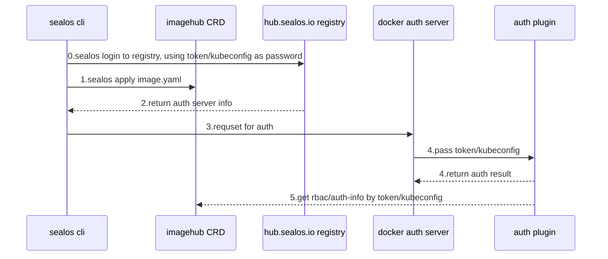

# hub.sealos.io

组件：
1. imagehub crd
2. sealos cli
3. docker registry v2
4. docker auth server
5. auth plugin

## docker registry

Requirements.

1. [hub.sealos.io](http://hub.sealos.io) store the user's image
2. synchronize imagehub permissions
3. sealos login [hub.sealos.io](http://hub.sealos.io) by token/kubeconfig.yaml
4. sealos push Sync to image hub

## docker registry auth

Requirements: provide fine-grained auth, support org sharing, need to sync with image hub

Design/steps.

- sealos login parse the token, get the user and use the token as password to log in to the registry.
- registry will return the docker auth server information
- The buildah login will control the request to docker auth itself.
- docker auth then call plugin to authenticate
- plugin gets the token/kubeconfig and connects to the k8s apiserver to get the imagehub privilege information
- plugin returns authentication

Advantages.

- Fully native support for docker login, buildah login, no need to re-process the interaction with the registry api during sealos login
- Can reuse docker auth code, only need to streamline docker auth to service auth
- plugin to achieve authentication, the custom authentication part of the stripped docker auth, the degree of freedom max

Disadvantages.

- cloud token as a password in the token failure need to re-sealos login
- token is too long, maybe passing kubeconfig by file is the optimal solution, but there is also the problem of long passwords, which consumes on io?

