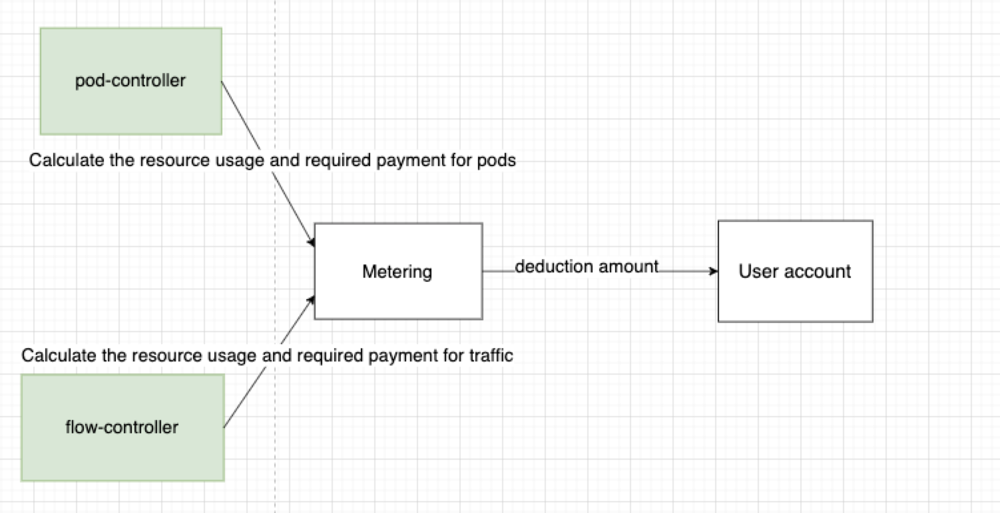
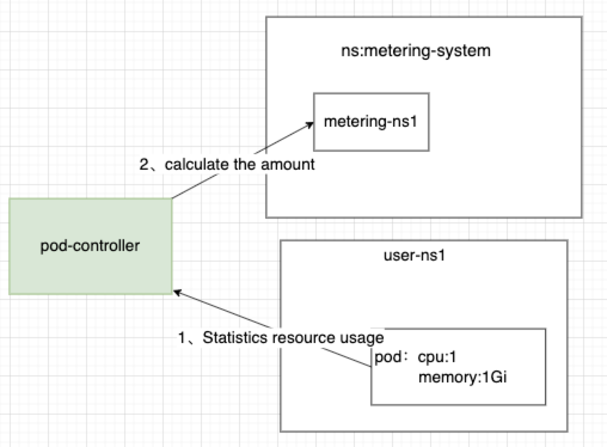
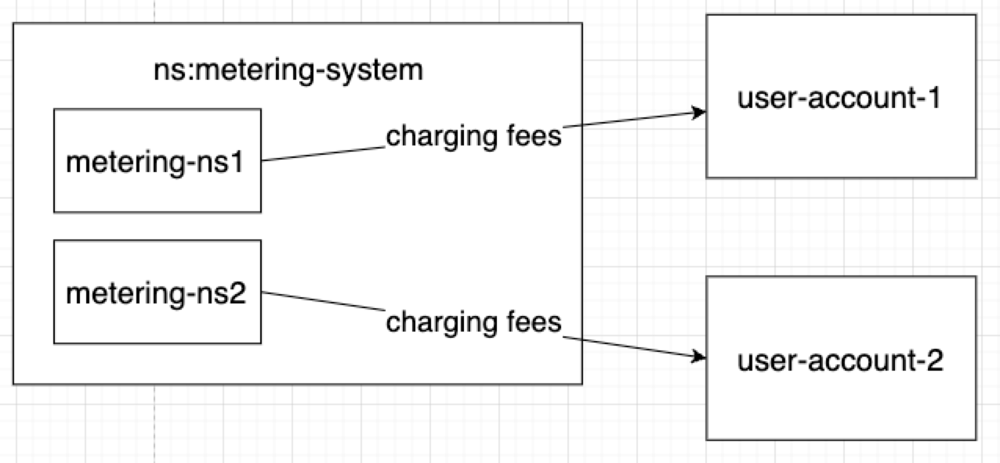
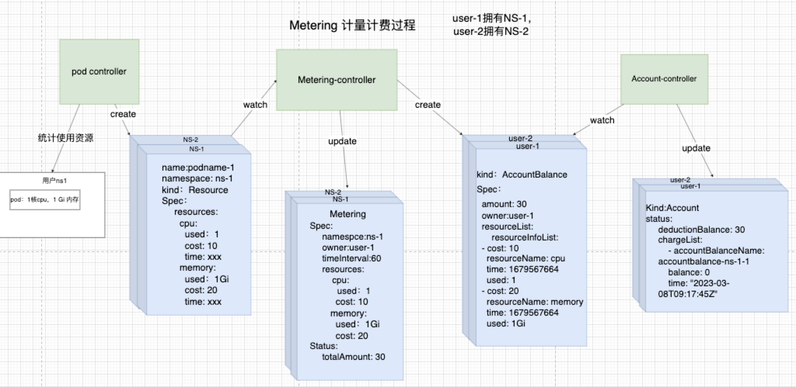

# Metering Design Documentation

## **1. Background**

sealos cloud is a multi-tenant cloud operating system with k8s as the core. Each user has at least one namespace of his own to use, which brings challenges to billing. How to bill the cpu, memory and other resources used by users in k8s? How about billing traffic and other resources that are not visible to Metering.

## 2. Scenarios that need to be met

1. Metering and billing the cpu, memory and other resources of the pod being used

2. It can measure third-party resources (such as traffic) that Metering cannot perceive, and requires a resource access solution

3. When it is necessary to create a user Namesapce, it will automatically create Metering and the fields required for its billing

3. Each controller needs to be idempotent

4. In case of emergencies, such as the Meterng-controller being hung up for 2 days, can the price deducted in these two days be restored normally?

5. Can Metering be created automatically with the creation of user Namespace?

## Three, design ideas

### 3.1. Introduction of each module

Resource Controller: Statistical resource usage

Metering and billing system: Calculate the price once in a billing cycle based on the statistical resource usage and the price list, let the user account deduct the money, and clear the statistical resource usage.

### 3.2, metering and billing process

3.2.1 Resource controller statistics process

3.2.2 The metering and billing system calculates the price based on the usage

It will count once in a billing cycle and calculate the price, and will clear the resource usage in the metering and billing, and finally deduct the calculated money from the user account.

## Four, the problems encountered

A controller needs to update multiple cr at the same time, so it cannot be idempotent

Detailed introduction: https://github.com/labring/sealos/discussions/2231

#### solution:

**Principle: Only one controller update per CR**

Green represents the controller, and blue represents CR (that is, the instantiation of CRD)

1. The pod-controller statistical resource process: After the pod-controller counts the resource usage, it no longer changes the existing CR, but creates a resource usage CR.

2. Metering-controller measurement process: watch Resource is generated, and the resource usage value will be put into the CR of Metering after generation.

3. Metering-controller billing process: Calculate the price according to the resource usage and price table counted in Metering CR, and clear the statistical resource usage, generate an AccountBalance CR, which will store the amount to be deducted (calculation formula :used/unit *price).

4. Deduction process: Account monitors the generation of Accountbalance CR, reads the value that needs to be deducted, and deducts the fee.