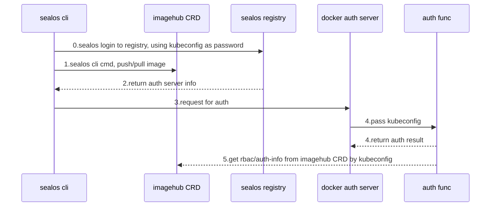

# sealos registry design

sealos registry is a docker v2 registry which is used to store and distribute cluster image.

The registry domain is `hub.sealos.cn`.

## registry server

Registry use the open source [docker v2 registry](https://github.com/distribution/distribution).

Deployment documentation can be found at [here](https://github.com/labring/sealos/blob/main/deploy/registry/README.md).

## registry auth server

### Based on sealos imagehub CRD, provide fine-grained auth.

We use user's kubeconfig yaml file as password. When user use `sealos login` to `hub.sealos.cn`, auth server will use it
to authenticate.

Here is the complete mermaid diagram.

### Using kubeconfig as password has the following advantages:

1. Fully native support for docker login, buildah login, no need to re-process the interaction with the registry api
   during sealos login
2. Auth server will use user kubeconfig to connect sealos cloud not by kubernetes-admin

*But there are some disadvantages:*

1. maybe kubeconfig is too long as password, which consumes on io