# Quick Installation of Halo Blogging Platform

Deploy Halo Blogging Platform swiftly on Sealos

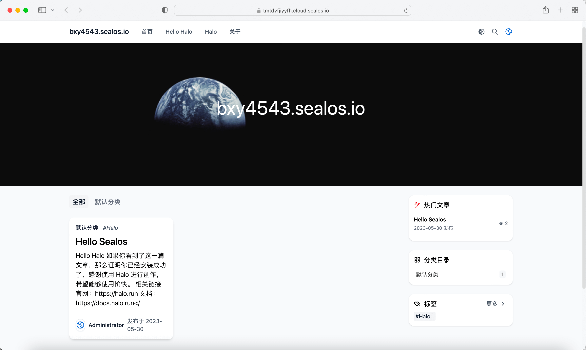

[Halo](https://github.com/halo-dev/halo) is a powerful and easy-to-use open-source website building tool. 
This article will introduce how to deploy Halo on Sealos, while deploying PostgreSQL on Sealos can help you easily manage and maintain the database to meet different business needs.

## Step 1: Deploy PostgreSQL on Sealos

### First, open Sealos and click on "More Apps" to enter the PostgreSQL deployment interface:

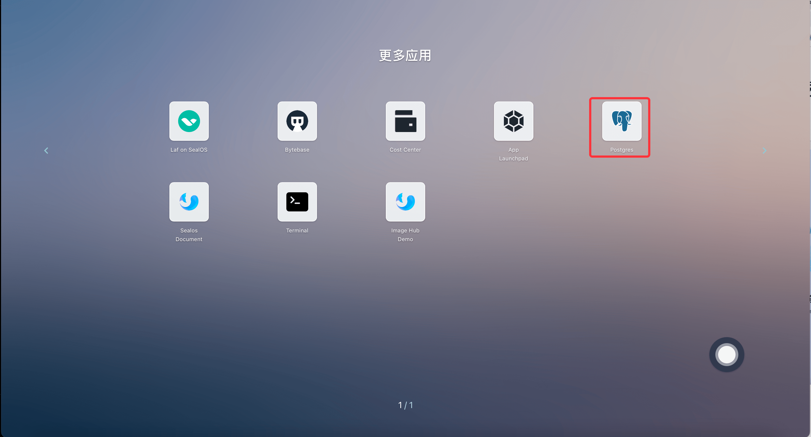

### Fill in the configuration

In the PostgreSQL deployment interface, click on "Create Cluster" and fill in the relevant configuration information as prompted.

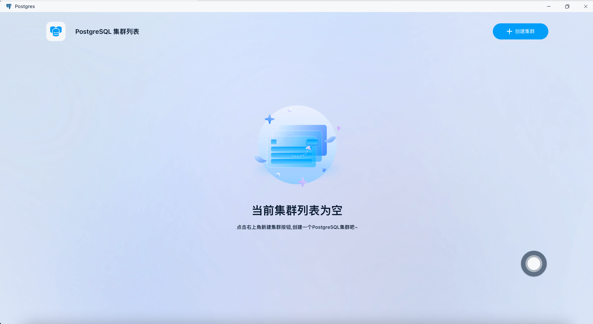

After entering the corresponding configuration, click on "Create Cluster":

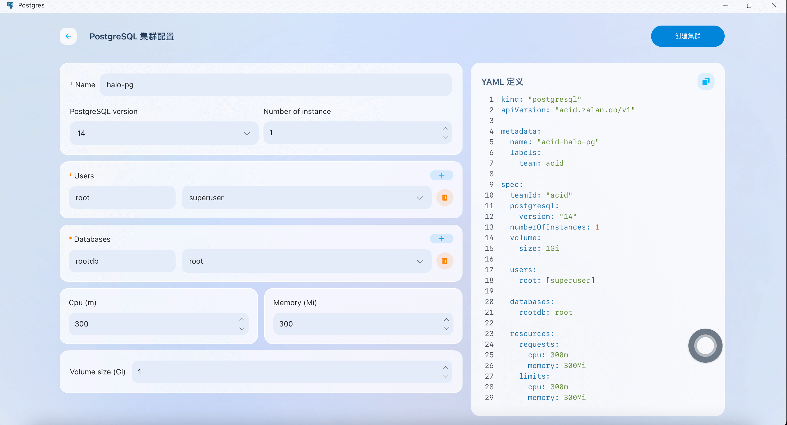

### Check the database configuration:


Save the generated configuration containing the database username, password, and connection method for use in the following Halo configuration:

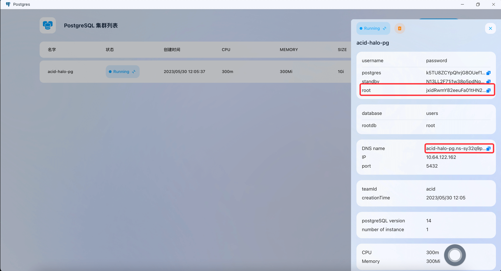

> The PostgreSQL configuration can be seen in the image as follows:
>
> Username: root
>
> Password: jxidRwmY82eeuFa01tHN28msb86woounM0QMbyl1jhwzKxT9IDqlNkFfyy4R34G3 
>
> pg DNS name: acid-halo-pg.ns-sy32q9p9.svc.cluster.local:5432

## Step 2: Deploy Halo on Sealos

### Open App Launchpad

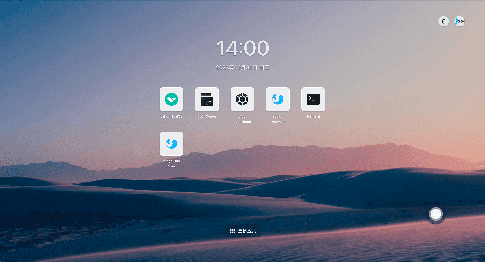

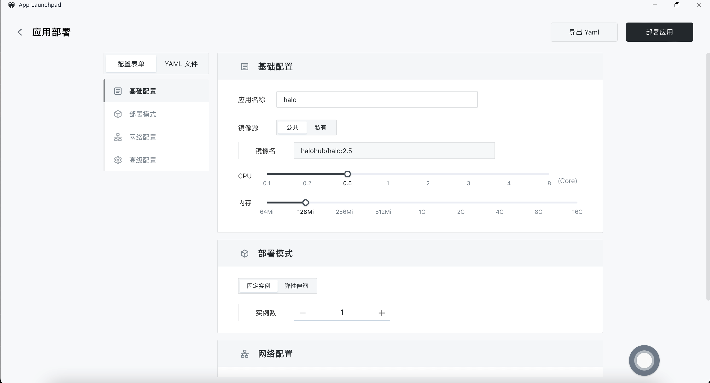

### Fill in the configuration

- Customize the application name

- Set the image name to `halohub/halo:2.5`

- CPU and storage should be configured according to actual conditions, memory requires 500Mi to start Halo, you can refer to the official [prepare](https://docs.halo.run/getting-started/prepare) 

- Expose port should be 8090. At the same time, setting it to external network access will automatically configure an exit domain for the application for external network access, and you also need to configure this address in Halo

- Environment variables include database configuration and other related configurations. It is important to note that you need to configure the database connection information based on the username, password, and DNS you set in Step 1. Additionally, you need to configure the username and password for the super administrator of Halo.

Configure Halo environment variables as follows:

```Bash
spring.sql.init.platform=postgresql
spring.r2dbc.url=r2dbc:pool:postgresql://acid-halo-pg.ns-sy32q9p9.svc.cluster.local:5432/halo
spring.r2dbc.username=root
spring.r2dbc.password=jxidRwmY82eeuFa01tHN28msb86woounM0QMbyl1jhwzKxT9IDqlNkFfyy4R34G3
halo.external-url=tmtdvfjiyyfh.cloud.sealos.io
halo.security.initializer.superadminusername=root
halo.security.initializer.superadminpassword=sealos
```

Detailed explanation of environment variable configuration:

| Parameter Name                                 | Description                                                                                              |
|------------------------------------------------|----------------------------------------------------------------------------------------------------------|
| spring.r2dbc.url                               | Database connection address, see Database Link Format below for details                                  |
| spring.r2dbc.username                          | Database username                                                                                        |
| spring.r2dbc.password                          | Database password                                                                                        |
| spring.sql.init.platform                       | Database platform name, supports postgresql, mysql, h2                                                   |
| halo.external-url                              | External access link, if you need public network access, you need to configure the actual access address |
| halo.security.initializer.superadminusername   | Initial super administrator username                                                                     |
| halo.security.initializer.superadminpassword   | Initial super administrator password                                                                     |

Database link format (here we use the postgresql format):

| Connection Method  | Connection Address Format                                                        | spring.sql.init.platform   |
|--------------------|----------------------------------------------------------------------------------|----------------------------|
| PostgreSQL         | r2dbc:pool:postgresql://{HOST}:{PORT}/{DATABASE}                                 | postgresql                 |
| MySQL              | r2dbc:pool:mysql://{HOST}:{PORT}/{DATABASE}                                      | mysql                      |
| MariaDB            | r2dbc:pool:mariadb://{HOST}:{PORT}/{DATABASE}                                    | mysql                      |
| H2 Database        | r2dbc:h2:file:///${halo.work-dir}/db/halo-next?MODE=MySQL&DB_CLOSE_ON_EXIT=FALSE | h2                         |

### Network configuration


### Environment variable configuration

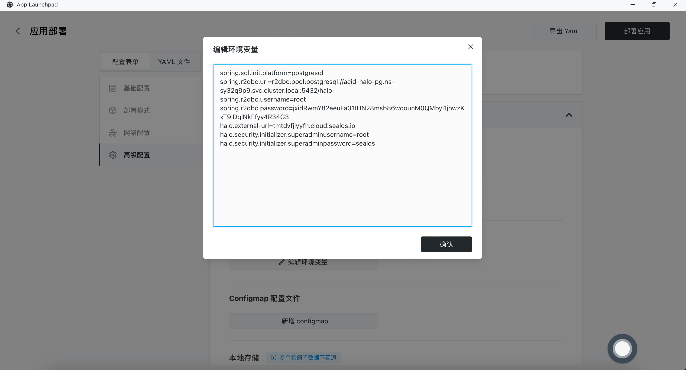

### Configure Persistent Storage Volume

Mount `/root/.halo2` directory to persist Halo data:

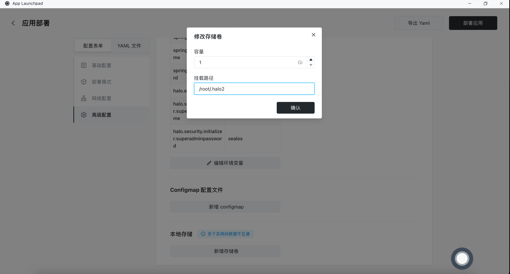

## Step 3: Access Halo via the Public Network

After successfully launching the application, you can access Halo through the public network address for configuration:

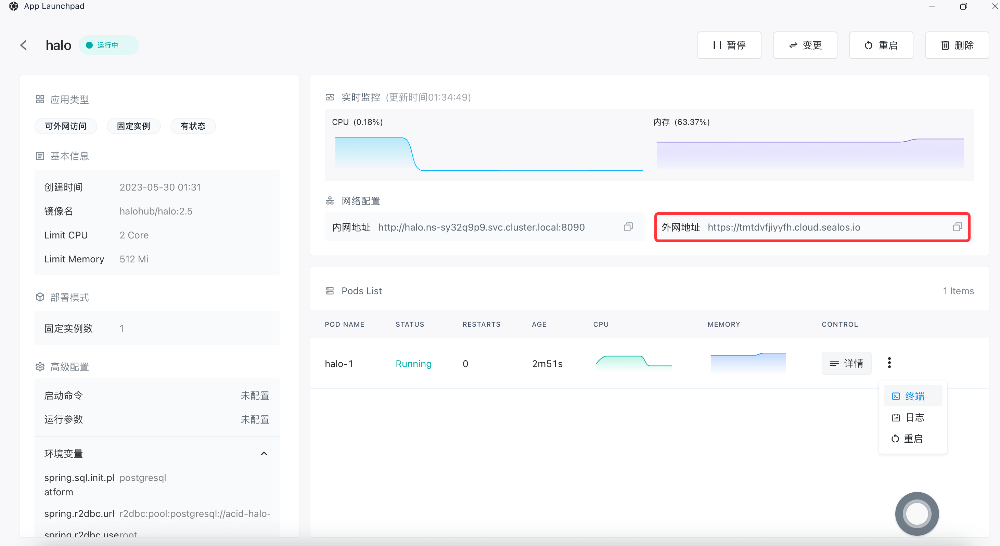

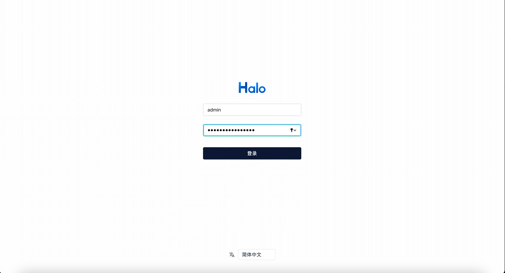

### **Initialize Halo**

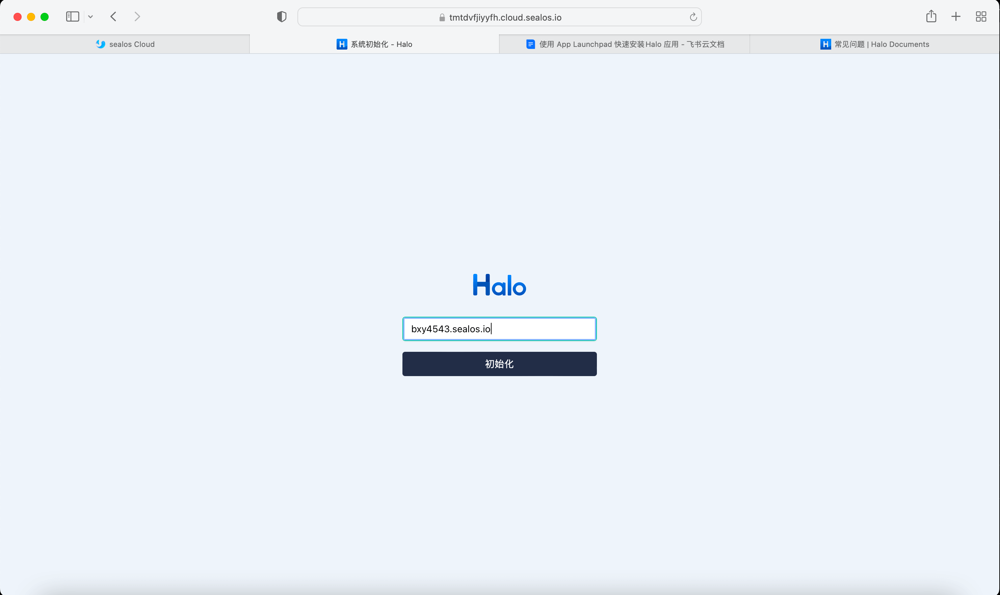

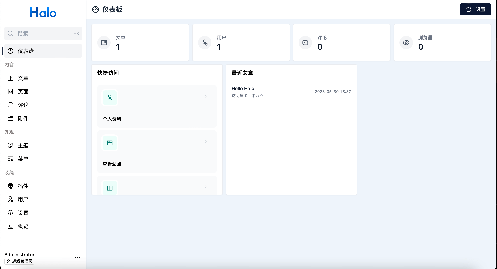

### **First Halo:**

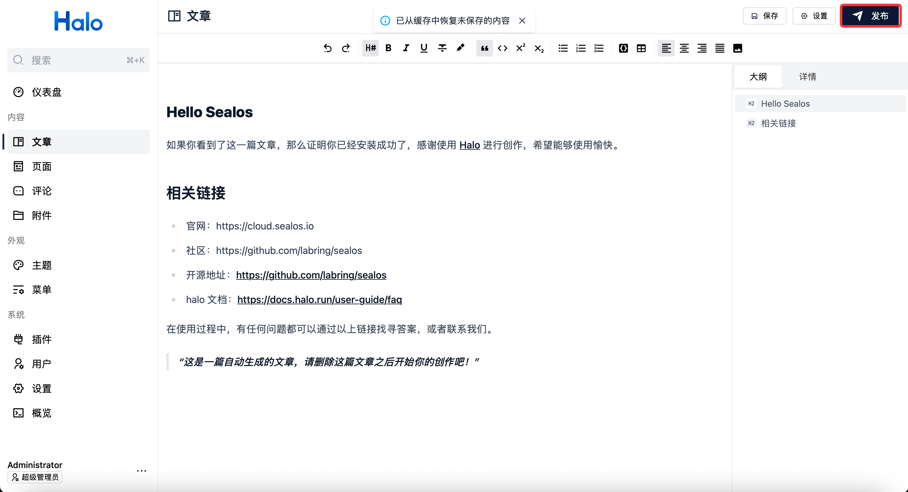

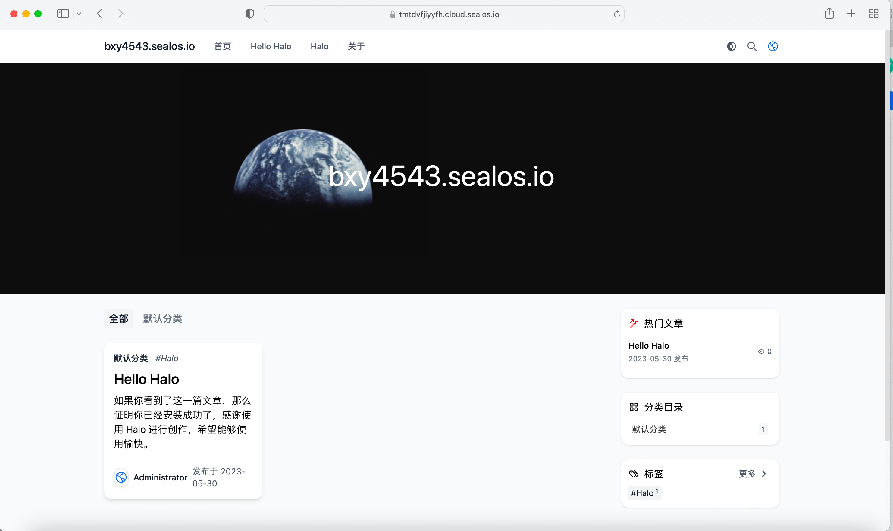

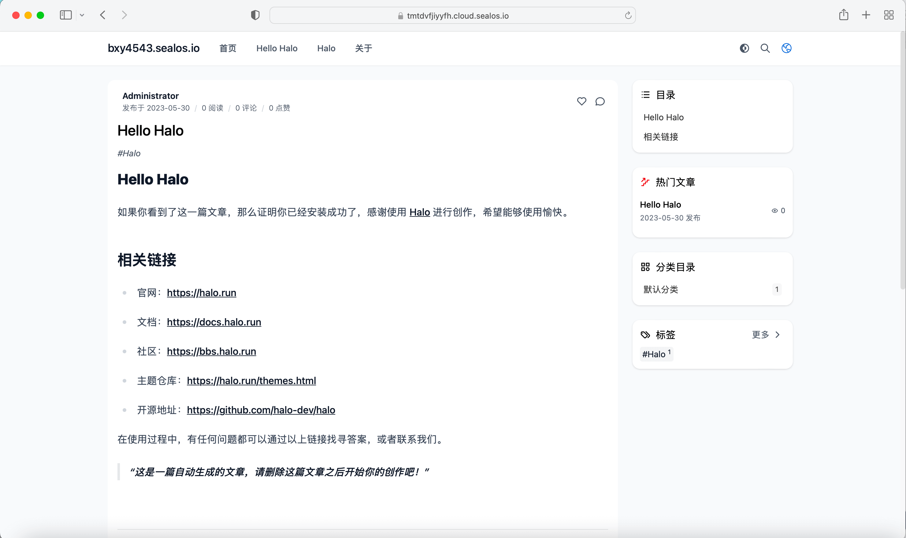

## FAQ

### Forgot Password

#### Enter the App Launchpad and click on "Logs":


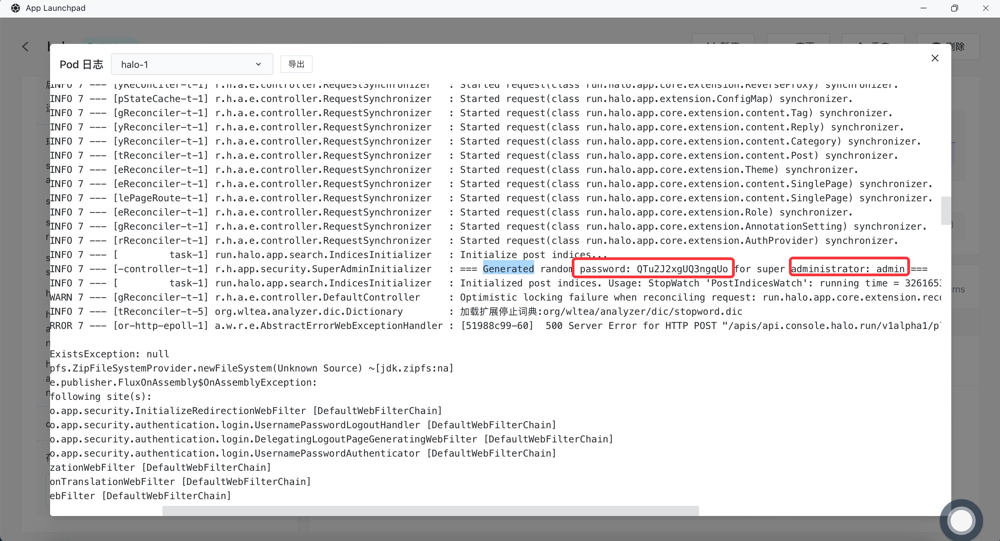

You can see the following information in the logs: Username: `admin` Password: `QTu2J2xgUQ3ngqUo`

#### Alternatively, you can view the logs by executing the following command in the terminal:

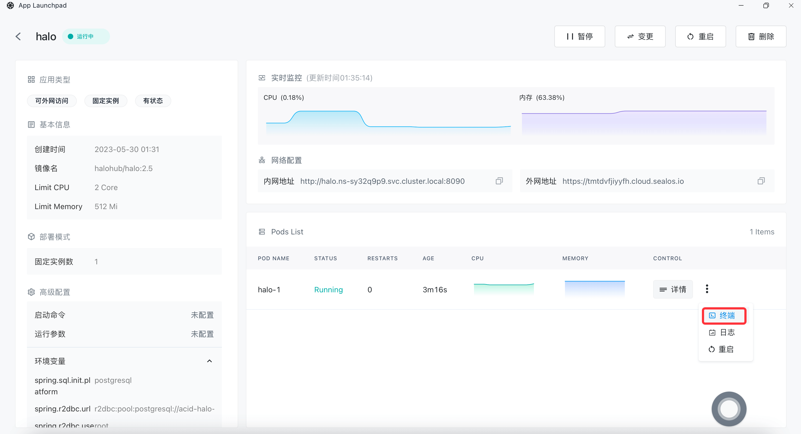

```
root@td3q8uc46:~# kubectl logs halo-0 | grep 'Generated random password:' | tail -1
2023-05-30T13:32:16.942+08:00  INFO 7 --- [-controller-t-1] r.h.app.security.SuperAdminInitializer   : === Generated random password: QTu2J2xgUQ3ngqUo for super administrator: admin ===
```

