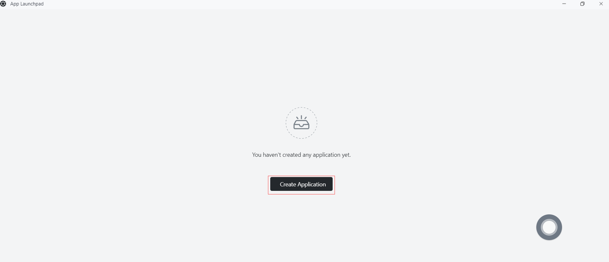

# Quick installation of Go Apps

First, make sure you have installed the following tools:

- Docker

## Step 1: Write Your Go Program

```go
package main

import (
	"fmt"
	"net/http"
)

func main() {
	http.HandleFunc("/", func(w http.ResponseWriter, r *http.Request) {
		fmt.Fprintf(w, "Hello, World!")
	})

	http.ListenAndServe(":8080", nil)
}
```

## Step 2: Create Docker Image

- In the same directory as `main.go`, create a file named `Dockerfile` with the following content:

```
FROM golang:1.17 as builder

WORKDIR /app
COPY . .

RUN go mod init myapp
RUN CGO_ENABLED=0 GOOS=linux go build -a -installsuffix cgo -o main .

FROM alpine:latest
RUN apk --no-cache add ca-certificates
WORKDIR /app
COPY --from=builder /app/main /app/

EXPOSE 8080
ENTRYPOINT ["/app/main"]
```

This `Dockerfile` defines a multi-stage build process. In the first stage, we use the official `golang` image as the base image and then compile the Go application. In the second stage, we use the lightweight `alpine` image, copy the compiled binary file to the `/app` directory, and expose port 8080.

- Run the following command in the directory where the `Dockerfile` is located to build a Docker image for the Go application:

```
docker build -t your_image_name .
```

Replace `your_image_name` with your image name and tag.

## Step 3: Push Docker Image

- Push the created Docker image to a Docker repository, such as Docker Hub or a private repository. **Assuming you are already logged in to the Docker repository**, use the following command to push the image:

  - First, tag the Docker image. Before pushing an image, you need to add a tag to it so that Docker knows where to push it. Run the following command to add a tag to the image:

    ```
  docker tag your-image-name your-dockerhub-username/your-repo-name:your-tag
    ```
    
    Replace `your-image-name` with your local image name, `your-dockerhub-username` with your Docker Hub username, `your-repo-name` with the repository name you want to create on Docker Hub, and `your-tag` with the tag you set for the image (e.g., latest).

    For example:

    ```
  docker tag demo damager6666/demo:latest
    ```

  - Next, push the Docker image. Use the following command to push the image to Docker Hub:
  
    ```
    docker push your-dockerhub-username/your-repo-name:your-tag
    ```
    
    Replace `your-dockerhub-username`, `your-repo-name`, and `your-tag` with the actual values. For example:

    ```
    docker push damager6666/demo:latest
    ```

## Step 4: Log in to Sealos

- Go to the [Sealos](https://cloud.sealos.io/) official website


## Step 5: Open the "App Launchpad" App


## Step 6: Create a New Application

- In "App Launchpad", click "Create New Application" to create a new application.



## Step 7: Application Deployment

- Basic Configuration:
  - Application Name (custom): go-demo
  - Image Name: damager6666/demo:latest
  - CPU (recommended): 1 Core
  - Memory (recommended): 1 G
- Deployment Mode:
  - Number of Instances (custom): 1


- Network Configuration:
  - Container Exposed Port: 8080
  - Internet Access: Enable


## Step 8: Deploy Application

- Click "Deploy Application" to start deploying the application.


## Step 9: Access Application

- Click "Application Management" to view. When the application's STATUS changes from Pending to Running, it means the application has started successfully.
- When STATUS is Running, you can directly access the external network address.


- In the browser, enter

```
https://tmgkflgdlstl.cloud.sealos.io/hello
```


- The page displays "Hello, World!", indicating that your Go application is running on Sealos.