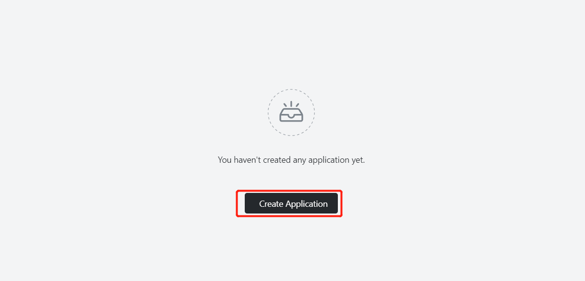

# 快速安装Gitea

Gitea 是一个自己托管的Git服务程序。他和GitHub, Bitbucket or Gitlab等比较类似。Gitea的首要目标是创建一个极易安装，运行非常快速，安装和使用体验良好的自建 Git 服务。

## 步骤 1：打开 「应用管理」 应用

## 步骤 2：新建应用

- 在 「应用管理」 中，点击「新建应用」来创建一个新的应用。

## 步骤 3：应用部署

- 基础配置：

  - 应用名称（自定义）：gitea
  - 镜像名（默认最新版本）：gitea/gitea:latest-rootless
  - CPU（推荐）：1 Core
  - 内存（推荐）：1 G

- 部署模式：

  - 实例数（自定义）：1

  

- 网络配置：

  - 容器暴露端口：3000
  - 外网访问：开启

  

- 高级配置：
  - 自定义本地存储，持久化 Appsmith 的数据（推荐 1 G）。
  - 

## 步骤 4：部署应用

- 点击「部署应用」开始部署应用。

## 步骤 5：访问应用

- 点击「详情」查看，当应用的 STATUS 由 Pending 变为 Running，则表明该应用已成功启动。

- 当 STATUS 为 Running，即可直接访问外网地址。

  

- 访问成功！
- 

