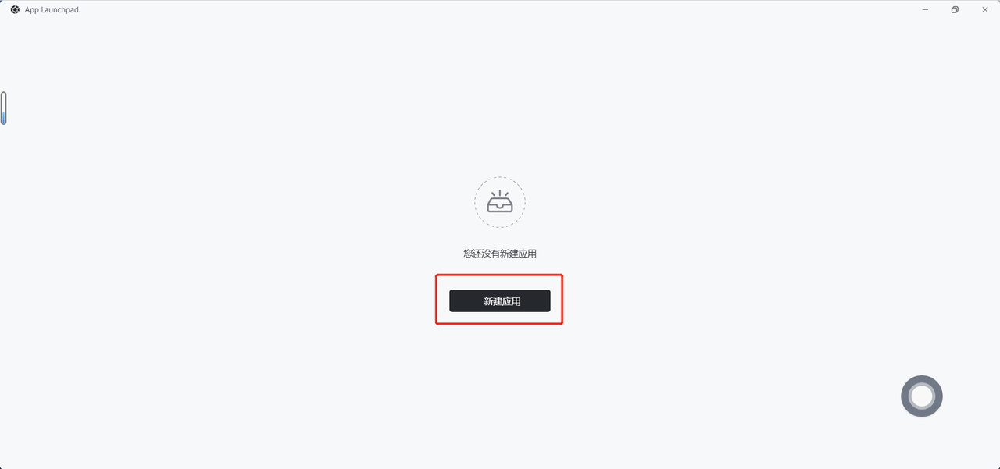
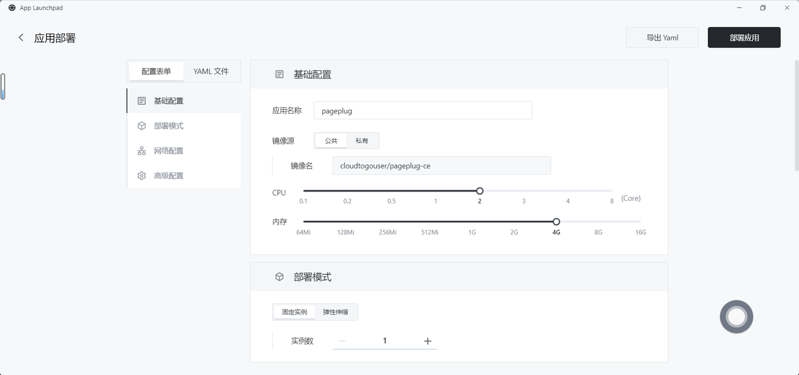
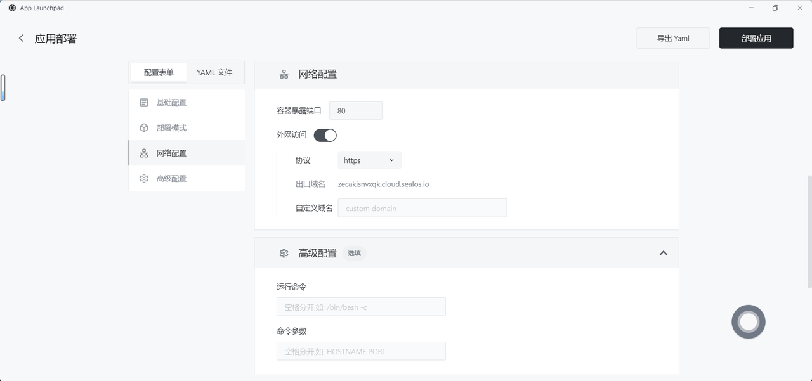
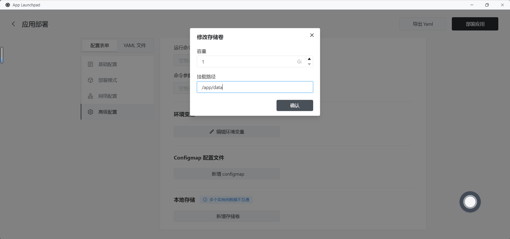
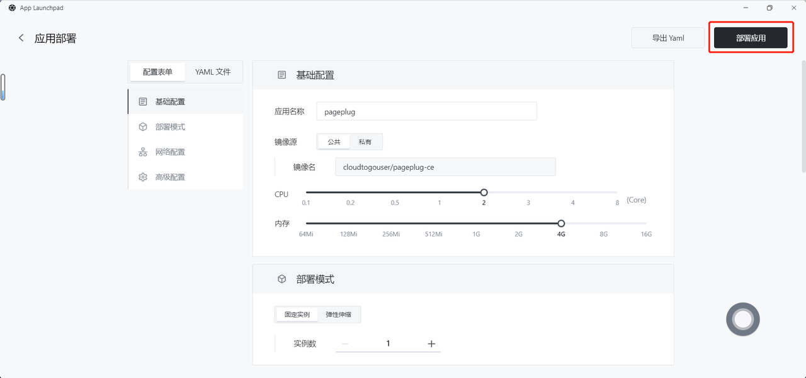
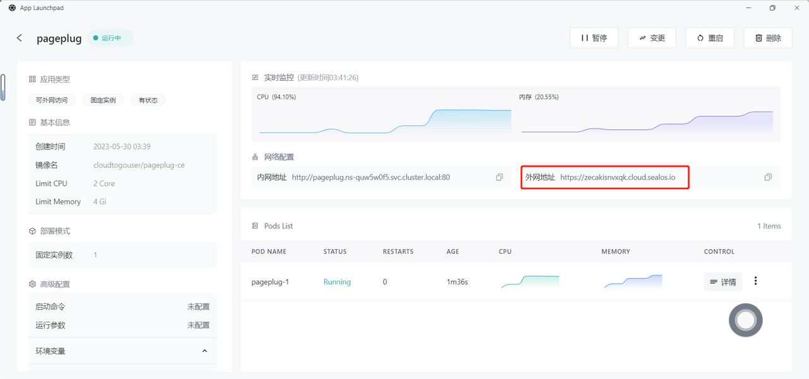
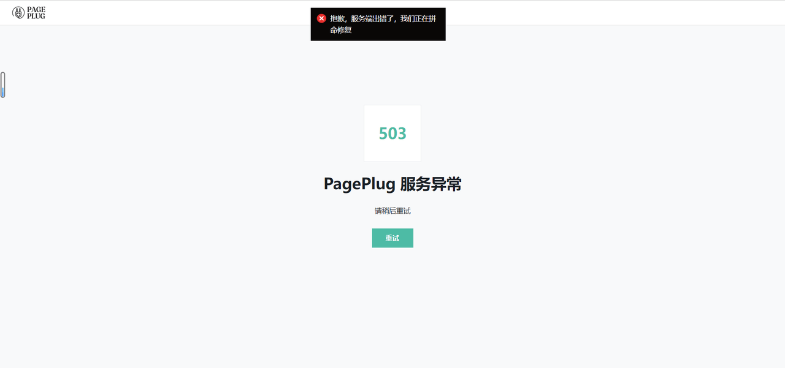

# Quick installation of low-code platform PagePlug

[PagePlug](https://github.com/cloudtogo/pageplug) is a Chinese project of [Appsmith](https://github.com/appsmithorg/appsmith), which optimizes the overall performance and Sinicizes based on Appsmith, and also integrates the characteristic form solution Formily component, chart solution Echarts component, low code Mini Program development, etc.
Is an open source, declarative, visual, intuitive front-end low-code framework for research and development.

## Step 1: open the App Launchpad application

## Step 2: create a new application

- In App Launchpad, click "New Application" to create a new application.

## Step 3: application deployment

- Basic configuration:
  
  - Application name (Custom): pageplug
  
  - Image name (default latest version): cloudtogouser/pageplug-ce
  
  - CPU (recommended): 2 Core
  
  - Memory (recommended): 4 GB

- Deployment model:
  
  - Number of instances (custom): 1

- Network configuration:
  
  - Container exposure port: 80
  
  - Public network access: enabled

- Advanced configuration:
  
  - Customize local storage and persist PagePlug data.

## Step 4: deploy the application

- Click "deploy Application" to start deploying the application.

## Step 5: access the application

- Click "details" to view, when the STATUS of the application has changed from Pending to Running, it indicates that the application has been launched successfully.

- When STATUS is Running, you can directly access the public network address.

- If a 503 exception occurs in the access, wait for a while and try again.

- The visit was successful!

