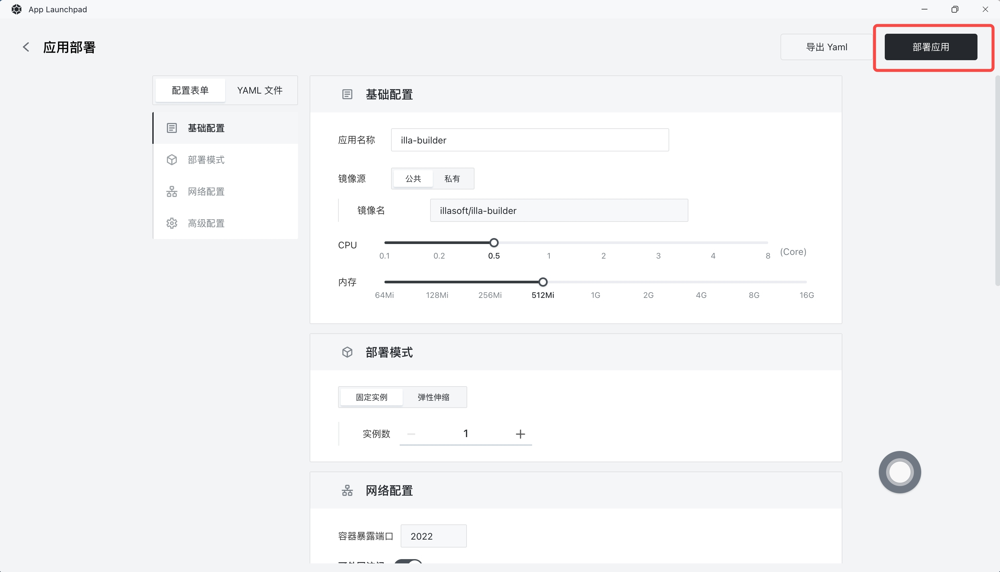
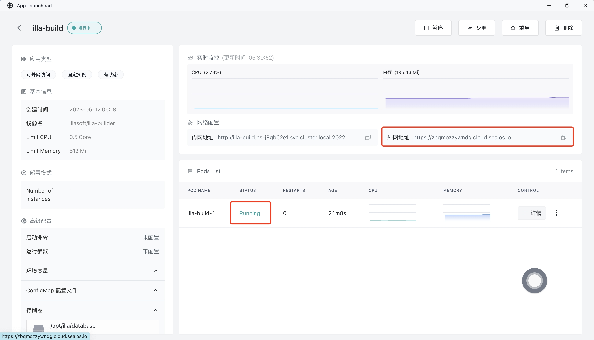

# Quick installation of ILLA Cloud

[ILLA Cloud](https://www.illacloud.com/zh-CN) is an open-source platform to build, deploy, and maintain internal apps. You can build anything from simple CRUD apps, admin panels, dashboards to custom business apps and complicated multi-step workflows.

## Step 1: open the App Launchpad application

## Step 2: create a new application

- In App Launchpad, click "New Application" to create a new application.

## Step 3: application deployment

- Basic configuration:

  - Application name (Custom): illa-builder

  - Image name (default latest version): illasoft/illa-builder

  - CPU (recommended): 0.5 Core

  - Memory (recommended): 512 MB

- deployment mode:

  - number of instances (custom): 1

- Network configuration:

  - Container exposure port: 2022

  - Public network access: enabled

  - Custom domain: (left blank in the example here but you may put your own domain down)

- Advanced configuration:

  - Customize local storage and persist ILLA Cloud data (15 GB is recommended).

## Step 4: deploy the application

- Click "deploy Application" to start deploying the application.

## Step 5: access the application

- Click "details" to view, when the STATUS of the application has changed from Pending to Running, it indicates that the application has been launched successfully.

- When STATUS is Running, you can directly access the public network address.

- The visit was successful!

