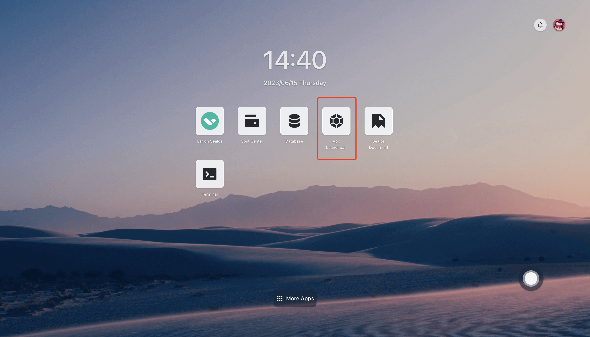
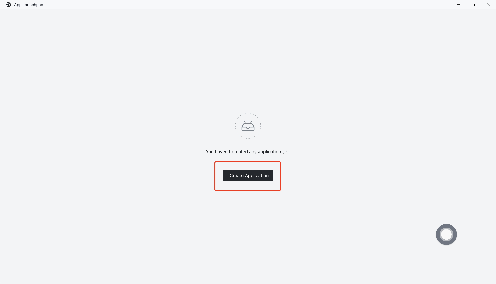
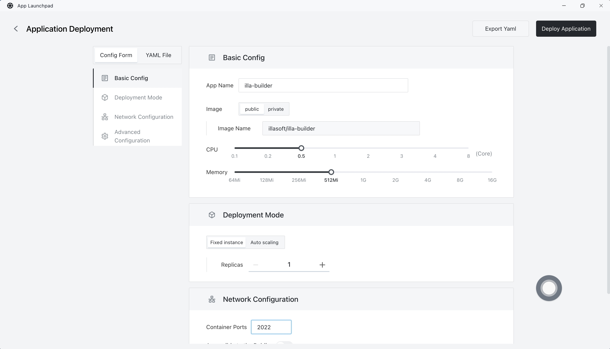
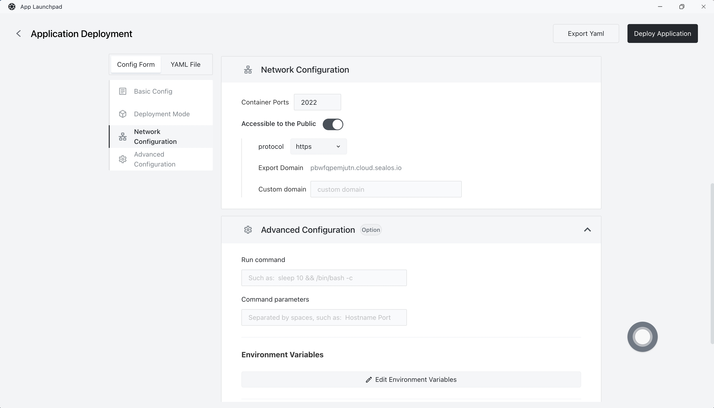
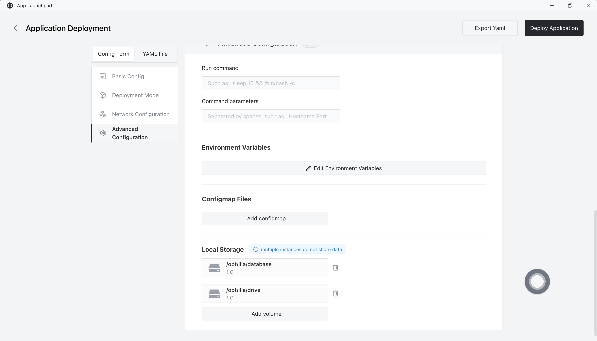
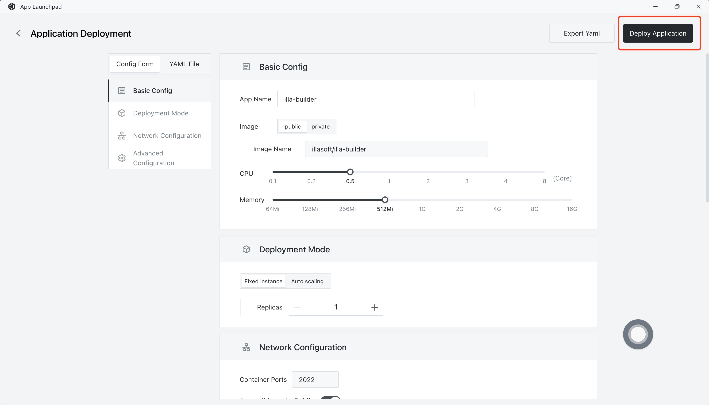
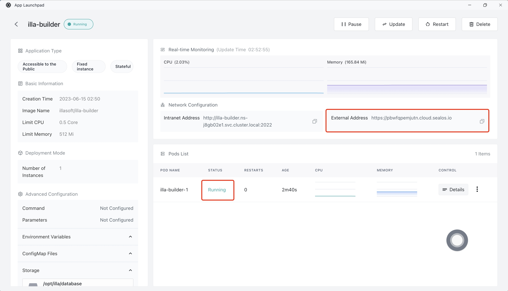

# Quick installation of ILLA Cloud

[ILLA Cloud](https://www.illacloud.com) is a low-code platform that is open-source, enabling users to create, deploy, and manage internal applications. With ILLA Cloud, you have the flexibility to build a wide range of applications, from basic CRUD apps to more complex multi-step workflows, using intuitive drag-and-drop components for building the user interface.

## Step 1: open the App Launchpad application in the [Sealos](https://cloud.sealos.io) desktop environment

## Step 2: create a new application

- In App Launchpad, click "New Application" to create a new application.

## Step 3: application deployment

- Basic configuration:

  - Application name (Custom): illa-builder

  - Image name (default latest version): illasoft/illa-builder

  - CPU (recommended): 0.5 Core

  - Memory (recommended): 512 MB

- deployment mode:

  - number of instances (custom): 1

- Note: the configuration here is the minimum requirement for successful running. You may use more based on your needs.

- Network configuration:

  - Container exposure port: 2022

  - Public network access: enabled

  - Note: Here we leave the custom domain blank, which does not affect running ILLA Cloud. You are welcome to put your own domain down.

- Advanced configuration:

  - Customize local database and drive (1 GB is the minimum).

## Step 4: deploy the application

- Click "deploy Application" to start deploying the application.

## Step 5: access the application

- Click "details" to view, when the STATUS of the application has changed from Pending to Running, it indicates that the application has been launched successfully.

- When STATUS is Running, you can directly access the public network address.

- The visit was successful!

