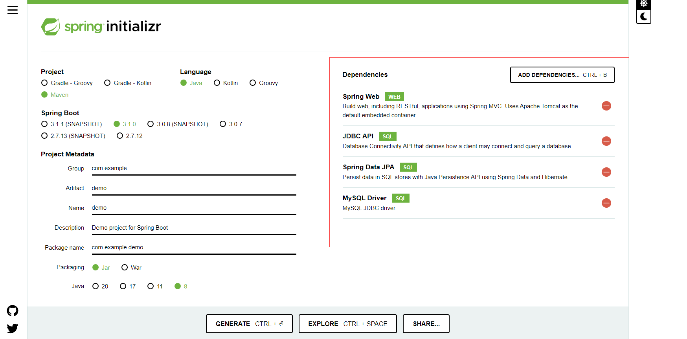
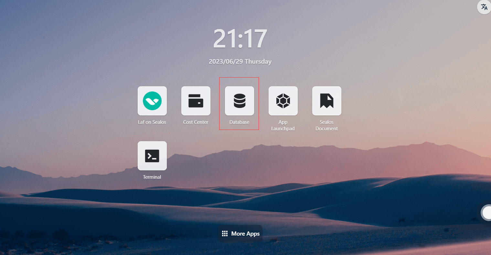
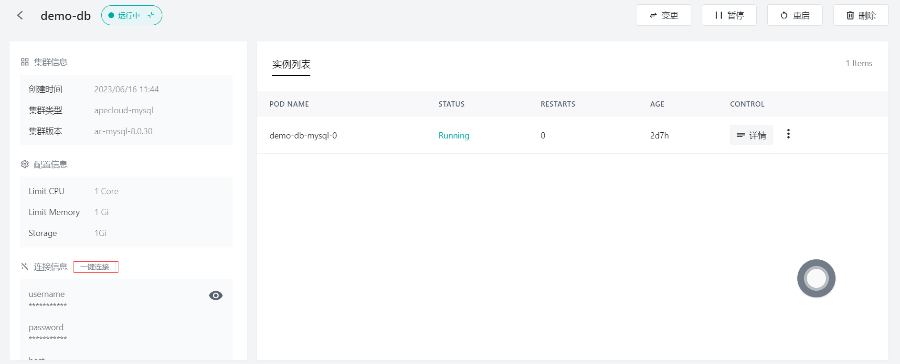
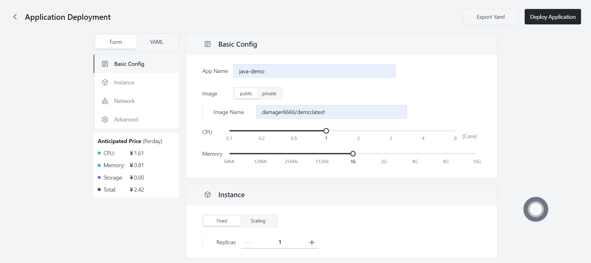

# Quick installation of Java Apps

First, make sure you have installed the following tools:

- Docker
- Maven

## Step 1: Write Your Java Program

- Here, directly generate a basic Spring Boot project through [Spring Initializr](https://start.spring.io/).



- Open the project's `pom.xml` file and add the following content to the `<dependencies>` section to include the MySQL JDBC driver:

  ```
  <dependency>
      <groupId>mysql</groupId>
      <artifactId>mysql-connector-java</artifactId>
  </dependency>
  ```

- Next, add the following content to the `application.properties` file in the `src/main/resources` directory to configure the database connection:

  ```
  spring.datasource.url=jdbc:mysql://localhost:3306/test_db?useSSL=false&serverTimezone=UTC&characterEncoding=UTF-8
  spring.datasource.username=root
  spring.datasource.password=your_password
  spring.jpa.hibernate.ddl-auto=update
  ```

## Step 2: Create Entity and Repository Classes

Create a new Java class in the project, such as `Person.java`, to represent the entity in the database. Add the following content:

```java
import javax.persistence.Entity;
import javax.persistence.GeneratedValue;
import javax.persistence.GenerationType;
import javax.persistence.Id;

@Entity
public class Person {
    @Id
    @GeneratedValue(strategy = GenerationType.IDENTITY)
    private Long id;
    private String name;

    // Getters and setters
    // ...
}
```

- Then create a repository interface, such as `PersonRepository.java`:

  ```java
  import org.springframework.data.jpa.repository.JpaRepository;
  import org.springframework.stereotype.Repository;
  
  @Repository
  public interface PersonRepository extends JpaRepository<Person, Long> {
  }
  ```

## Step 3: Create a Web Controller

- In the `src/main/java` directory of the project, create a simple web controller. For example, create a file named `PersonController.java` and add the following content:

```java
import org.springframework.beans.factory.annotation.Autowired;
import org.springframework.web.bind.annotation.*;

import java.util.List;

@RestController
public class PersonController {
    @Autowired
    private PersonRepository personRepository;

    @GetMapping("/getPersons")
    public String getAllPersons() {
        List<Person> persons = personRepository.findAll();
        StringBuilder sb = new StringBuilder();
        for (int i = 0; i < persons.size(); i++) {
            sb.append("id: " + persons.get(i).getId() + " name: " + persons.get(i).getName() + "/n");
        }
        System.out.println(sb.toString());
        return sb.toString();
    }

    @PostMapping(value = "/addPerson")
    public Person addPerson(@RequestBody Person person) {
        return personRepository.save(person);
    }


}
```

## Step 4: Build the Application

- Build the project using Maven by running the following command:

  ```
  mvn clean install
  ```


## Step 5: Create a Docker Image

- In the root directory of the Java project, create a file named `Dockerfile`. This file will contain the instructions required to build the Docker image. Here's a simple example Dockerfile:

  ````
  # Use the official OpenJDK image as the base image
  FROM openjdk:8-jre-slim
  
  # Set the working directory
  WORKDIR /app
  
  # Copy the built JAR file into the image
  COPY target/demo-0.0.1-SNAPSHOT.jar /app/demo-0.0.1-SNAPSHOT.jar
  
  # Expose the application's port
  EXPOSE 8080
  
  # Set the start command
  CMD ["java", "-jar", demo-0.0.1-SNAPSHOT.jar"]
  ```
  ````

- In the project root directory, run the following command to build the Docker image:

```
docker build -t java-demo .
```

## Step 6: Push the Docker Image

- Push the created Docker image to a Docker repository, such as Docker Hub or a private repository. **Assuming you are already logged in to the Docker repository**, use the following command to push the image:

  - First, tag the Docker image. Before pushing an image, you need to add a tag to it so that Docker knows where to push it. Run the following command to add a tag to the image:

    ```
    docker tag your-image-name your-dockerhub-username/your-repo-name:your-tag
    ```

    Replace `your-image-name` with your local image name, `your-dockerhub-username` with your Docker Hub username, `your-repo-name` with the repository name you want to create on Docker Hub, and `your-tag` with the tag you set for the image (e.g., `latest`).

  - Then, push the tagged image to the Docker repository:

    ```
    docker push your-dockerhub-username/your-repo-name:your-tag
    ```

## Step 7: Log in to Sealos

- Visit the [Sealos](https://cloud.sealos.io/) official website


## Step 8: Open the "Database" application



## Step 9: Create a database

- Click on "Create New Database"


- Basic configuration:
  - Cluster type: mysql
  - Cluster name: demo-db
  - CPU (recommended): 1 Core
  - Memory (recommended): 1 G
  - Number of instances: 1
  - Storage capacity: 1 Gi
- Click "Deploy Cluster"

## Step 10: Configure the database



- Click on "One-click Connect to Database" and execute the following statements:

  - Create the `test_db` database

    ```sql
    create database test_db;
    ```

  - Create the `test` table

    ```sql
    CREATE TABLE `name_info` (
      `id` int(11) NOT NULL,
      `name` varchar(12) COLLATE utf8mb4_unicode_ci DEFAULT NULL,
      PRIMARY KEY (`id`)
    );
    ```

  - Insert data

    ```sql
    insert into test values (1,'Sealos');
    ```

## Step 11: Open the "App Launchpad" application


## Step 12: Create a new application

- In "App Launchpad", click on "Create New Application" to create a new application.


## Step 13: Deploy the application

- Basic configuration:
  - Application name (custom): java-demo
  - Image name: damager6666/java-demo:v2
  - CPU (recommended): 1 Core
  - Memory (recommended): 1 G
- Deployment mode:
  - Number of instances (custom): 1



- Network configuration:
  - Exposed container port: 8080
  - Public network access: enabled


## Step 14: Deploy the application

- Click on "Deploy Application" to start deploying the application.


## Step 15: Access the application

- Click on "Application Management" to view the application. When the application's STATUS changes from Pending to Running, it indicates that the application has started successfully.
- When the STATUS is Running, you can directly access the public network address.


- Enter the following in your browser:

```
https://tmgkflgdlstl.cloud.sealos.io/getPersons
```


- The page displays the data inserted into the database earlier, indicating that your Java application is now running on Sealos.

