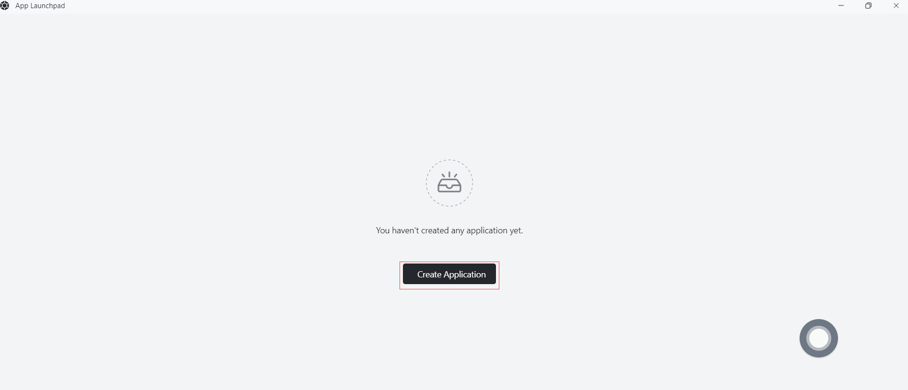
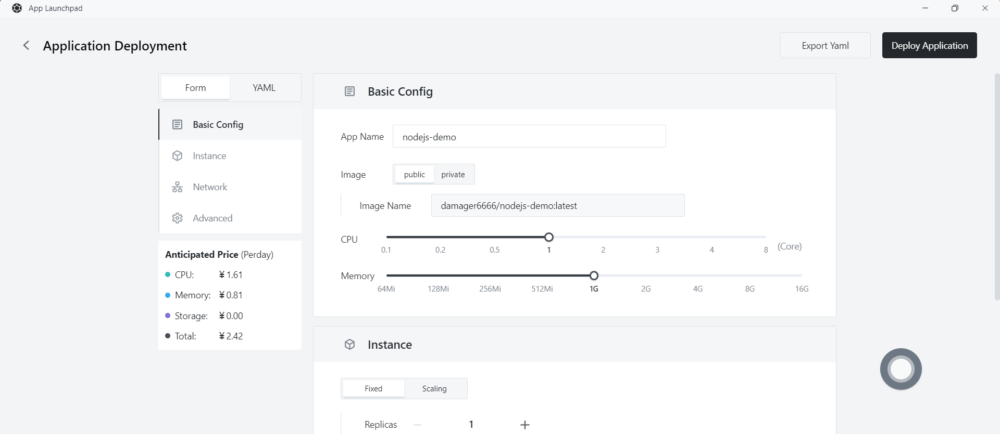
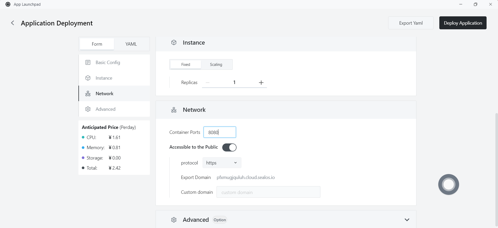
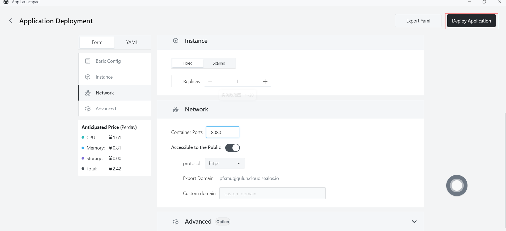
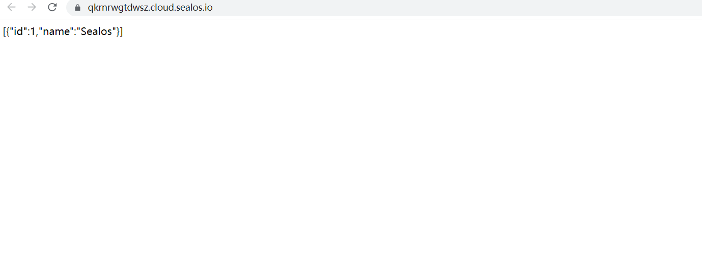

# Quick installation of Node.js Apps

First, make sure you have installed the following tools:

- Docker

## Step 1: Write your Node.js program

- Create a file named `app.js` in your directory and add the following code:

  ```js
  const express = require('express');
  const mysql = require('mysql');
  const app = express();
  
  const db = mysql.createConnection({
    host: process.env.DB_HOST,
    user: process.env.DB_USER,
    password: process.env.DB_PASSWORD,
    database: process.env.DB_NAME,
  });
  
  db.connect((err) => {
    if (err) throw err;
    console.log('Connected to the database.');
  });
  
  app.get('/', (req, res) => {
    db.query('SELECT id, name FROM users', (err, results) => {
      if (err) throw err;
      res.send(JSON.stringify(results));
    });
  });
  
  app.listen(8080, () => {
    console.log('Server is running on port 8080');
  });
  ```

- Create a file named `package.json` in the root directory of your project, and include the following content:

  ~~~json
  {
    "name": "nodejs-web-app-mysql",
    "version": "1.0.0",
    "main": "app.js",
    "scripts": {
      "start": "node app.js"
    },
    "dependencies": {
      "express": "^4.17.1",
      "mysql": "^2.18.1"
    }
  }
  ```
  ~~~

## Step 2: Create a Docker image

- In the root directory of your project, create a file named `Dockerfile`. This file will contain the instructions needed to build the Docker image. Here is a simple example Dockerfile:

```dockerfile
FROM node:16

WORKDIR /app

COPY package*.json ./

RUN npm install

COPY . .

EXPOSE 8080

CMD ["npm", "start"]
```

## Step 3: Build the Docker image

- Run the following command in the directory containing the `Dockerfile` to build the Docker image:

  ```
  docker build -t nodejs-demo .
  ```

## Step 4: Push the Docker image

- Push the created Docker image to a Docker repository, such as Docker Hub or a private repository. **Assuming you have logged in to the Docker repository**, use the following command to push the image:

  - First, tag the Docker image. Before pushing the image, you need to add a tag to it so that Docker knows where to push it. Run the following command to add a tag to the image:

    ```
    docker tag your-image-name your-dockerhub-username/your-repo-name:your-tag
    ```

    Replace `your-image-name` with the name of your local image, `your-dockerhub-username` with your Docker Hub username, `your-repo-name` with the name of the repository you want to create on Docker Hub, and `your-tag` with the tag you set for the image (e.g. latest).

    For example:

    ```
    docker tag nodejs-demo damager6666/nodejs-demo:v1
    ```

  - Next, push the Docker image. Use the following command to push the image to Docker Hub:

    ```
    docker push your-dockerhub-username/your-repo-name:your-tag
    ```

    Replace `your-dockerhub-username`, `your-repo-name`, and `your-tag` with the actual values. For example:

    ```
    docker push damager6666/nodejs-demo:v1
    ```

## Step 5: Login to Sealos

- Go to the [Sealos](https://cloud.sealos.io/) website.


## Step 6: Open the "Database" application


## Step 7: Create a database

- Click on "Create a database"


- Basic configuration:
  - Cluster type: mysql
  - Cluster name: demo-db
  - CPU (recommended): 1 Core
  - Memory (recommended): 1 G
  - Number of instances: 1
  - Storage capacity: 1 Gi
- Click "Deploy Cluster"

## Step 8: Configure the database


- Click "Connect to the database" to execute the following statements:

  - Create a database named test_db

    ```sql
    create database test_db;
    ```

  - Create a table named test

    ```sql
    CREATE TABLE `name_info` (
      `id` int(11) NOT NULL,
      `name` varchar(12) COLLATE utf8mb4_unicode_ci DEFAULT NULL,
      PRIMARY KEY (`id`)
    );
    ```

  - Insert some data

    ```sql
    insert into test values (1,'Sealos');
    ```

## Step 9: Open the "App Launchpad" application


## Step 10: Create a new application

- In App Launchpad", click "Create New Application" to create a new application.



## Step 11: Deploy the application

- Basic configuration:
  - Application name (customizable): nodejs-demo
  - Image name : damager6666/nodejs-demo:v1
  - CPU (recommended): 1 core
  - Memory (recommended): 1 G
- Deployment mode:
  - Number of instances (customizable): 1



- Network configuration:
  - Exposed container port: 8080
  - External network access: enabled



## Step 12: Deploy the application

- Click "Deploy Application" to start deploying the application.



## Step 13: Access the application

- Click "App Launchpad" to view the application status. When the STATUS changes from Pending to Running, it means that the application has been successfully launched.
- When the STATUS is Running, you can directly access the external network address.


- Enter the following URL in your browser:

```
https://tmgkflgdlstl.cloud.sealos.io/getPersons
```



- The page will display the data inserted into the database, indicating that your Node.js application is running on Sealos.