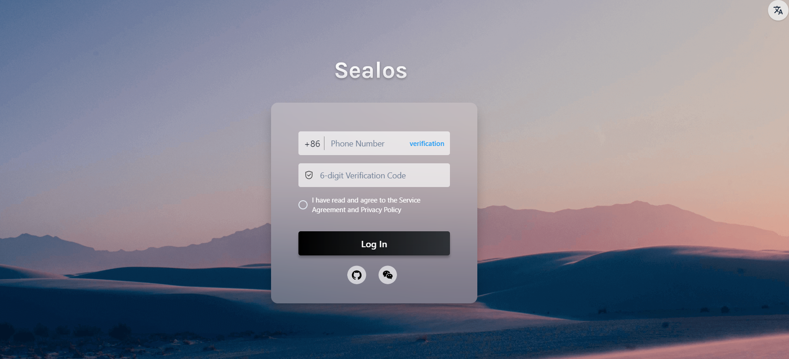
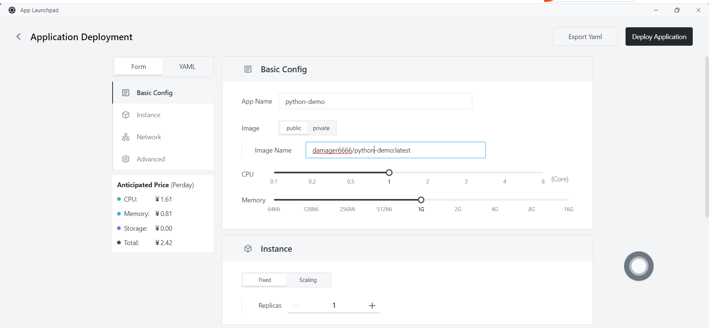
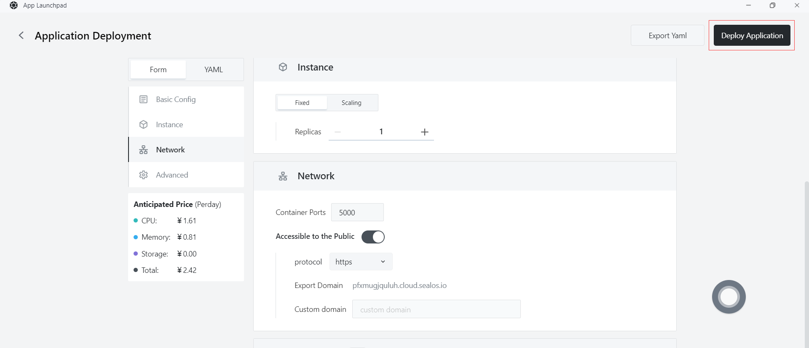
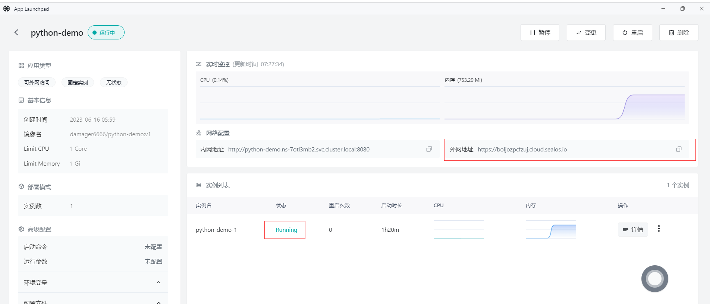
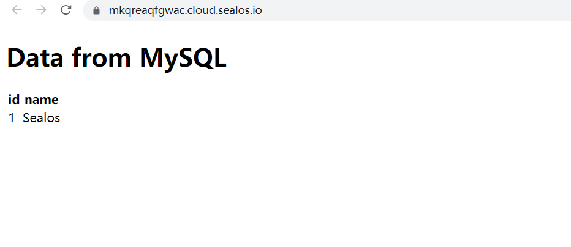

# Quick installation of Python Apps

First, make sure you have the following tools installed:

- Docker

## Step 1: Write your Python program

- Create a file named `app.py` in your project directory and add the following code:

  ```python
  from flask import Flask, render_template
  import mysql.connector
  
  app = Flask(__name__)
  
  def get_data_from_database():
      cnx = mysql.connector.connect(
          host="java-demo-db-mysql.ns-7otl3mb2.svc",
          user="root",
          password="l9h8f24b",
          database="test_db"
      )
  
      cursor = cnx.cursor()
      cursor.execute("SELECT * FROM test")
      data = cursor.fetchall()
      cursor.close()
      cnx.close()
  
      return data
  
  @app.route('/')
  def index():
      data = get_data_from_database()
      return render_template('index.html', data=data)
  
  if __name__ == '__main__':
      app.run(host='0.0.0.0', debug=True)
  
  ```

- Create a file named `requirements.txt` in the directory to list the dependencies required by the application.

```
Flask
mysql-connector-python
```

- Create a folder named `templates` in your project directory and create a file named `index.html` inside it. Add the following content to `index.html`:

  ```html
  <!doctype html>
  <html lang="en">
    <head>
      <meta charset="utf-8">
      <title>Data from MySQL</title>
    </head>
    <body>
      <h1>Data from MySQL</h1>
      <table>
        <tr>
          <th>Column1</th>
          <th>Column2</th>
          <th>Column3</th>
        </tr>
        
          <tr>
            <td>{{ row[0] }}</td>
            <td>{{ row[1] }}</td>
            <td>{{ row[2] }}</td>
          </tr>
        
      </table>
    </body>
  </html>
  
  Replace `Column1`, `Column2`, and `Column3` with the actual column names you want to display.
  ```

## Step 2: Create a Docker image

- Create a file named `Dockerfile` in the root directory of the project. This file will contain the instructions needed to build the Docker image. Here is a simple example Dockerfile:

  ```dockerfile
  FROM python:3.8
  
  WORKDIR /app
  
  COPY requirements.txt .
  
  RUN pip install --no-cache-dir -r requirements.txt
  
  COPY . .
  
  EXPOSE 5000
  
  CMD ["python", "app.py"]
  ```

## Step 3: Build the Docker image

- Run the following command in the directory containing the `Dockerfile` to build the Docker image:

  ```
  docker build -t python-demo .
  ```

## Step 4: Push the Docker image

- Push the created Docker image to a Docker repository, such as Docker Hub or a private repository. **Assuming that you have logged in to the Docker repository**, use the following command to push the image:

  - First, tag the Docker image. Before pushing the image, you need to add a tag to it so that Docker knows where to push it. Run the following command to add a tag to the image:

    ```
    docker tag your-image-name your-dockerhub-username/your-repo-name:your-tag
    ```

    Replace `your-image-name` with your local image name, `your-dockerhub-username` with your Docker Hub username, `your-repo-name` with the name of the repository you want to create on Docker Hub, and `your-tag` with the tag you set for the image (e.g. latest).

    For example:

    ```
    docker tag python-demo damager6666/python-demo:v1
    ```

  - Next, push the Docker image. Use the following command to push the image to Docker Hub:

    ```
    docker push your-dockerhub-username/your-repo-name:your-tag
    ```

    Replace `your-dockerhub-username`, `your-repo-name`, and `your-tag` with the actual values. For example:

    ```
    docker push damager6666/python-demo:v1
    ```

## Step 5: Log in to Sealos

- Go to the [Sealos](https://cloud.sealos.io/) website.



## Step 6: Open the "Database" application


## Step 7: Create a database

- Click "Create Database"


- Basic Configuration:
  - Cluster Type: mysql
  - Cluster Name: demo-db
  - CPU (Recommended): 1 Core
  - Memory (Recommended): 1 G
  - Number of Instances: 1
  - Storage Capacity: 1 Gi
- Click "Deploy Cluster"

## Step 8: Configure the database


- Click "Connect to the Database" and execute the following SQL statements:

  - Create the test_db database

    ```sql
    create database test_db;
    ```

  - Create the test table

    ```sql
    CREATE TABLE `name_info` (
      `id` int(11) NOT NULL,
      `name` varchar(12) COLLATE utf8mb4_unicode_ci DEFAULT NULL,
      PRIMARY KEY (`id`)
    );
    ```

  - Insert data

    ```sql
    insert into test values (1,'Sealos');
    ```

## Step 9: Open the "App Management" application


## Step 10: Create a new app

- In "App Management", click "New App" to create a new app.


## Step 11: App deployment

- Basic Configuration:
  - Application Name (Customized): python-demo
  - Image Name: damager6666/python-demo:v1
  - CPU (Recommended): 1 Core
  - Memory (Recommended): 1 G
- Deployment Mode:
  - Number of Instances (Customized): 1



- Network Configuration:
  - Container Exposed Port: 5000
  - External Access: Enabled


## Step 12: Deploy the app



## Step 13: Access the app

- Click "App Management" to check when the STATUS of the app changes from "Pending" to "Running", indicating that the app has been successfully launched.
- When the STATUS is Running, you can directly access the external network address.



- Enter the external network address in the browser to access the data that was just stored in MySQL, indicating that the program has been successfully deployed on Sealos.

  ```http
  https://mkqreaqfgwac.cloud.sealos.io/
  ```

