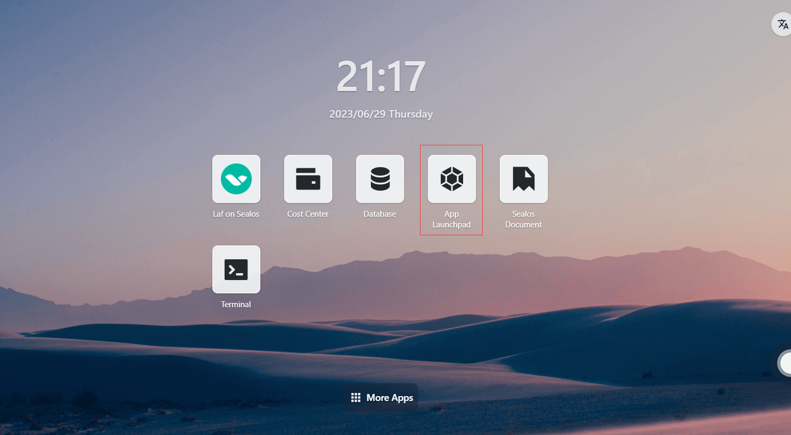
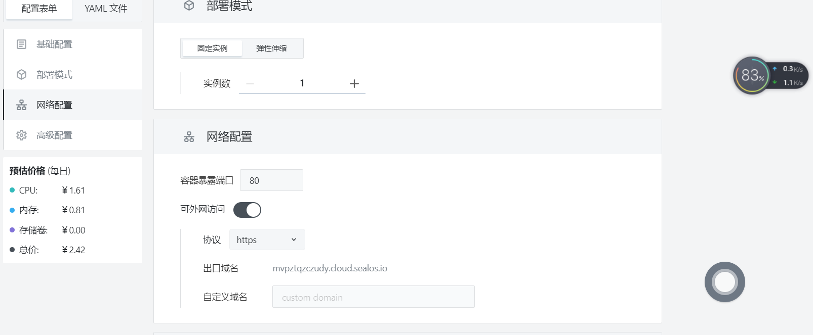
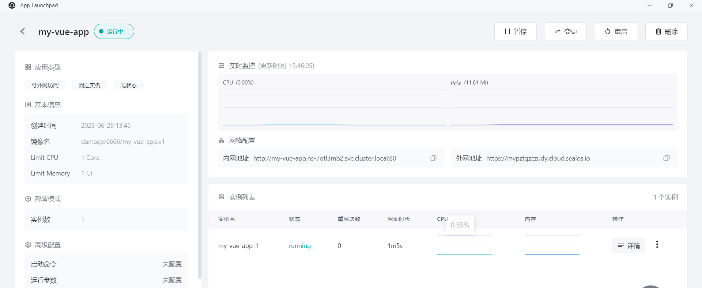

# Quick installation of Vue Apps

First, make sure you have installed the following tools:

- Docker
- Node.js
- npm

## Step 1: Install Vue CLI

```bash
npm install -g @vue/cli
```

## Step 2: Create a new project with Vue CLI

```bash
vue create my-vue-app
```

## Step 3: Build the production version of the project with Vue CLI

```bash
cd my-vue-app
npm run build
```

## Step 4: Create a Docker image

- In the `my-vue-app` directory, create a file named `Dockerfile` with the following content:

```dockerfile
# 使用 nginx 镜像作为基础镜像
FROM nginx:1.21-alpine

# 复制构建的前端文件到 nginx 容器中
COPY dist/ /usr/share/nginx/html

# 暴露端口
EXPOSE 80

# 启动 nginx
CMD ["nginx", "-g", "daemon off;"]
```

- Run the following command in the directory where the `Dockerfile` is located to build a Docker image for the Vue application:

```bash
docker build -t my-vue-app .
```

## Step 5: Push Docker Image

- Push the created Docker image to a Docker repository, such as Docker Hub or a private repository. **Assuming you are already logged in to the Docker repository**, use the following command to push the image:

  - First, tag the Docker image. Before pushing an image, you need to add a tag to it so that Docker knows where to push it. Run the following command to add a tag to the image:

    ```
    docker tag your-image-name your-dockerhub-username/your-repo-name:your-tag
    ```

    Replace `your-image-name` with your local image name, `your-dockerhub-username` with your Docker Hub username, `your-repo-name` with the repository name you want to create on Docker Hub, and `your-tag` with the tag you set for the image (e.g., latest).

    For example:

    ```
    docker tag my-vue-app damager6666/my-vue-app:v1
    ```

  - Next, push the Docker image. Use the following command to push the image to Docker Hub:

    ```
    docker push your-dockerhub-username/your-repo-name:your-tag
    ```

    Replace `your-dockerhub-username`, `your-repo-name`, and `your-tag` with the actual values. For example:

    ```
    docker push damager6666/my-vue-app:v1
    ```

## Step 6: Log in to Sealos

- Go to the [Sealos](https://cloud.sealos.io/) official website


## Step 7: Open the "App Launchpad" App



## Step 8: Create a New Application

- In "App Launchpad", click "Create New Application" to create a new application.


## Step 9: Application Deployment

- Basic Configuration:
  - Application Name (custom): my-vue-app
  - Image Name: damager6666/my-vue-app:v1
  - CPU (recommended): 1 Core
  - Memory (recommended): 1 G
- Deployment Mode:
  - Number of Instances (custom): 1


- Network Configuration:
  - Container Exposed Port: 80
  - Internet Access: Enable



## Step 10: Deploy Application

- Click "Deploy Application" to start deploying the application.



## Step 11: Access Application

- Click "Application Management" to view. When the application's STATUS changes from Pending to Running, it means the application has started successfully.
- When STATUS is Running, you can directly access the external network address.


- In the browser, enter

```
https://mvpztqzczudy.cloud.sealos.io
```

)

- The page displays "Hello, Vue.js!", indicating that your Vue application is running on Sealos.