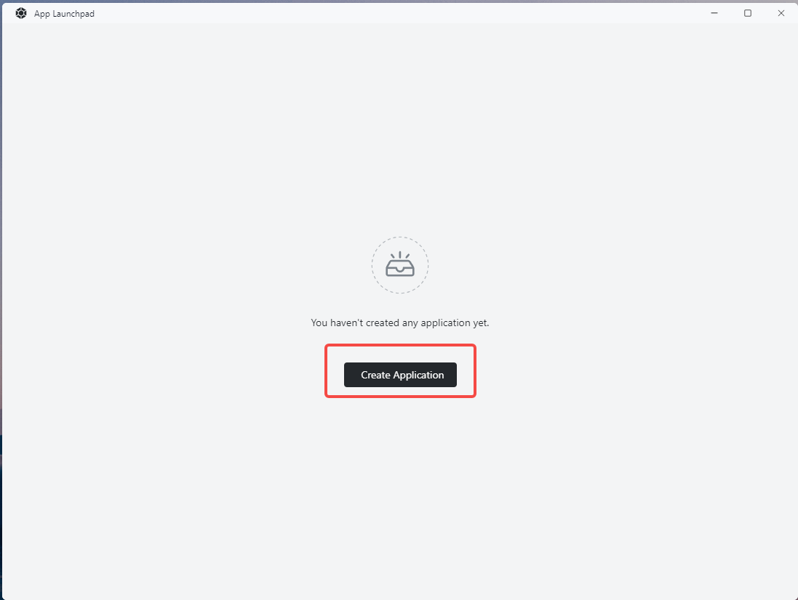
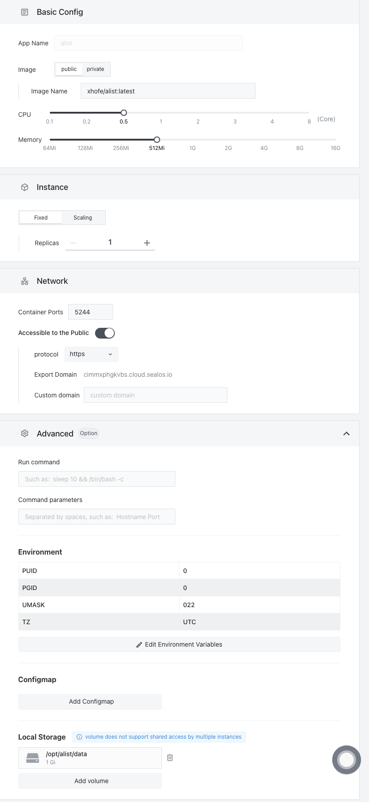
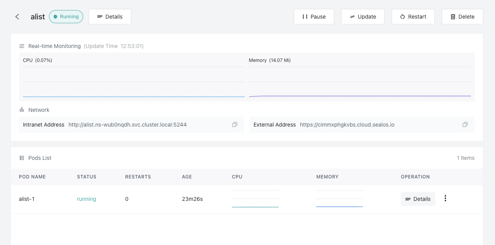
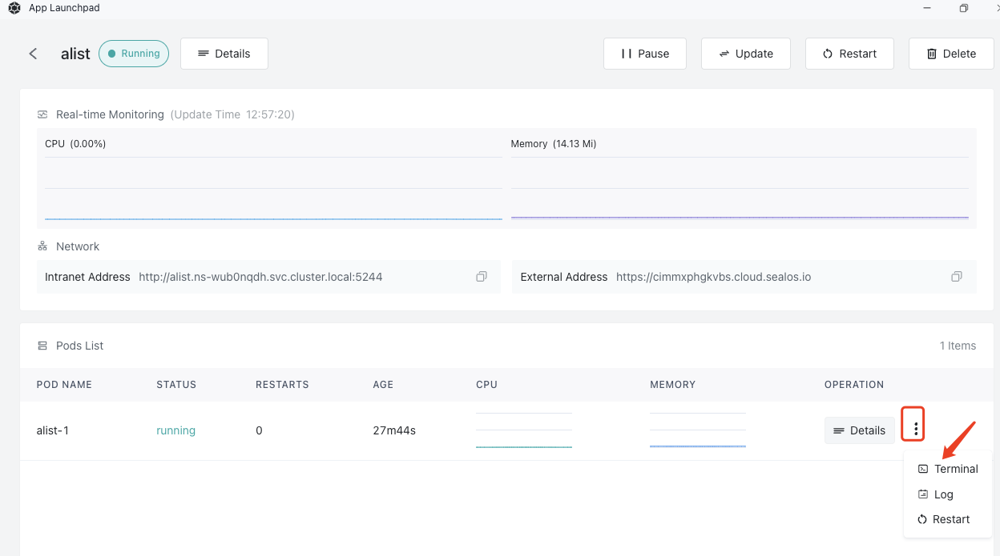
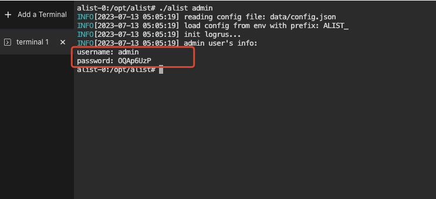
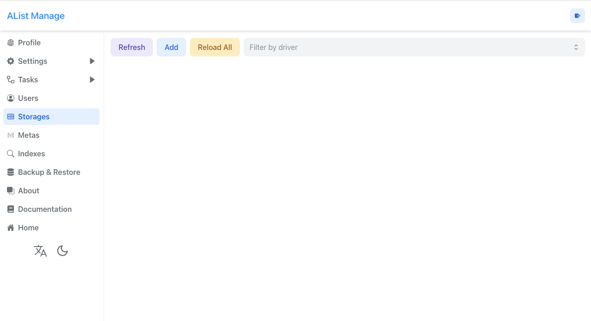

# Fast installation alist

[alist](https://alist.nn.ci/guide/) is a document management application of the people, can mount a variety of storage, and support the standard WebDAV protocol.

## First enter the Sealos and open the [application management]

## Create an application



### Install alist

`alist` have a special image file and installation is very simple.

Now we will deploy ` alist `.

`alist` need configuration is as follows.

- Using a mirror:`xhofe/alist:latest`
- Exposed container port:`5244`(Remember to open the network access)
- Configure the environment variables as follows:

```env
PUID=0
PGID=0
UMASK=022
TZ=UTC
```

- The local store:`/opt/alist/data`

The result is as follows:



Wait patiently for a period of time after can see ` alist ` service has been started up



## Enter the alist

Click on the web address, can direct access to their own alist service

## Access to the admin account password

Click for details on the side of the three points, into the terminal.





Input `./alist admin` admin password, from the website can modify the initial password after login

## Add Storage=

Login and then click the button at the bottom of the management, can enter the alist management background



alist support a variety of network backup, object storage access

The concrete can view the official document

[alist](https://alist.nn.ci/guide/)
