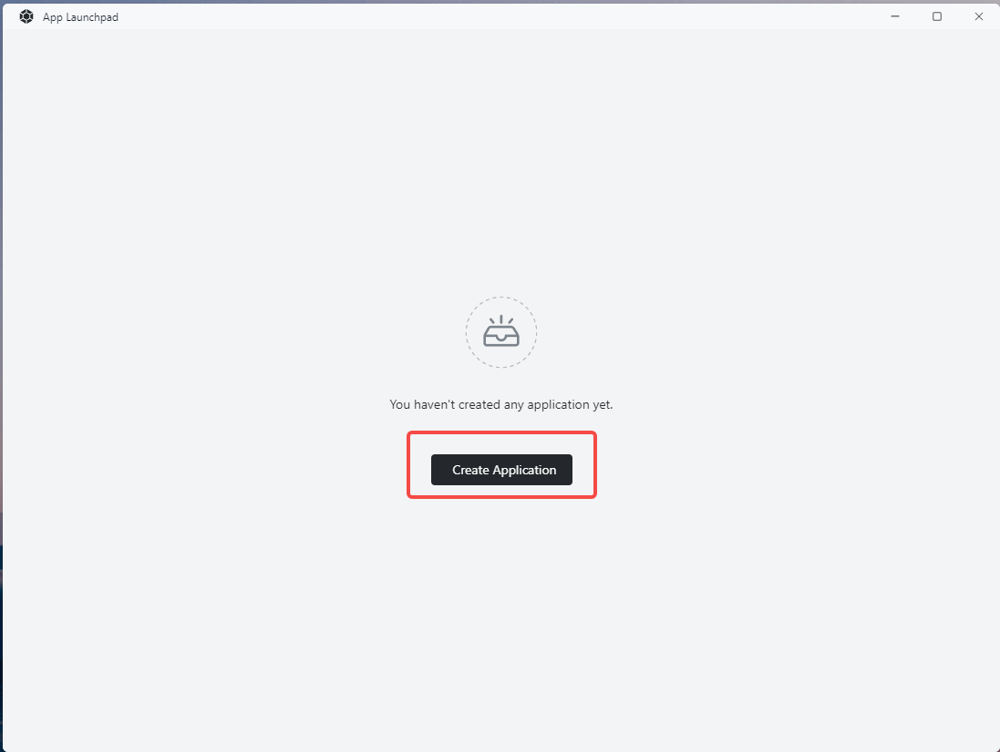

# Quick install discuz

[discuz](https://gitee.com/Discuz/DiscuzX) is an open source BBS program that provides a rich features and plug-ins, is widely used in various websites and communities.

## First enter the Sealos and open the "application management"

## Create an new application



### install discuz

`discuz` Have a special image file and installation is very simple.

Now we will deploy ` discuz `.

`discuz` The required configuration is as follows.

- Using a mirror:`tencentci/discuz`
- Exposed container port:`80`

The result is as follows:


Wait patiently for a period of time after can see ` discuz ` service has been started up


Click agree, the next step

## Install discuz Mysql database

`Mysql` The required configuration is as follows.

- App name:`discuz-db`
- Image name:: `mysql:5.7`
- Container Ports:`3306`
- Environment:

```env
MYSQL_ROOT_PASSWORD=123456
```

The result is as follows:


The database server address directly fill in the database container name just installed:

## Initialize the discuz

Back to the discuz application, click outside the web address into the discuz initialize the page


- The database server address: ` discuz - db ` (here you can directly fill in the database name)

- Database password:`123456`

Other configuration items according to the need to modify.
