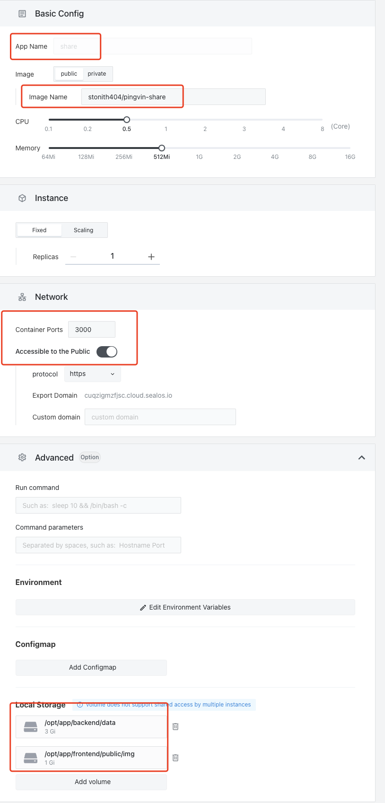

# Fast installation pingvin-share

[pingvin-share](https://github.com/stonith404/pingvin-share) is a private file sharing tools

## First enter the Sealos and open the [application management]

## Create an application

According to the following configuration



```shell
App Name： `pingvin-share`
Image Name： `stonith404/pingvin-share`
port 3000
Accessible to the Public： on
Local Storage：
  /opt/app/backend/data
  /opt/app/frontend/public/img
```

## Deploy and online

Click on the upper right corner of the deployed application.
