# Quick installation of Tailchat

[Tailchat](https://tailchat.msgbyte.com/) is an open source IM application that is pluggable and easy to expand. Plugin architecture gives Tailchat unlimited possibilities.

Front-end micro-kernel architecture + back-end micro-service architecture makes Tailchat to control any customized/privatized scenarios

Created for enterprises and private domain users, highly free group management and customized panel display allow private domain owners to better display their works, manage users, and build their own brand and circle.

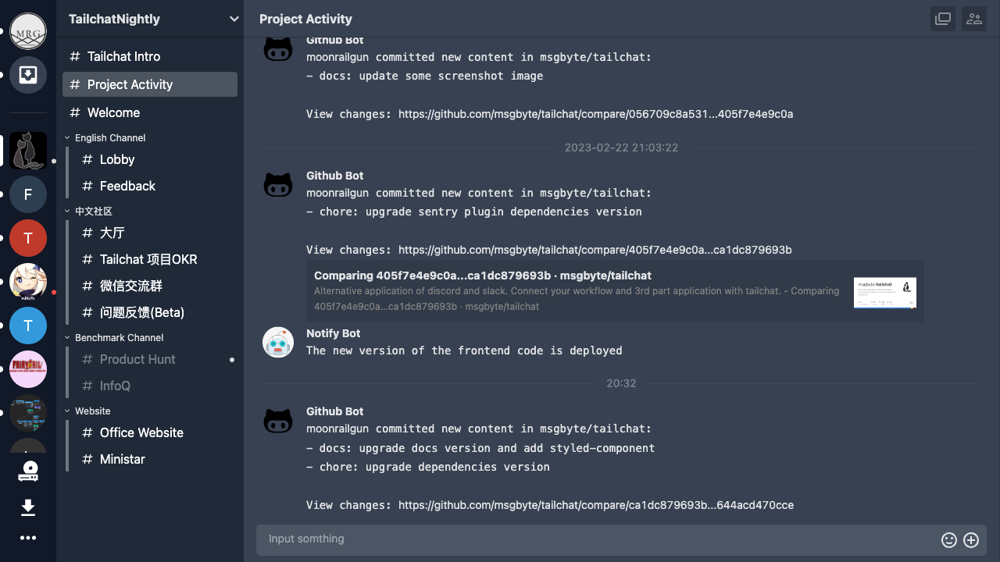

## First, enter Sealos and open "Application Management"

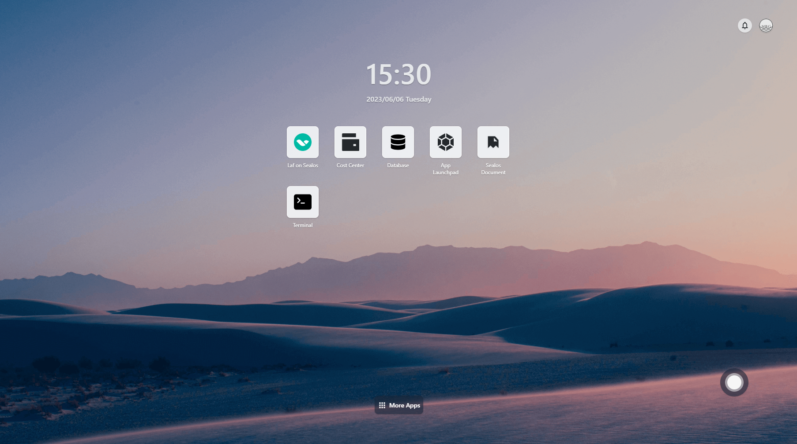

## Create a new application


### Create dependencies

As an enterprise-level application, `tailchat` has the minimum dependencies of `mongodb`, `redis`, and `minio`. Let's create them one by one.

#### MongoDB

For convenience, we will fix one instance and bind it to local storage. The image used is `mongo:4`. Note that because we did not set a password for the database, do not provide network services to the public network. The container exposes port 27017, which is the default database service port. The content is as follows:

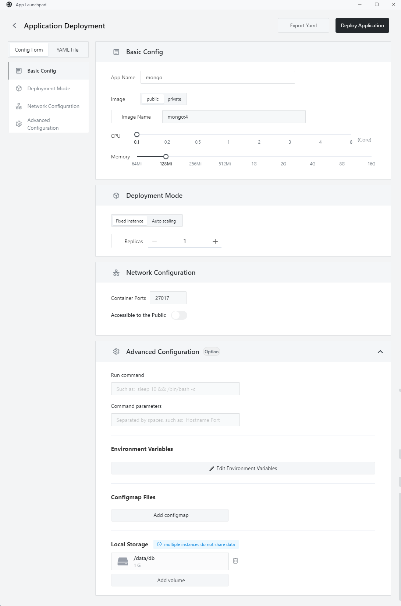

Click "Deploy Application" to submit the deployment. Wait patiently for a while, and you can see that the application has started up.


> Note: that the initial allocation of 64m is too small for MongoDB, so I changed it to 128m by modifying the application. Resource allocation can be changed at any time, which is also a convenient feature of Sealos/Kubernetes.

#### Minio

Next, we will create Minio, an open-source object storage service. We can also quickly create it through Sealos's UI. The image used is `minio/minio`. Note that we need to make some adjustments:

- Expose port: 9000
- Change the run command to: `minio`
- Change the command parameters to: `server /data`
- Set environment variables:
  - MINIO_ROOT_USER: tailchat
  - MINIO_ROOT_PASSWORD: com.msgbyte.tailchat
- Local storage: `/data`

The final result is as follows:

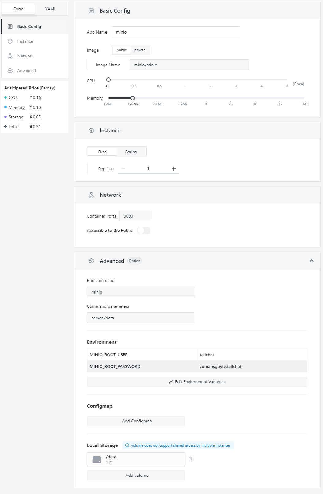

Click the "Deploy" button and you can see that the service has started up normally.

#### Redis

Finally, we need to deploy Redis as a content cache and message forwarding. The image used is `redis:alpine`, and the exposed port is `6379`. The final result is as follows:


### Create Tailchat itself

At this point, all the dependencies required by Tailchat have been deployed, as shown below:

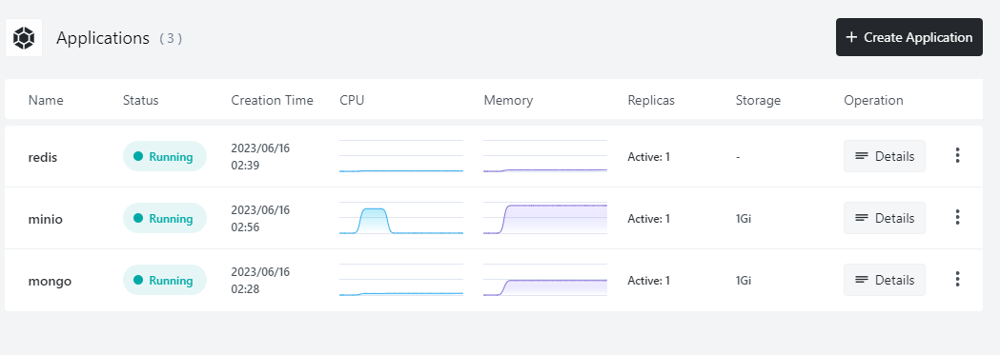

Now we can deploy the Tailchat itself. The Tailchat itself will be relatively complex, but because Sealos is purely UI-based, it will not be too complicated.

- Use image: `moonrailgun/tailchat`
- Expose port: `11000` (remember to open external access)
- Configure environment variables as follows:
  ```
  SERVICEDIR=services,plugins
  TRANSPORTER=redis://redis:6379
  REDIS_URL=redis://redis:6379
  MONGO_URL=mongodb://mongo/tailchat
  MINIO_URL=minio:9000
  MINIO_USER=tailchat
  MINIO_PASS=com.msgbyte.tailchat
  ```

The final effect is as follows:

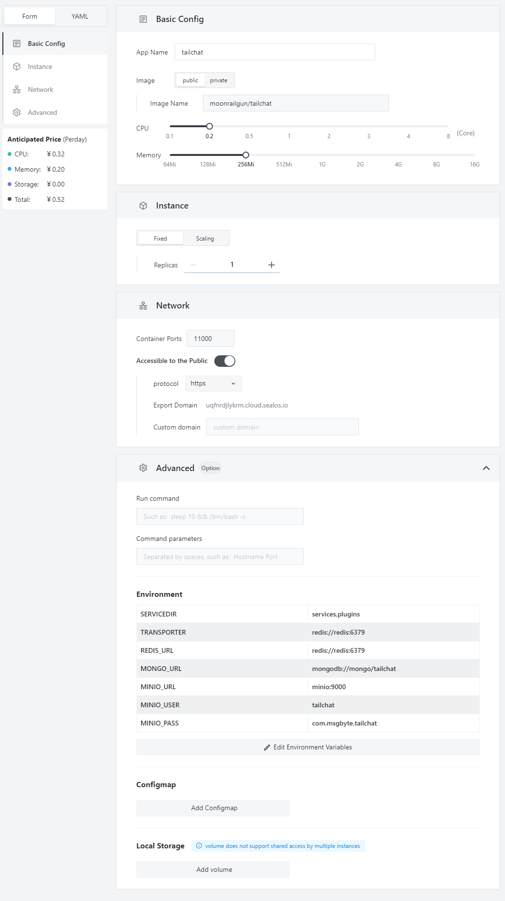

After waiting patiently for a while, you can see that the Tailchat service has started up.

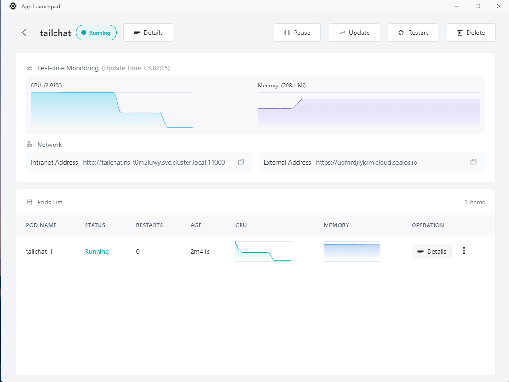

## Preview service

First, we can check the availability of the Tailchat service by adding `/health` to the external address provided by the service, such as `https://<xxxxxxxxxx>.cloud.sealos.io/health`. When it starts up, the Tailchat service will return content like this:

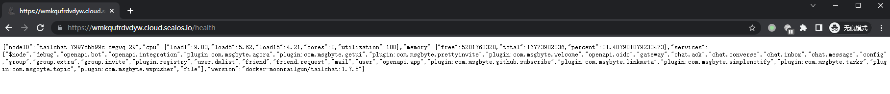

This JSON string contains the image version used, node name, system usage, and microservice loading status. Here we can see that my common services, such as `user`/`chat.message`, and some services with plugin prefixes such as `plugin.registry`, have all started up normally, indicating that our server is running normally. Now we can directly access our external address and see that after a short loading time, the page opens normally and automatically jumps to the login page.

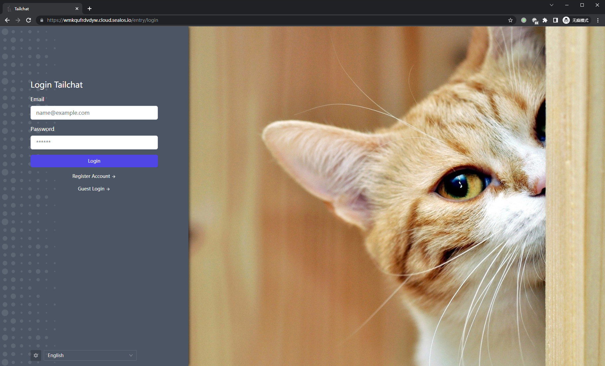

Register an account casually, and you can see that we can enter the main interface of Tailchat normally, as shown in the following figure:

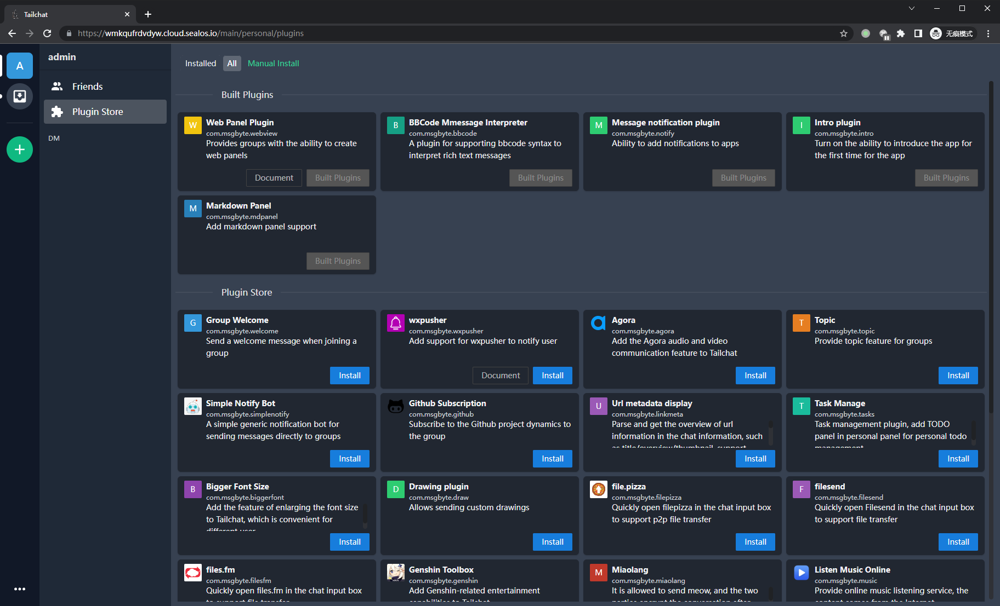

At this point, our service has successfully landed in Sealos.

## Scaling service

Of course, as a distributed architecture system, Tailchat naturally supports horizontal scaling. In Sealos, scaling is also very simple. Just modify the number of instances through the change operation:

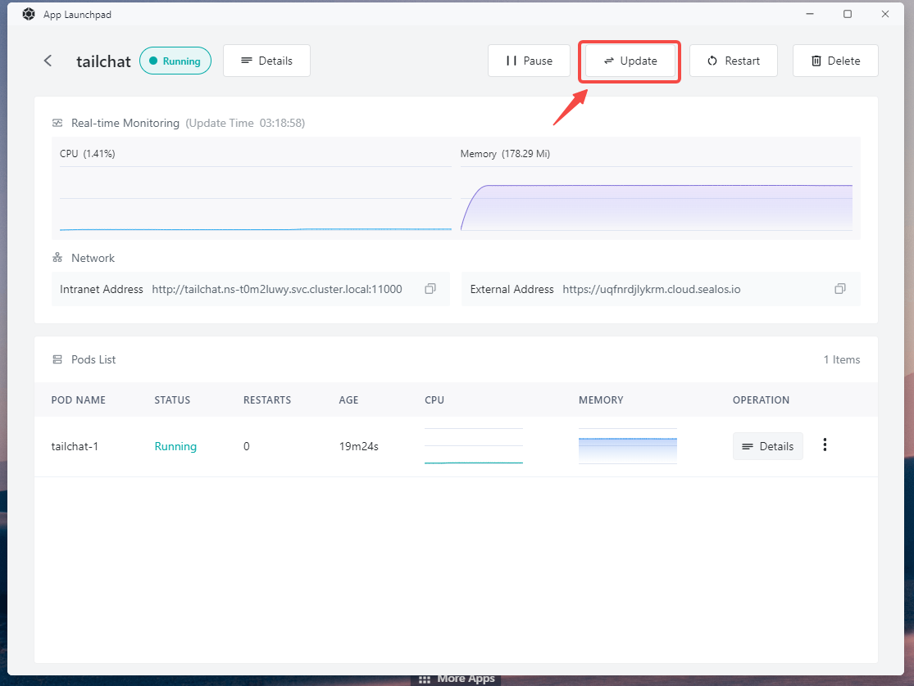

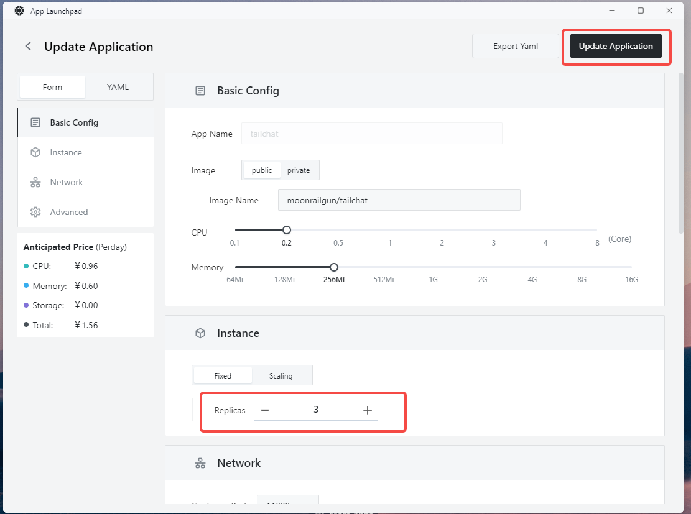

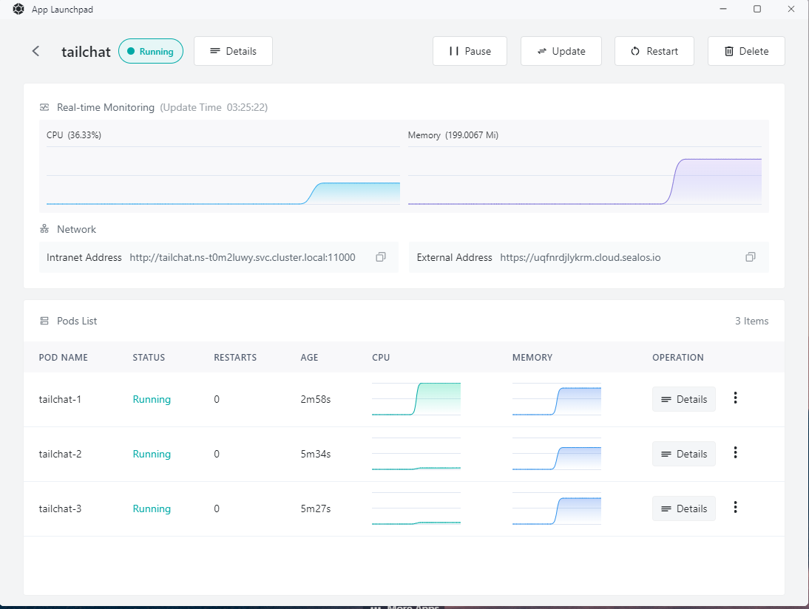

At this point, when we access `https://<xxxxxxxxxx>.cloud.sealos.io/health`, we can see that we can access different nodes.

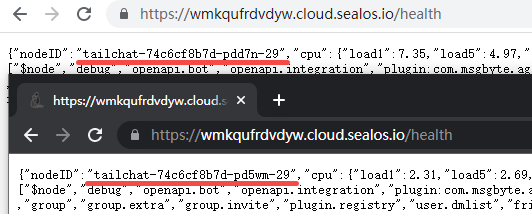

## Add Tailchat entry to desktop

Open Terminal, enter `vim app.yml` to create and edit a configuration file

Enter the following content, note that the url should be replaced with the url deployed by yourself

```yml
apiVersion: app.sealos.io/v1
kind: App
metadata:
  name: tailchat-app-entry
spec:
  name: Tailchat
  icon:
  type: iframe
  data:
    url: <Your url>
    desc:
  icon: https://tailchat.msgbyte.com/img/logo.svg
  menuData:
  displayType: normal
```

Press `esc` to exit edit mode, press `:wq` to save and exit vim

Type `kubectl apply -f app.yml` to start the configuration.

After refreshing the page, we can see that our entry appears on the desktop of `sealos`

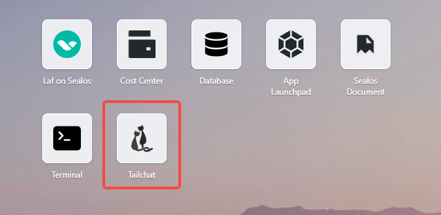
