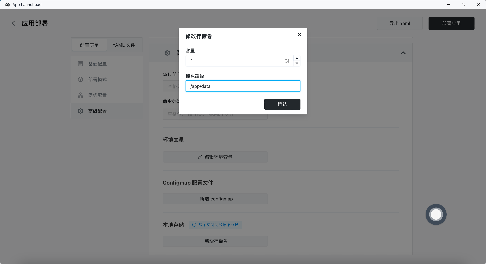
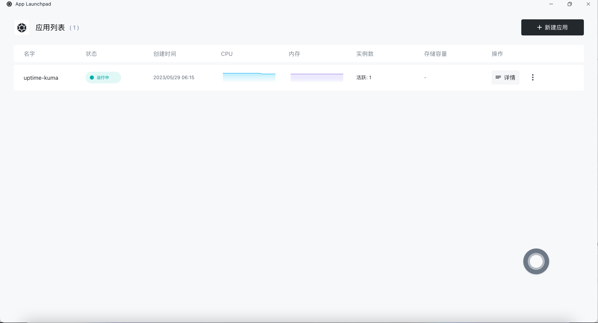

# Quick Installation of Uptime Kuma

Uptime Kuma is an open-source and easy-to-use server monitoring tool. It helps you monitor the real-time status, response time, and other key metrics of your server to ensure that it always remains in optimal condition. If you want to quickly install Uptime Kuma, follow these steps:

### Step 1: First, enter Sealos and open the App Launchpad

### Step 2: Create a New Application

In the App Launchpad, click "New Application" to create a new application.

### Step 3: Set Startup Parameters

Configure the startup parameters as follows:

- Set the container exposed port to 3001
- Enable public network access to access the application via the provided domain

### Step 4: Set up Storage Volumes

In the advanced settings, add a storage volume mount to persist the Uptime Kuma data directory `/app/data`. This ensures that the application data is not lost when the container restarts.

### Step 5: Deploy the Application

Click 「Deploy Application」 to start the application:

### Step 6: Access the Application

Once the application is successfully launched, you can access it using its public network address. Enter the application domain in your browser to access the main interface.

### Step 7: Create an Administrator Account

To ensure the security of Uptime Kuma, you will need to create an administrator account when you first access the application. Fill in the basic information for the administrator account, including the username and password. After completing the form, click the "Create" button to register the account.

### Step 8: Add Custom Monitoring Items

