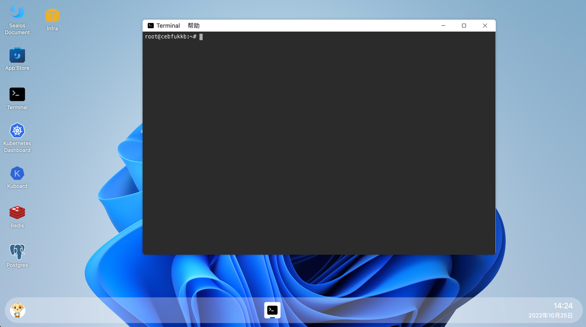
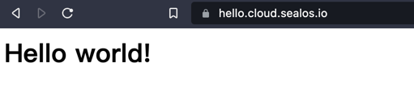

# Use sealos cloud to deploy a hello-world demo

This document describes how to use sealos cloud to deploy a hello-world demo. We use cloud terminal to create a pod
and a service.
then use ingress to access the pod.

## Login to the sealos cloud

https://cloud.sealos.io you can use github account to login.

## Open the cloud terminal



## Create pod and service

pod.yaml:

```yaml
apiVersion: v1
kind: Pod
metadata:
  name: my-first-demo
  labels:
    app: my-first-demo
spec:
  containers:
    - name: my-first-demo
      image: hellodm/my-first-demo:v1.0
      ports:
        - containerPort: 80
      resources:
        requests:
          cpu: 0.1
          memory: 32Mi
        limits:
          cpu: 0.5
          memory: 32Mi
```

service.yaml:

```yaml
apiVersion: v1
kind: Service
metadata:
  name: my-first-demo-svc
  labels:
    app: my-first-demo
spec:
  type: ClusterIP
  ports:
    - port: 8080
      targetPort: 80

  selector:
    app: my-first-demo
```

```shell
kubectl apply -f pod.yaml
kubectl apply -f service.yaml
```

Check the pod and service status:

```shell
kubectl get pod
kubectl get svc
```

```shell
root@cebfukkb:~# kubectl get pod
NAME            READY   STATUS    RESTARTS   AGE
my-first-demo   1/1     Running   0          59m
root@cebfukkb:~# kubectl get svc
NAME                TYPE        CLUSTER-IP   EXTERNAL-IP   PORT(S)    AGE
my-first-demo-svc   ClusterIP   10.96.1.29   <none>        8080/TCP   3h9m
root@cebfukkb:~# curl 10.96.1.29:8080
<h1>Hello world! <h1>
```

## Create ingress

ingress.yaml:
```yaml
apiVersion: networking.k8s.io/v1
kind: Ingress
metadata:
  annotations:
    kubernetes.io/ingress.class: nginx
    nginx.ingress.kubernetes.io/rewrite-target: /
    nginx.ingress.kubernetes.io/backend-protocol: "HTTP"
  name: hello-world
  labels:
    k8s-app: hello-world
spec:
  rules:
    - host: hello.cloud.sealos.io
      http:
        paths:
          - pathType: Prefix
            path: /
            backend:
              service:
                name: my-first-demo-svc 
                port:
                  number: 8080
  tls:
    - hosts:
        - hello.cloud.sealos.io
      secretName: wildcard-cloud-sealos-io-cert
```

Now you can use your browser to access the pod through the ingress (HTTPS).

The domain is https://hello.cloud.sealos.io

