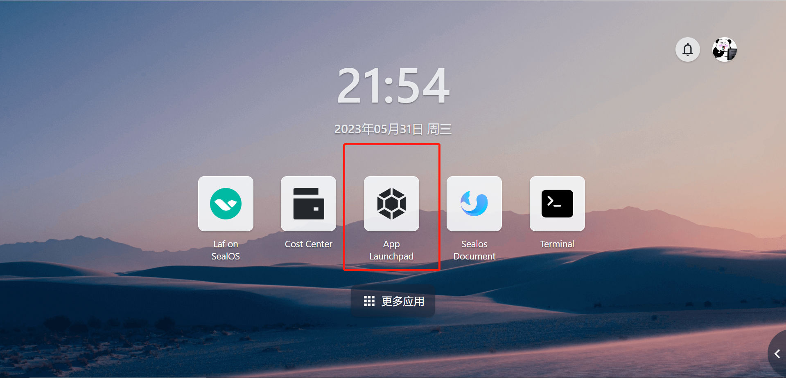

# Quickly Install WordPress

WordPress is a powerful, user-friendly and open source content management system (CMS) that can be used to publish websites, news, blogs and other content online. It provides convenient methods for content editing, publishing and updating, and can also be highly customized through themes and plugins. WordPress has become a very successful and popular CMS system, with over 30 million websites built on WordPress worldwide.

> By deploying **WordPress** with **Sealos**, you can greatly reduce deployment time and start users' content publishing journey at lightning speed.

WordPress requires installation and use in conjunction with a MySQL database. In this example, we will first show how to install a MySQL database, then demonstrate the process of installing WordPress, and how to connect to the installed MySQL database.

## Step 1: Install the MySQL database

### App Launchpad



### Basic configuration

Click *Create Application* to enter the application installation configuration interface and complete the basic configuration settings.

- Specify a unique username
- Specify the image to pull (recommend using the official image, default is latest version)
- Configure CPU and memory resources for the application（MySQL requires at least 1 CPU core and 512MB of memory）


### Network configuration

Set the exposed port for the network configuration of the container to 3306, which is the default port number for MySQL.


### Advanced configuration

In the advanced configuration section, you need to configure the database environment variables and add data volumes.

Recommend env setting:

- MYSQL_ROOT_PASSWORD
- MYSQL_USER
- MYSQL_PASSWORD
- MYSQL_DATABASE

The data volume is mounted at `/var/lib/mysql` for the official MySQL image, though may differ for other images. With this option, you can configure the storage space allocated to the WordPress application

Below, a configuration example is given.

```Plain
MYSQL_ROOT_PASSWORD=123456    
MYSQL_USER=sealos
MYSQL_PASSWORD=123456
MYSQL_DATABASE=wordpress
```


After filling out all the required information in the configuration form, you can now go ahead and install the WordPress application.

### Install Application

After filling out the configuration form, click the 'Install' button to start the WordPress installation process. Then, wait for the WordPress application to install successfully.


By this point, the MySQL database has been successfully installed. Next, we will begin the actual WordPress installation.

**Note: If the database installation fails, it is recommended to directly delete the current instance and create a new instance, rather than making changes based on this.**

## Step 2: Install WordPress

The overall WordPress installation procedure is largely similar to the MySQL installation process. I recommend using the official WordPress image, without specifying an image version number and defaulting to 'latest'. In hardware requirements, WordPress is very lightweight, with 0.1 CPU cores and 64MB of memory being sufficient to guarantee a successful application installation.


For network configuration:

- Enable external network access
- Sealos will assign an outbound domain name for external access
- Users can CNAME their custom domain name to this outbound domain name
- Then they can use their custom domain name to access the WordPress installation.

**Note: In the following demonstration, we are using the outbound domain name randomly generated by Sealos.**


Advanced configuration, configure environment variables and local storage for WordPress. Common WordPress environment variables are as follows:

```Plain
WORDPRESS_DB_HOST     Database IP Address
WORDPRESS_DB_USER     Database username
WORDPRESS_DB_PASSWORD Database password
```

According to the previous MySQL installation example, you can configure the environment variables as follows:

```Plain
WORDPRESS_DB_HOST=mysql.ns-biy7854k.svc.cluster.local:3306
WORDPRESS_DB_USER=sealos
WORDPRESS_DB_PASSWORD=123456
WORDPRESS_DB_NAME=wordpress
```

The data volume mount location for the official WordPress image is `/var/www/html`, and the user can allocate storage space for the application as needed.

With these configurations, the WordPress installation was also successful. By clicking 'Details' and accessing the assigned public IP address or domain name, you can now successfully view your WordPress site.


By clicking that link, if the following page appears, it proves that the installation was successful:


**Note: If the installation fails, first check for network issues, then check the environment variable settings. If the database environment variables are incorrectly configured, please recreate the database instance instead of making changes.**

