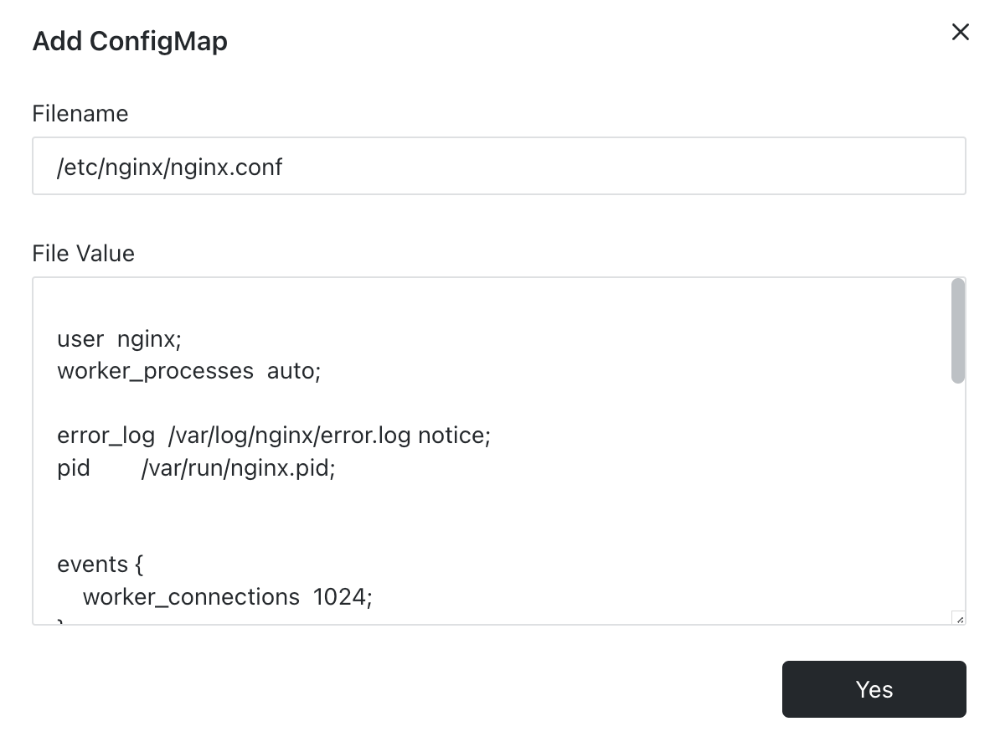

# ConfgMap

In [Sealos](https://cloud.sealos.io), the implementation of configuration files plays a vital role, particularly when the application deals with numerous or complex configurations. Differing from environment variables, configuration files are a more versatile and dependable means for managing settings. Environment variables are more apt for simple, small-scale configuration tasks.

The primary strength of configuration files is their capability to hold and control elaborate configuration data, including aspects like configuration files, command-line arguments, and environment variables. These pieces of data can be incorporated into the container upon the launch of the application container, facilitating adjustments to the application's functionalities without the necessity of recompiling the image.

Take, for example, the Nginx container. The utilization of configuration files in this context can be described as follows:

- **Filename**: This pertains to a file within the Nginx container, for which references can be drawn from the instructions provided by the image supplier.
- **File Value**: This is the content corresponding to the file. In cases where the content is elaborate, it's recommended to complete editing it offline and then paste it into the specified location.
- **Key Points**: The approach involves mounting an individual file, not an entire directory. It is imperative to precisely identify the file to be mounted, rather than just a directory path.

