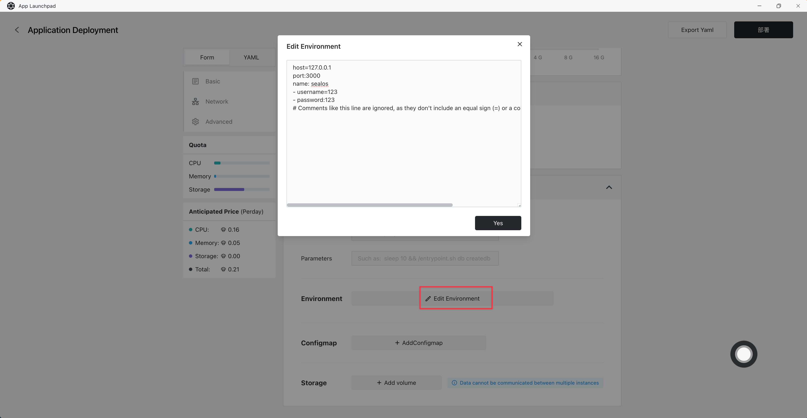

# Environment

In [Sealos](https://cloud.sealos.io), environment variables are pivotal in managing the configuration data for container applications. These variables enable the provision of essential configuration information to applications without necessitating changes to the application's code or image, thus bolstering their maintainability and scalability.

The process of defining environment variables in the "[App Launchpad](/guides/applaunchpad/applaunchpad.md)" interface is streamlined through a bulk input method. Users can define multiple variables by entering them line by line. Each variable comprises a key and a value, separated by either an equal sign (=) or a colon (:). The interface is designed to automatically eliminate any invalid characters from the key, ensuring the accuracy and validity of the environment variables.



**Environment Variable Formats That Are Correctly Interpreted:**

```shell
host=127.0.0.1
port:3000
name: sealos
- username=123
- password:123
# Comments like this line are ignored, as they don't include an equal sign (=) or a colon (:), which are the key markers.
```

**Environment Variable Formats That Cannot Be Interpreted:**

```shell
host=127.0.0.1 # This line is interpreted because it contains an equal sign (=) or a colon (:). The comment here is also considered part of the variable due to the preceding equal sign (=).
```