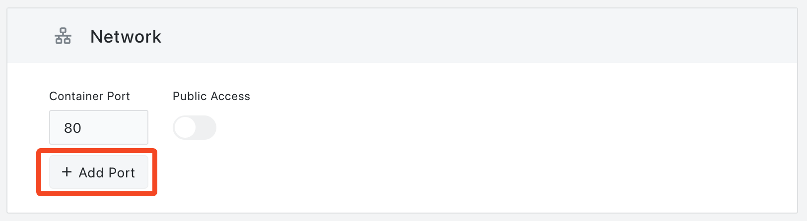

# Exposing Multiple Ports

In complex application environments, it's common for services to expose multiple ports simultaneously to cater to diverse needs. These requirements can emerge from various scenarios:

+ **Multi-protocol support**: For example, an application might support both HTTP and HTTPS, necessitating the exposure of both ports 80 and 443.
+ **Multi-functional application**: An application might have a web service and an admin service, both of which listen on different ports.
+ **Compatibility considerations**: To remain compatible with older versions or other services, you might need to expose ports for both the new and old interfaces.
+ **Combined Database + App**: For instance, if you have an application and a database within the same Pod, you might need to expose ports for both the application and the database.
+ **Prometheus Monitoring and App Service**: If your application has a business port and another port for Prometheus monitoring via `/metrics`, you might need to expose both.
+ **Coexistence of GRPC and RESTful services**: If your application offers both GRPC and RESTful services, you might need to expose separate ports for each type of service.

When deploying applications using "[App Launchpad](/guides/applaunchpad/applaunchpad.md)" on [Sealos](https://cloud.sealos.io), you can easily choose to expose multiple ports. During the deployment process, users simply click on the "Network" option and then select "Add Port" to configure multiple ports.

Furthermore, the Sealos platform offers external access to these ports. Once exposed to the public network, each port will be assigned a unique sub-domain, facilitating easier remote access and management.