# Object Storage

**Object Storage** is Sealos' built-in object storage service, which is primarily used to store and manage unstructured
data.

Currently, **Object Storage** has the following features:

- Upload files to bucket
- Download files from bucket
- Expose the access permission of the bucket
- Use SDK to access bucket
- Monitors bucket resource metrics
- Static host

## Quick start

### Upload files to bucket

Go to Object Storage
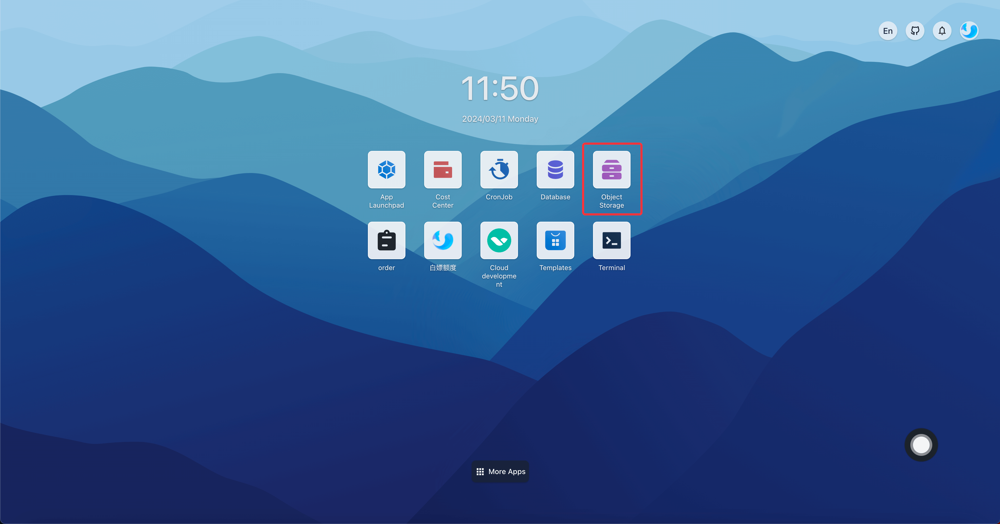

Create a bucket
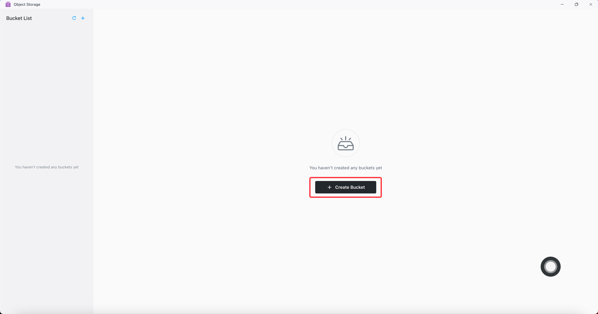

Set bucket name to test and permission to private
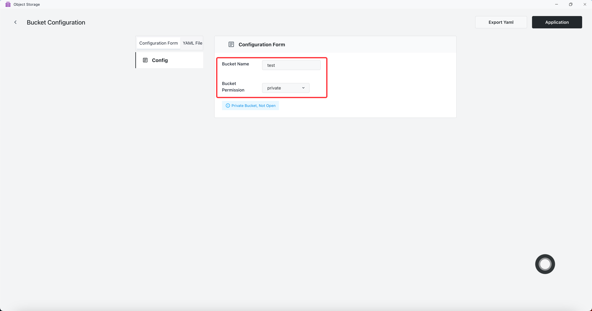

Bucket is created successfully
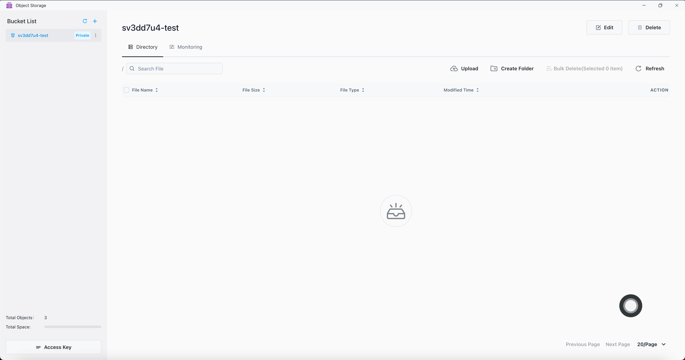

Upload file
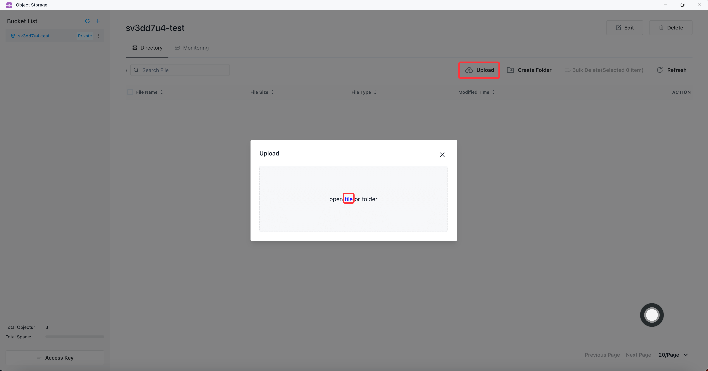

File uploaded successfully
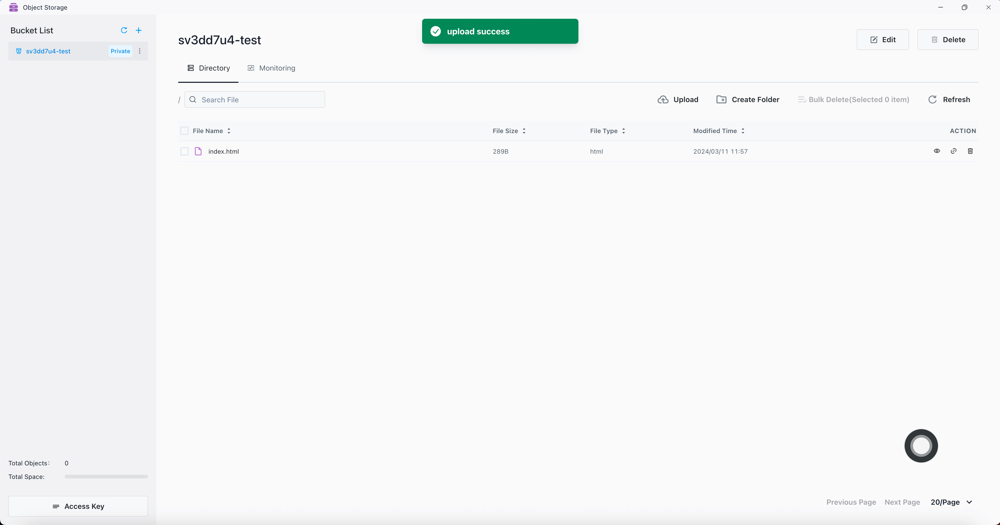

### Expose the access permission of the bucket

Click the Edit button
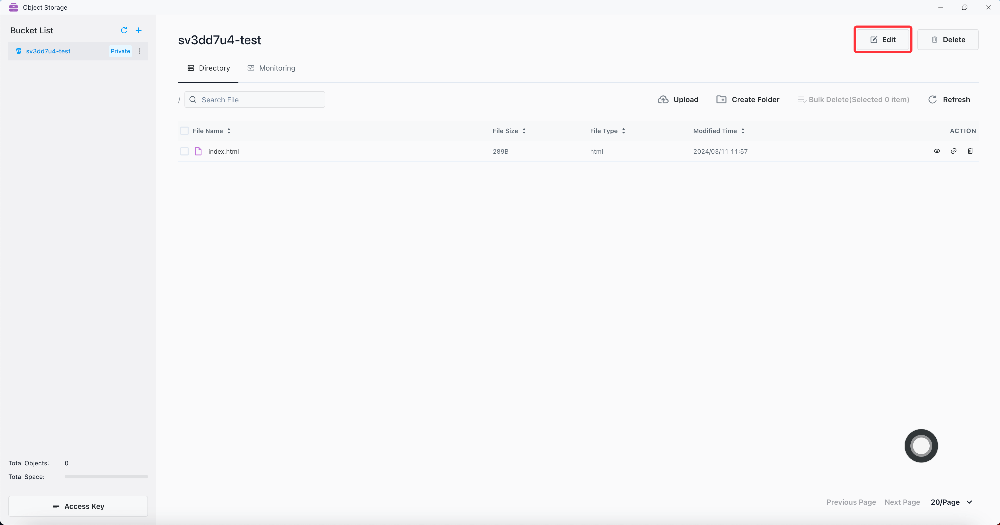

Set Bucket Permission to publicRead and click the Application button
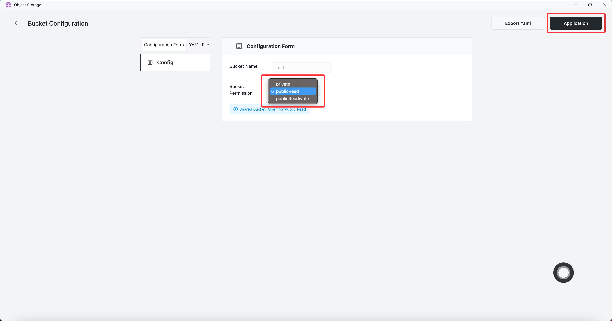

Copy file link
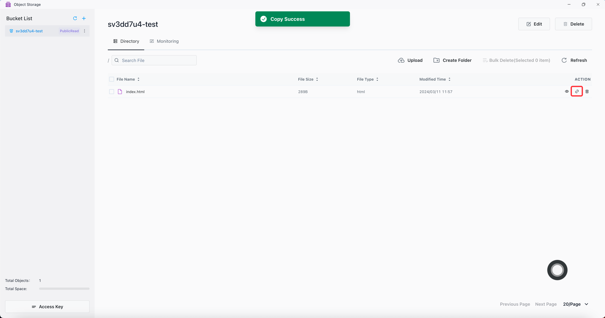

Paste to browser address bar to access files
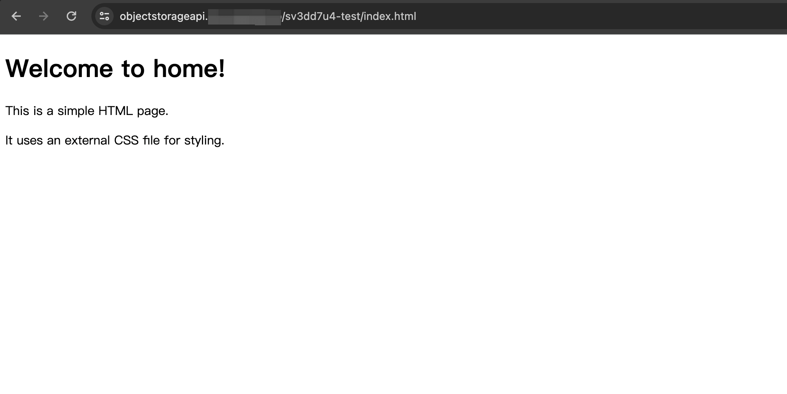

### View the access key configuration

An Object Storage user consists of a unique access key (username) and corresponding secret key (password). Internal is
the internal access address of Object Storage, and External is the external access address of Object Storage.
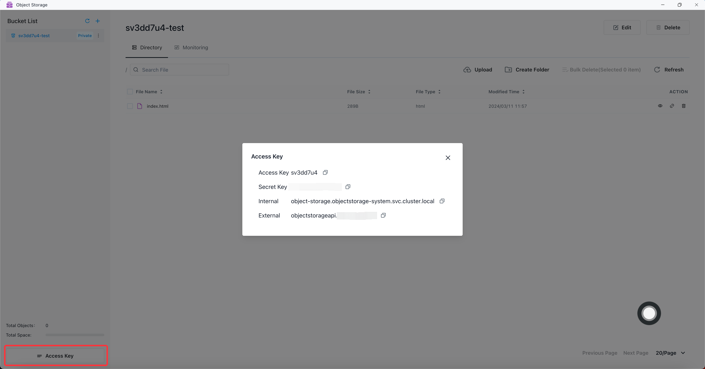

### Use SDK to access bucket

The SDK requires three parameters to access bucket: AccessKey, SecretKey, and Endpoint (Internal or External). If the
Region parameter is required, us-east-1 is used by default.

#### Go Client SDK

Detailed documentation reference: https://min.io/docs/minio/linux/developers/go/API.html

Example: Use the Go Client SDK to upload the style.css file to the sv3dd7u4-test bucket, and set the endpoint to the
external address. If the service is deployed in the K8s cluster, you can change the endpoint to the internal address.

```go
package main

import (
	"context"
	"fmt"
	"log"
	"os"
)
import "github.com/minio/minio-go/v7"
import "github.com/minio/minio-go/v7/pkg/credentials"

func main() {
	endpoint := "objectstorageapi.xxx.xxx.xxx"
	accessKey := "xxxxxxxx"
	secretKey := "xxxxxxxxxxxxxxxx"
	// init minio client
	minioClient, err := minio.New(endpoint, &minio.Options{
		Creds: credentials.NewStaticV4(accessKey, secretKey, ""),
	})
	if err != nil {
		log.Fatalln(err)
	}
	// get local file
	file, err := os.Open("./style.css")
	if err != nil {
		fmt.Println(err)
		return
	}
	defer file.Close()

	fileStat, err := file.Stat()
	if err != nil {
		fmt.Println(err)
		return
	}
	// put object
	uploadInfo, err := minioClient.PutObject(context.Background(), "sv3dd7u4-test", "style.css", file, fileStat.Size(), minio.PutObjectOptions{ContentType: "text/css"})
	if err != nil {
		fmt.Println(err)
		return
	}
	fmt.Println("Successfully uploaded bytes: ", uploadInfo)
}
```

File uploaded successfully
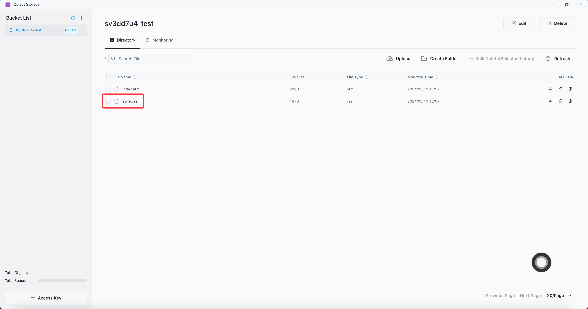

#### Java Client SDK

Detailed documentation reference: https://min.io/docs/minio/linux/developers/java/API.html

Example: Use the Java Client SDK to upload the style1.css file to the sv3dd7u4-test bucket, and set the endpoint to the
external address. If the service is deployed in the K8s cluster, you can change the endpoint to the internal address.

```xml

<dependency>
    <groupId>io.minio</groupId>
    <artifactId>minio</artifactId>
    <version>8.5.9</version>
</dependency>
```

```javascript
package org.example;

import io.minio.MinioClient;
import io.minio.UploadObjectArgs;

public class FileUploader {
    public static void main(String[] args) throws Exception {

        MinioClient minioClient =
                MinioClient.builder()
                        .endpoint("https://objectstorageapi.xxx.xxx.xxx")
                        .credentials("xxxxxxxx", "xxxxxxxxxxxxxxxx")
                        .build();


        minioClient.uploadObject(
                UploadObjectArgs.builder()
                        .bucket("sv3dd7u4-test")
                        .object("style1.css")
                        .filename("src/main/java/org/example/style1.css")
                        .build());

        System.out.println("Successfully uploaded bytes.");
    }
}
```

File uploaded successfully
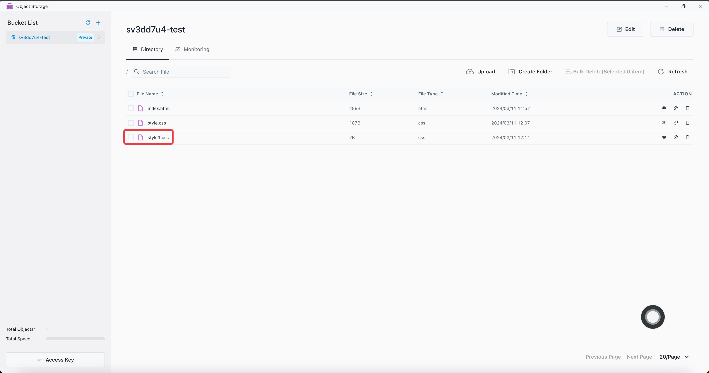

#### Omit other language SDK

Detailed documentation reference: https://min.io/docs/minio/linux/developers/minio-drivers.html

### Static host

Create a permission for publicRead/publicReadwrite bucket, click Enable Hosting.
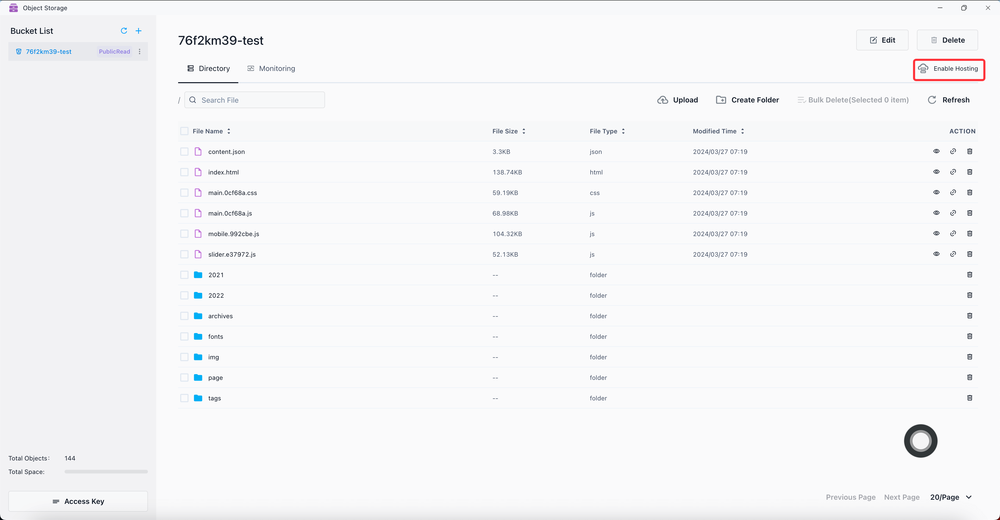

Click on the address to jump to access.
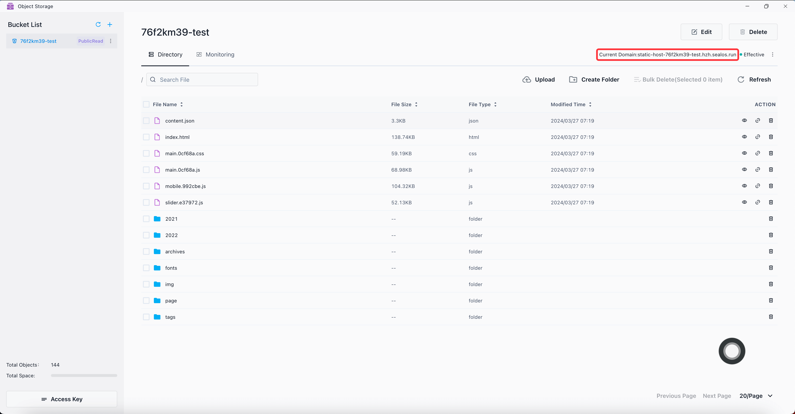

Click Custom Domain.
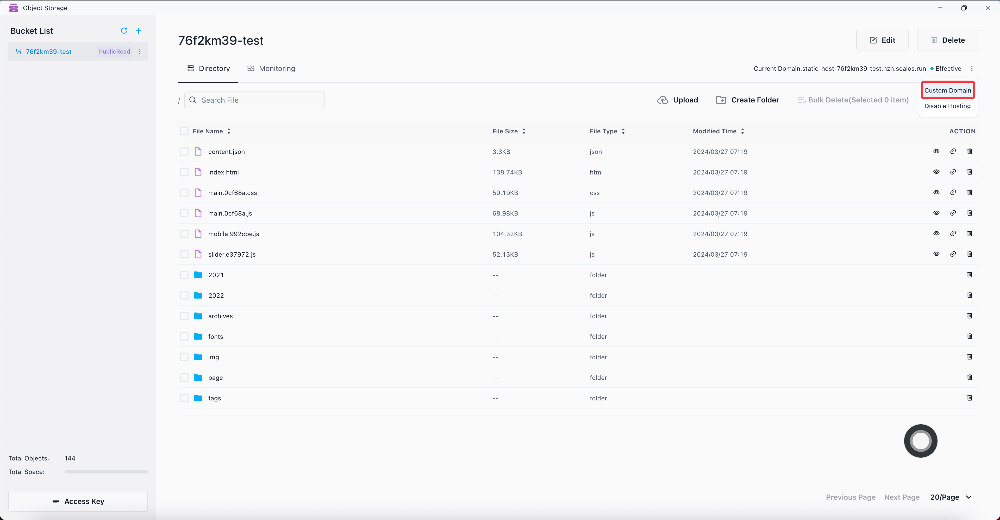

In the Update area of App Launchpad, you can customize the domain.
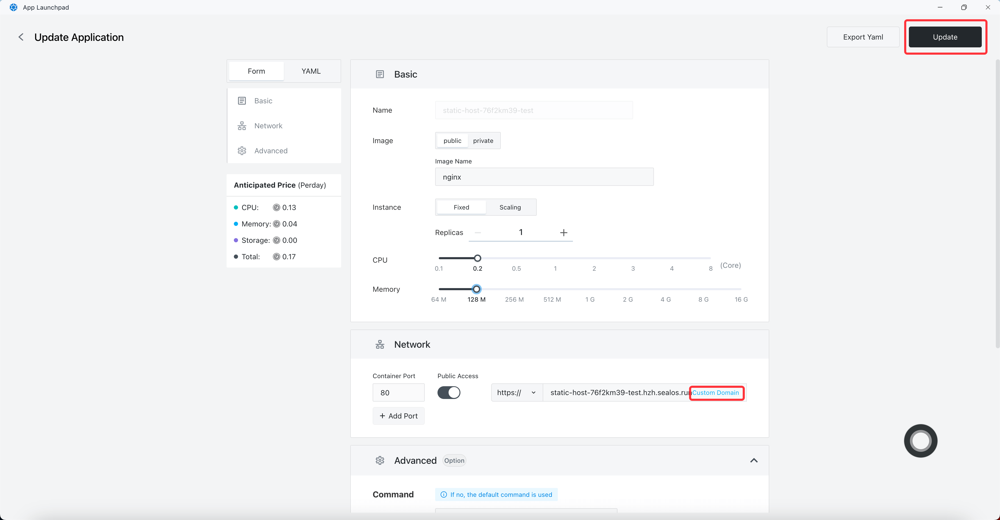


