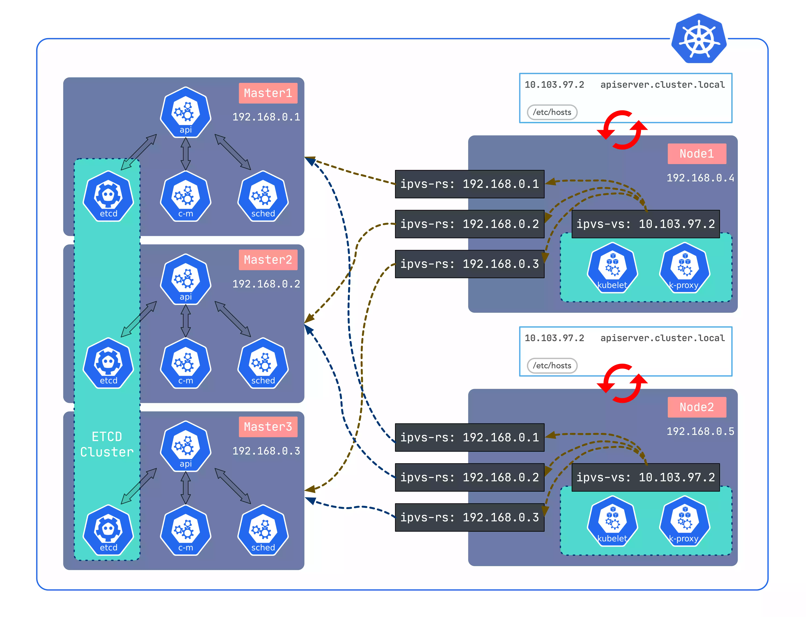

# 集群生命周期管理

sealos 可以帮助用户非常好的管理整个集群的生命周期。

可以用 sealos 安装一个不包含任何组件的裸 kubernetes 集群。
也可以用 sealos 在 kubernetes 之上通过集群镜像能力组装各种上层分布式应用，如数据库消息队列等。

可以用 sealos 安装一个单节点的 kubernetes 开发环境。
也可以用 sealos 构建数千节点的生产高可用集群。

可以用 sealos 自由伸缩集群，备份恢复，释放集群等。
也可以即便在离线环境中也可以非常好的使用 sealos 来运行 kubernetes.



- [x] 支持 ARM，v1.20 以上版本离线包支持 containerd 与 docker 集成
- [x] 99年证书, 支持集群备份，升级
- [x] 不依赖 ansible haproxy keepalived, 一个二进制工具，0依赖
- [x] 离线安装，不同 kubernetes 版本使用不同的集群镜像即可
- [x] 高可用通过 ipvs 实现的 localLB，占用资源少，稳定可靠，类似 kube-proxy 的实现
- [x] 几乎可兼容所有支持 systemd 的 x86_64 架构的环境
- [x] 轻松实现集群节点的增加/删除
- [x] 数万用户在线上环境使用 sealos，稳定可靠
- [x] 支持集群镜像，自由组合定制你需要的集群，如 openebs 存储+数据库+minio 对象存储


## 使用sealos运行一个kubernetes集群

```bash
$ curl -sfL  https://raw.githubusercontent.com/labring/sealos/v4.2.0/scripts/install.sh \
    | sh -s v4.2.0 labring/sealos
# Create a cluster
$ sealos run labring/kubernetes:v1.25.0-4.2.0 labring/helm:v3.8.2 labring/calico:v3.24.1 \
     --masters 192.168.64.2,192.168.64.22,192.168.64.20 \
     --nodes 192.168.64.21,192.168.64.19 -p [your-ssh-passwd]
```

[](https://asciinema.org/a/519263?speed=3)


## 运行集群上的各种分布式应用

可以通过 `sealos run` 命令来运行集群(目前是kubernetes)之上的各种分布式应用，像数据库，消息队列，AI 能力甚至企业级 SaaS 软件。

如：

```shell
# MySQL cluster
$ sealos run labring/mysql-operator:8.0.23-14.1

# Clickhouse cluster
$ sealos run labring/clickhouse:0.18.4

# Redis cluster
$ sealos run labring/redis-operator:3.1.4
```

## 自定义集群

对于 sealos 生态没有的集群镜像，用户可以使用非常方便的方式来自己构建和定制属于自己的集群镜像。

如：

[构建一个 ingress 集群镜像](https://www.sealos.io/docs/getting-started/build-example-cloudimage)

也可以定制一个完全属于自己的 kubernetes:

Sealfile:
```shell
FROM kubernetes:v1.25.0
COPY flannel-chart .
COPY mysql-chart .
CMD ["helm install flannel flannel-chart", "helm install mysql mysql-chart"]
```

```shell
sealos build -t my-kuberentes:v1.25.0 .
sealos run my-kuberentes:v1.25.0 ...
```


# FAQ

> sealos 是 kubernetes 安装工具吗？

安装部署是 sealos 一个最基本的小功能，就像单机操作系统也有 boot 模块一样，sealos 的 boot 模块可以很好的管理整个 kubernetes 在
任何场景下生命周期管理问题。

> 不是很懂 kubernetes 是否能很友好的使用 sealos？

可以的，就像是不懂 linux kernel 也能很容易的使用 ubuntu 一样，关键看使用者是什么样的角色，比如一个 DBA 只需要在 sealos 上
安装一个数据库应用即可来做数据库管理 SQL 调优等，而无需关心 kubernetes 的存在。

> sealos 和 rancher kubesphere 有什么区别？

定位不同，sealos 的设计理念是 "化整为零，自由组装，大道至简"，利用 kubernetes 的能力使用非常简单的方式提供给用户真正想要的东西。
也就是说用户想要的不一定是 kubernetes，大众用户需要的是一个具体的能力，而且可能都不一样。

操作系统的特点是用户需要什么它就是什么，极其灵活，不会给用户带来额外负担。

如 windows 对于一个游戏玩家来说就是个游戏机, 对于程序员来说就是用来写代码的工具，对于美工来说就是用来修图的。 操作系统的形态取决于使用者是谁，装了什么应用。

那 sealos 云操作系统也一样，sealos 本身通过 sealos core, sealos hub, sealos desktop 把分布式应用管理好即可， 剩下一切能力让应用层去扩展。

分布式应用是 sealos 上的一等公民，一切皆应用。

