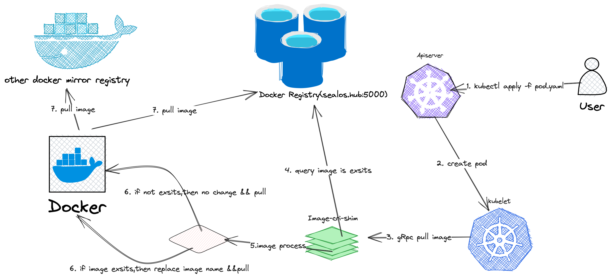

# image-cri-shim User Guide

## Overview

image-cri-shim is a gRPC (Google Remote Procedure Call) shim based on CRI (Container Runtime Interface) and kubelet. CRI is the interface used in Kubernetes to interact with container runtimes, while kubelet is the Kubernetes component responsible for maintaining container runtime status and node-level resource management.

The main functionality of image-cri-shim is automatic image name recognition, which eliminates the need for users to manually specify the image name when deploying containers with Kubernetes. This simplifies the container image deployment process and improves the convenience for users.

In practical usage, image-cri-shim serves as middleware that receives requests from kubelet and forwards them to the container runtime. By automatically recognizing the image name, image-cri-shim streamlines the deployment process of container images and reduces user burden.

```
+------------+         +----------------+         +-------------------+
|   User     |         |  Kubelet       |         |   image-cri-shim  |
| (Kubernetes|         | (Node agent)   |         |   (Middleware)    |
|  Manifest) |         |                |         |                   |
+-----+------+         +-------+--------+         +-------+-----------+
      |                        |                          |
      | YAML Manifest          |                          |
      |--------------->        |                          |
      |                        |                          |
      |                        |                          |
      |                        |   CRI Request            |
      |                        |------------------------> |
      |                        |                          |
      |                        |   Image Name             |
      |                        |   Auto-Recognition       |
      |                        |                          |
      |                        |                          |
      |                        |   CRI Response           |
      |                        | <------------------------+
      |                        |                          |
      |                        |                          |
      |          Container     |                          |
      |          Deployment    |                          |
      | <----------------------|                          |
      |                        |                          |
      |                        |                          |
+------------+         +-------+--------+         +-------+-----------+

```

From the above flowchart, it can be seen that a user creates a Kubernetes YAML manifest containing container information and submits the manifest to kubelet. kubelet, which acts as an agent on Kubernetes nodes, is responsible for managing containers.
Next, kubelet sends a CRI request to the image-cri-shim middleware. The main task of image-cri-shim is to automatically recognize the image name. It processes the CRI request and retrieves relevant image information. Once image-cri-shim identifies the image name, it returns the CRI response to kubelet.

Finally, kubelet deploys the container using the image name obtained from image-cri-shim. This process is transparent to the user, as they do not need to manually specify the image name, simplifying the container deployment process and improving convenience.

## Architecture

The architecture of image-cri-shim is illustrated in the following diagram:



## Usage

```yaml
shim: /var/run/image-cri-shim.sock
cri: /run/containerd/containerd.sock
address: http://sealos.hub:5000
force: true
debug: true
timeout: 15m
auth: admin:passw0rd

registries:
- address: http://172.18.1.38:5000
  auth: admin:passw0rd
```

The above configuration is a YAML file used to set the parameters of image-cri-shim. It includes several key parameters, and the explanation for each parameter is as follows:

1. shim: Specifies the UNIX socket file path

for image-cri-shim. This path is used for communication with kubelet.
2. cri: Specifies the UNIX socket file path for the container runtime (e.g., containerd). image-cri-shim uses this path to communicate with the container runtime.
3. address: Defines the address of the image registry. In this example, the registry address is http://sealos.hub:5000.
4. force: When set to true, image-cri-shim forcefully starts the shim without waiting for the cri to start.
5. debug: When set to true, enables debug mode and outputs more logging information.
6. timeout: Defines the timeout for image operations. In this example, the timeout is set to 15 minutes (15m).
7. auth: Defines the authentication credentials for accessing the image registry. In this example, the username is admin and the password is passw0rd.

Additionally, the configuration file includes a list of registries, which defines other image registries and their authentication credentials. In this example, there is only one additional registry:
- address: The address of the registry is http://172.18.1.38:5000.
- auth: The authentication credentials for accessing the registry. In this example, the username is admin and the password is passw0rd.

This configuration file provides image-cri-shim with the necessary information to communicate with kubelet, the container runtime (such as containerd), and access and manage the image registry.

Note: image-cri-shim is compatible with both CRI API v1alpha2 and v1.

### Service Management

image-cri-shim is typically run as a system service. To manage image-cri-shim, you can use system service management tools (such as systemctl) to start, stop, restart, or view the status of the service. First, make sure you have correctly installed image-cri-shim and configured it as a system service.

1. Start the service: `systemctl start image-cri-shim`
2. Stop the service: `systemctl stop image-cri-shim`
3. Restart the service: `systemctl restart image-cri-shim`
4. View the service status: `systemctl status image-cri-shim`

### Log Management

To view the logs of the image-cri-shim service, you can use the journalctl command. journalctl is a tool used to query and display system logs, and it is used in conjunction with the systemd service manager.

Here are the commands to view the logs of the image-cri-shim service using journalctl:

```shell
journalctl -u image-cri-shim
```

This will display all logs of the image-cri-shim service. If you want to view the logs in real-time, you can add the -f option:

```shell
journalctl -u image-cri-shim -f
```

Additionally, you can filter the logs by time. For example, if you only want to view the logs from the past hour, you can use the following command:

```shell
journalctl -u image-cri-shim --since "1 hour ago"
```

These commands should help you view and analyze the logs of the image-cri-shim service, allowing you to better understand the service's operation status and potential issues.
