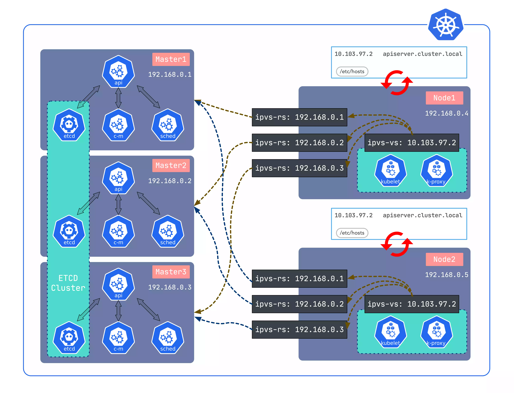

# LVScare User Guide

## Introduction

LVScare is a lightweight load balancing and health checking tool based on IPVS technology. It provides real-time monitoring and management of backend services. Sealos, a cloud operating system, is a Kubernetes HA installation tool based on kubeadm that can be used to install and upgrade high availability Kubernetes clusters on any Linux system. When combined, Sealos and LVScare enable high availability of Kubernetes master nodes. Leveraging the lifecycle management capabilities of Sealos and the lightweight, zero-dependency, and high availability features of LVScare, it ensures the stability and reliability of Kubernetes clusters effectively.

### How LVScare Works and Its Features

LVScare monitors the health status of backend services (real servers) in real-time using IPVS. If a service becomes unavailable, LVScare immediately sets its weight to 0 (for graceful TCP termination) and removes it from the service list during the next check. When the service recovers, LVScare automatically adds it back to the service list. This design of LVScare makes it lightweight, zero-dependency, and highly available. It occupies fewer resources, is stable and reliable, and similar to the implementation of kube-proxy, it can ensure the continuous availability of services through IPVS-based local load balancing.

## Integration of Sealos and LVScare

In Sealos, we utilize the recommended approach of static pods to automatically configure and manage LVScare for achieving high availability of Kubernetes clusters. During the installation process of a Kubernetes cluster, Sealos automatically uses LVScare for health checking and load balancing of the master nodes. This means that even if one of the master nodes fails, it does not affect the overall functionality of the Kubernetes cluster.



### Running LVScare as a Static Pod

First, use the `sealctl static-pod` command to generate the configuration for LVScare and place it in the `/etc/kubernetes/manifests` directory. This allows all nodes in the Kubernetes cluster to access this configuration.

```bash
lvscare care --vs 10.103.97.12:6443 --rs 192.168.0.2:6443 --rs 192.168.0.3:6443 --rs 192.168.0.4:6443 --interval 5 --mode route
```

### Generating and Adjusting Static Pod Configuration

To start LVScare on each node, we can use the following command to generate the configuration for the static pod:

```bash
sealctl static-pod lvscare --vip 10.103.97.2:6443 --name lvscare --image lvscare:latest --masters 192.168.0.2:6443,192.168.0.3:6443 --print
```

When there are changes in the master nodes, Sealos only needs to rerun the `sealctl static-pod` command to adjust the master nodes, simplifying the logic of maintaining static pods. Before joining the cluster nodes, we need to manually start the IPVS rules by calling `sealctl ipvs` (which directly calls the LVScare SDK) to maintain the IPVS cluster. After the node joins successfully, Kubernetes static pods can take over the IPVS rules.

## Advantages of Using LVScare

### High Availability

By combining LVScare with Sealos, high availability of Kubernetes cluster master nodes can be achieved.

### Health Checking Mechanism

The health checking mechanism of LVScare can promptly detect and handle issues, preventing them from causing larger problems due to the failure of a single node.

### Seamless Integration

As a static pod in Seal

os, LVScare can seamlessly integrate with other parts of the Kubernetes cluster.

### Simplified Operations

Sealos automatically configures and manages LVScare, greatly simplifying the operational tasks of the Kubernetes cluster.

## LVScare Usage Example

Please note that all real servers need to listen on the same host and be set in "route" mode. Then, you can run LVScare in the foreground. For example:

```bash
docker run -p 8081:80 --name echoserver1 -d cilium/echoserver
docker run -p 8082:80 --name echoserver2 -d cilium/echoserver
docker run -p 8083:80 --name echoserver3 -d cilium/echoserver
lvscare care --vs 169.254.0.1:80 --rs 127.0.0.1:8081 --rs 127.0.0.1:8082 --rs 127.0.0.1:8083 --logger DEBG --health-schem http --health-path /
```

## Cleanup

Finally, you can use the following command to clean up:

```bash
lvscare care --vs 169.254.0.1:80 --logger DEBG -C
```

Conclusion: LVScare is a lightweight load balancing and health checking tool based on IPVS. When seamlessly integrated with Sealos, it greatly improves the availability and performance of Kubernetes clusters. Give it a try and see how LVScare can help you better manage your Kubernetes cluster!
