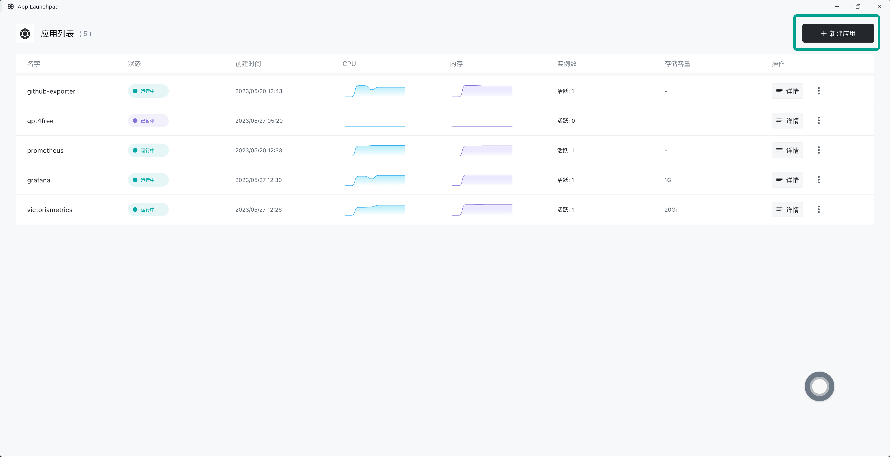
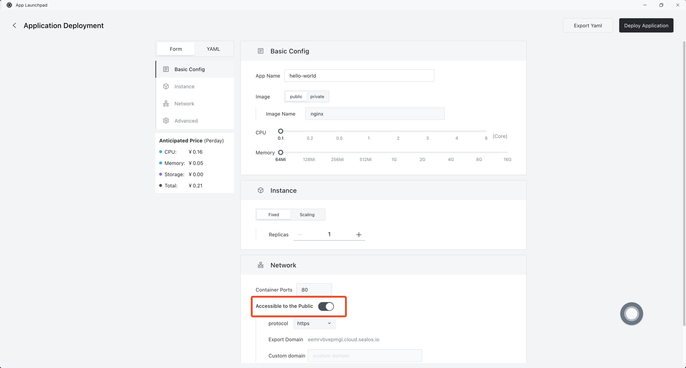
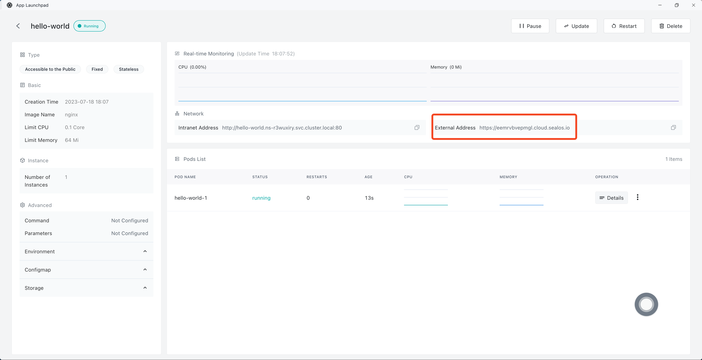
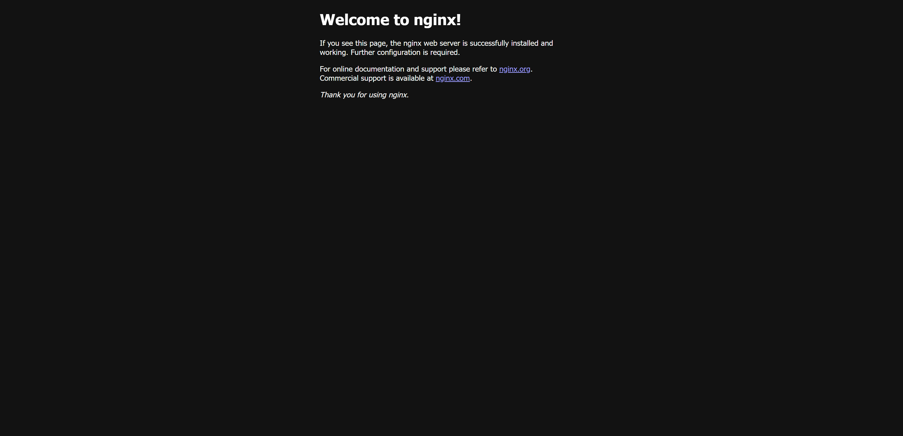
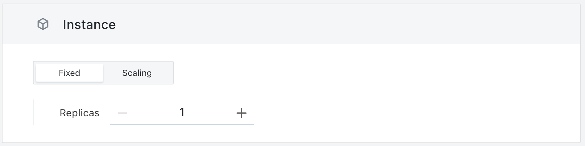
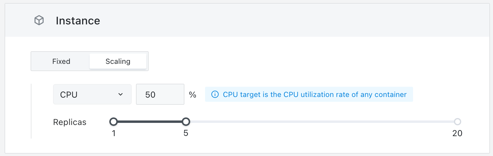
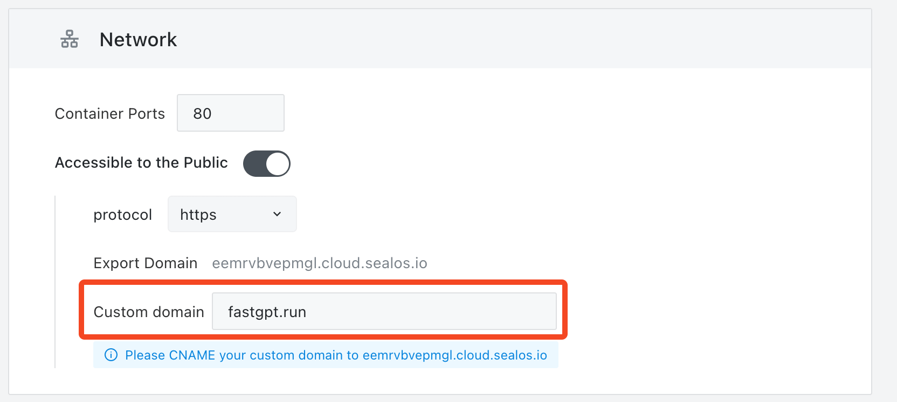
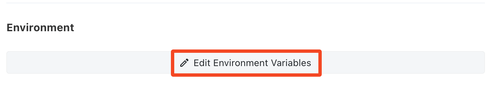
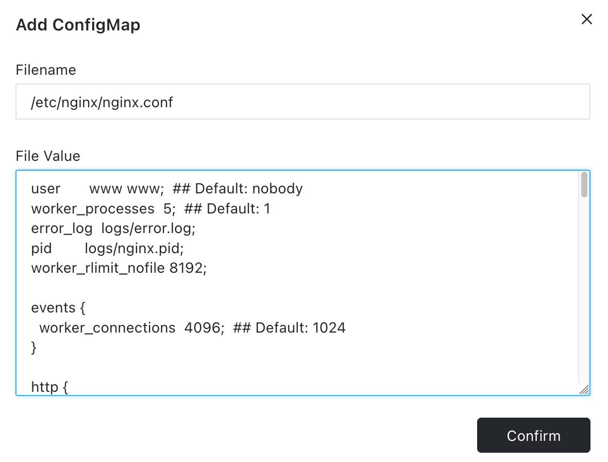
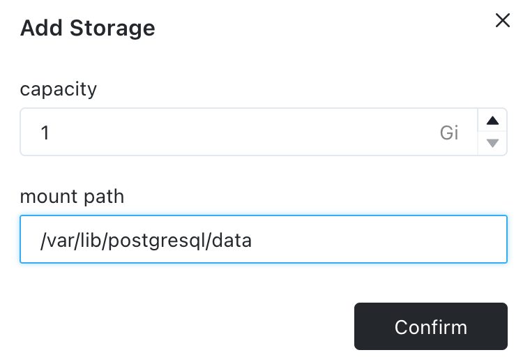

# App Launchpad

**App Launchpad** is a single-image deployment tool offered by Sealos that can help you deploy an image online within 5 minutes.

- [x] Private image
- [x] Customizable CPU and memory
- [x] Multiple replicas
- [x] HPA
- [x] External access address
- [x] Custom domains
- [x] ConfigMap configuration files
- [x] Persistent storage
- [x] APP and Pod monitoring
- [x] Logs
- [x] Events analysis
- [x] One-click entry into containers
- [x] One-click deployment to Sealos Desktop
- [x] Editable Yaml
- [x] Support for multiple external exposed ports

## Quick Start

Let's take deploying a simple Nginx as an example, to demonstrate the convenience of container deployment and **App Launchpad**.

Complete the deployment and access in just 6 steps:

1. Enter the **App Launchpad** app from the Sealos Desktop.


2. Click to create a new application.



3. Turn on the **External Access** switch. The Nginx image is already filled in by default, no need for modification. Then Click Deploy Aplication.



4. Enter the App details.



5. Click the "External Address" to access Nginx.



## Detailed Features

### Auto Scaling

You can freely switch between fixed instances or elastic scaling mode during application creation/change.

 



- Fixed Instance: Permanently create a fixed number of Pods, unaffected by actual traffic.
- Elastic Scaling: You can choose to dynamically adjust the number of Pods based on the percentage of CPU or Memory. Setting up elastic scaling requires a certain understanding of your own business traffic. Of course, you can also directly select 1~20 instance numbers, as the billing system will only calculate the actual running instances, inactive ones will not be charged.

### Custom Domains

**App Launchpad** will provide you with an SSL-certified external access domain by default. Of course, when serving externally, you may wish for users to access your domain. At this time, you can set your own domain in **App Launchpad**. You'll need to make two adjustments:

1. Fill in your own domain in the custom domain input box under the **Network Configuration** section.
2. Follow the prompt to modify the DNS at the domain service provider, CNAME resolve to the prompted domain.
3. Confirm the creation/update of the application.

 

### Environment

**App Launchpad** uses batch input to enter environment variables, split by line, **=** sign, and **:** sign, and invalid characters in the key will be removed.



**Examples of valid environment variable formats:**

```
makefile
host=127.0.0.1
port:3000
name: sealos
- username=123
- password:123
# Comments like this will be ignored as they don't contain = : two marking characters.
```

**Examples of invalid environment variable formats:**

```
makefile
# This line will be parsed: because it contains : or =
host=127.0.0.1 # This comment will also be parsed because there is an = sign in front of it
```

### ConfigMap

You can think of ConfigMap as volumes in Docker. Mount a custom file into the container to modify container configurations. Below is an example of modifying the Nginx configuration file.

- File Name: Corresponds to the file in the Nginx container, refer to the instructions provided by the image provider.
- File Value: Corresponds to the content of the file. If the content is too complex, you can edit it locally before pasting it here.
- Note: ConfigMap mounts individual files, not directories.



### Persistent Storage

Any content saved in the Pod is temporary, so be sure not to save content that needs to be persisted directly in the Pod!!! If you want to allocate a space for persistent storage to the Pod, you can add a **Storage Volume**.

Suppose you need to deploy a PostgreSQL database, you must create a storage volume to persistently store the content in the database.



Of course, we recommend you use [Database Management](./dbprovider/dbprovider.md) for deploying and managing databases.
