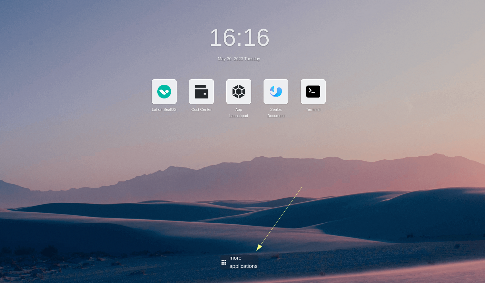
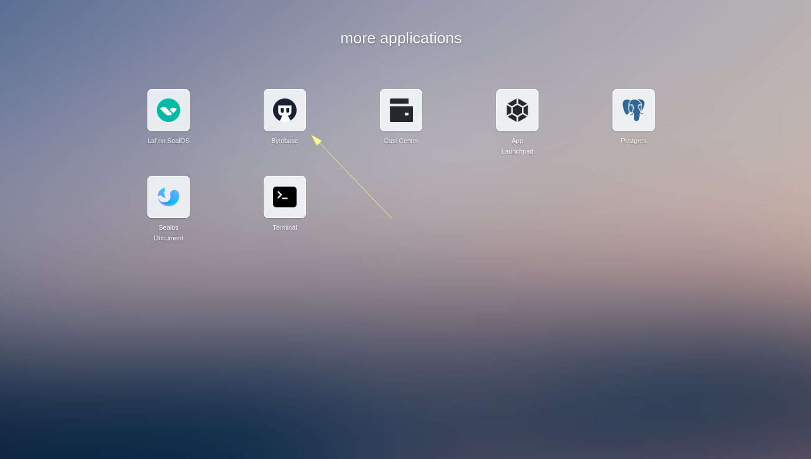
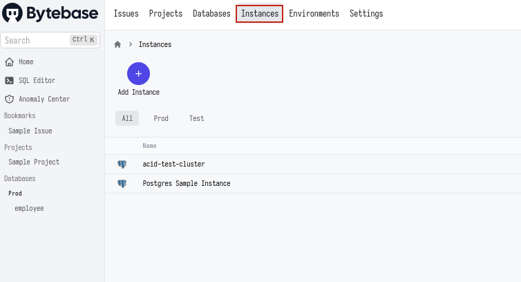
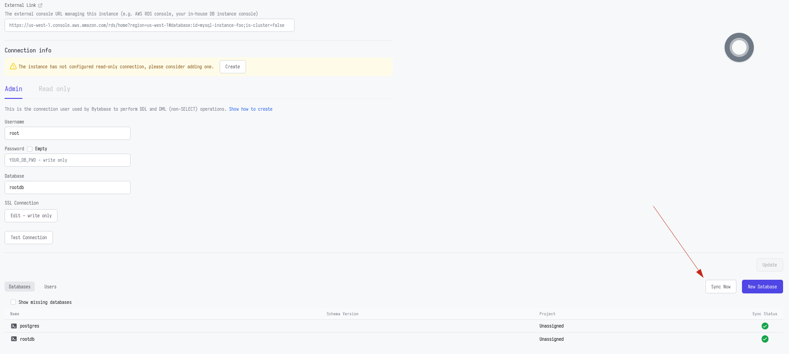

# Bytebase APP Introduction

Bytebase is an open-source database DevOps tool, it's the GitLab for managing databases throughout the application development lifecycle. It offers a web-based workspace for DBAs and Developers to collaborate and manage the database change safely and efficiently.

For more information and usage of Bytebase, please refer to [the official website](https://www.bytebase.com/docs/tutorials/overview/).

## Feature

* Database management powered by Bytebase
* Instant access to all your database instances created by the Sealos database adminer with one click

## Use Bytebase on Sealos
### Navigate to 'more applications' on the Sealos desktop
To find the application of bytebase, please navigate to 'more applications' button on the bottom of the Sealos desktop.

### Click on the Bytebase icon
In the applications drawer, click on the Bytebase icon.

If it's your first time using Bytebase, or you haven't use bytebase for a while, it might take a minute or two to load.
### Navigate and click the 'Instance' tab
Click on the 'Instance' tab. You will find all your database instances created by the Sealos database adminer there. Currently, this feature doesn't support manually created database instances.

From now on, you can click on each instance and check their status.
### Click 'Sync Now' and viola!
In the status page of your database instance, click 'Sync Now' to sync all the databases in this instance. Then, enjoy the powerful features of Bytebase!

## FAQ
### After clicking on the Bytebase icon, my Bytebase is not responding and the window is blank, what happened?
It means that your Bytebase application is in the initialization phase, please
wait for 3 to 5 minutes and try again. 