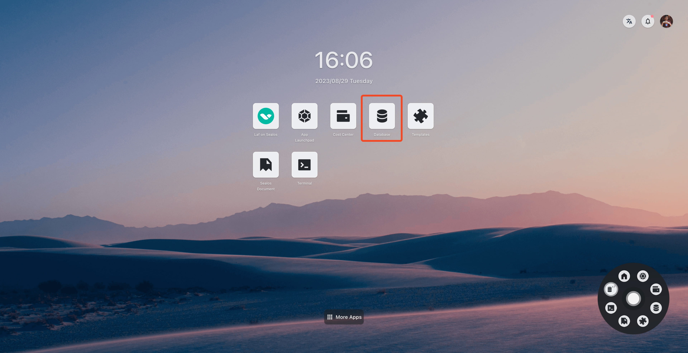
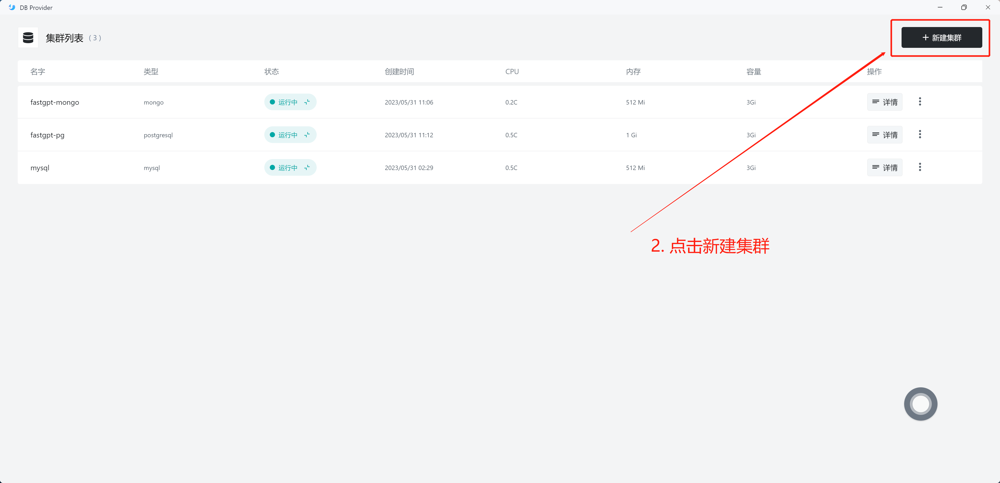
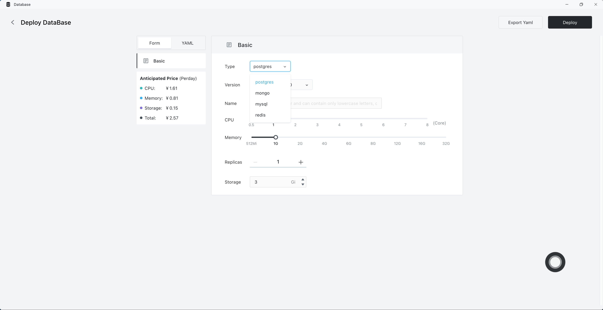
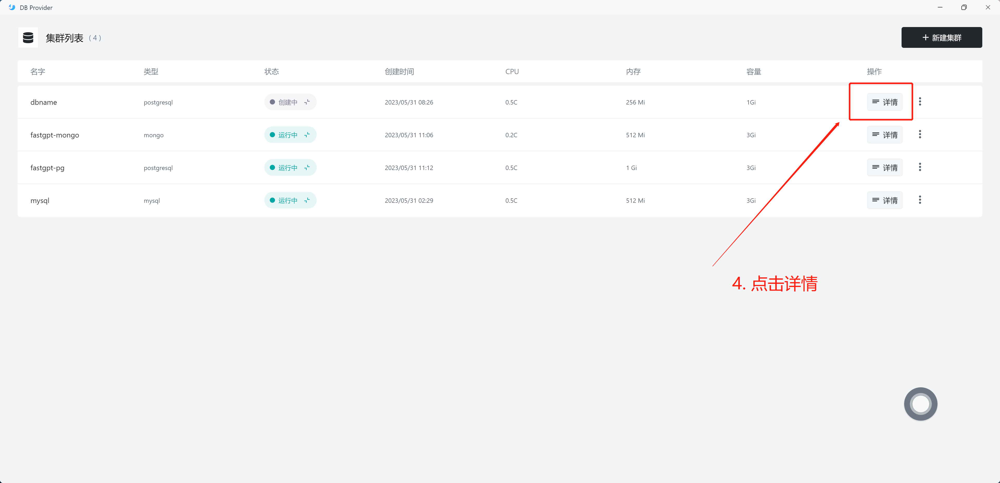
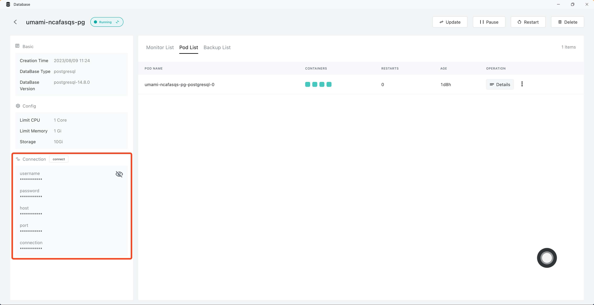
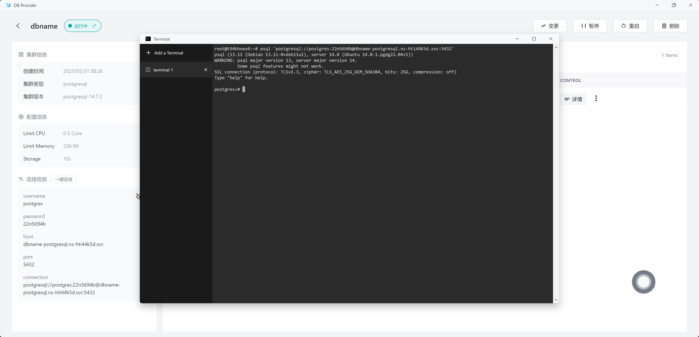

# Database

The **Database** is a quintessential component of an application. Sealos provides a database cluster deployment management tool, aiding in the swift deployment of database clusters. At present, it supports MySQL, PostgreSQL, and MongoDB. The **Database** is currently in its experimental phase.

- [x] Cluster CRUD
- [x] One-click direct connection to the database
- [x] Manual backup
- [x] Automatic backup
- [x] Elastic scaling
- [ ] Creation of read-only clusters
- [ ] Visual configuration of user groups and database groups
- [x] Visual database management
- [x] Support for additional databases and versions

## Getting Started

To illustrate the convenience of the **Database**, let's deploy a PostgreSQL database.

It only takes six steps to complete the deployment and access:

1. Enter the **Database** application from the Sealos desktop.

2. Click on the creation of a new cluster.

3. Select the corresponding database and parameters.

4. Click on deployment.

5. Enter DB to view details.

6. Obtain the database access parameters.

7. Experience the one-click database connection.

