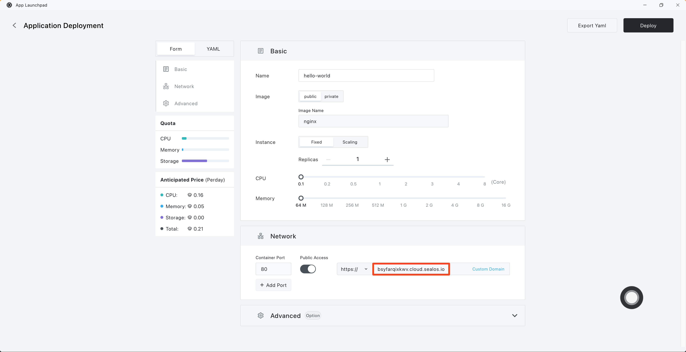
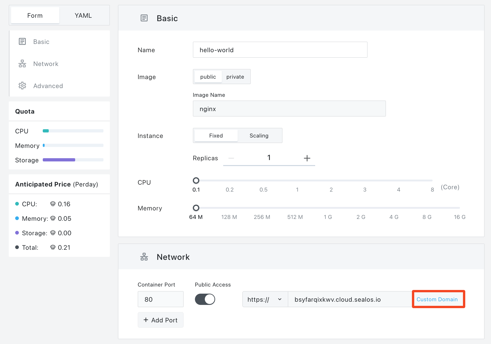
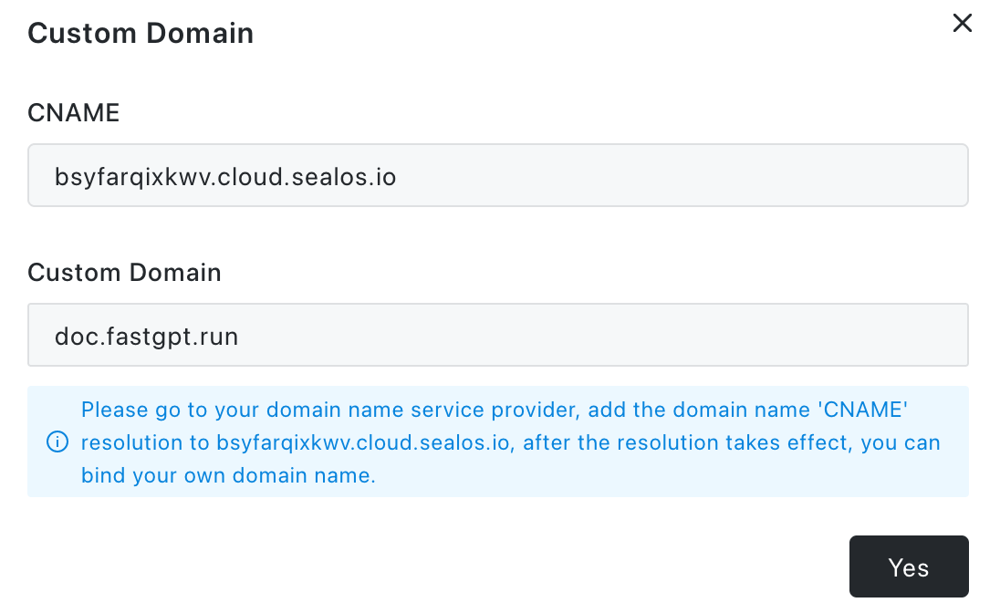

# Add a domain

Assigning a custom domain to your project guarantees that visitors to your application will have a tailored experience that aligns with your brand.

## When Deploying

Just enable "Public Access" when you're deploying, and [Sealos](https://cloud.sealos.io) will sorts you out with a domain.

Now, on your domain provider's end, link the 'CNAME' to the one Sealos provided.

Once it's active, jump back to Sealos, click on "Custom Domain" to the side:

Enter your custom domain in the pop-up box and click confirm.

To wrap up, click the "Deploy" button. Once your app's live, click on the external address to access the app via the custom domain.

## Post Deployment

For the apps you've deployed, just click "Update" top-right on the app details page. Then, follow the earlier steps to integrate your custom domain.