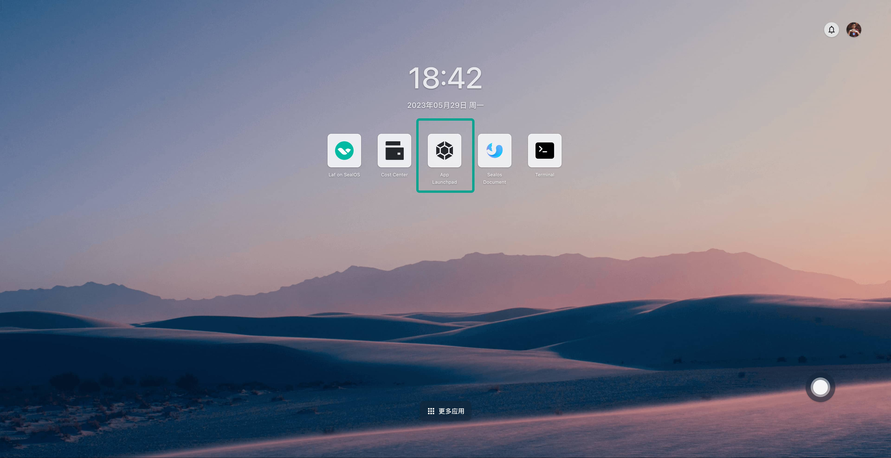
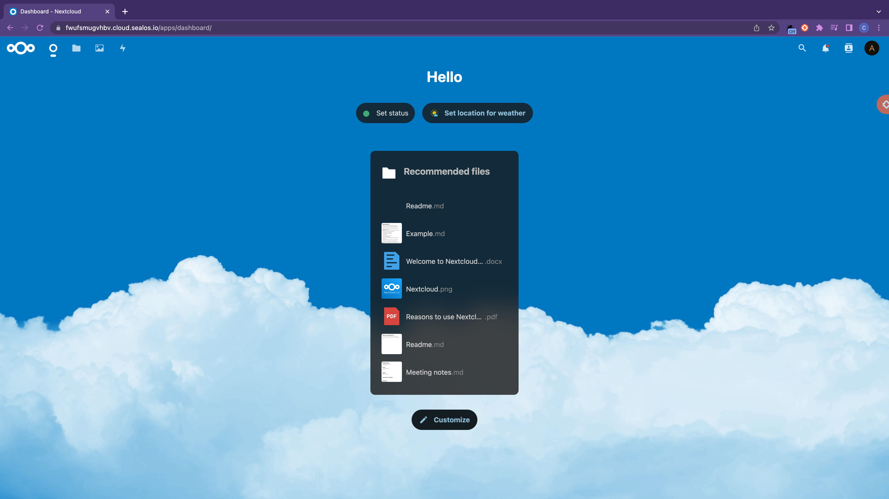

# Swiftly Install Applications with App Launchpad

The desktop environment of Sealos is similar to that of single-machine operating systems such as macOS or Windows. Each icon on the desktop represents an App, similar to the shortcuts in Windows. Like standalone operating systems, Sealos also comes with system-built Apps. If you want to quickly install applications on this cloud operating system, you need to use the system's built-in App Launchpad.

For more information about application management, please refer to [Introduction to App Launchpad](../platform-components/applaunchpad/applaunchpad.md)

> Here, we'll demonstrate how to quickly install some common applications on the Sealos cloud operating system.

## Quick Install of Nginx

First, open the App Launchpad.

Click on "New Application."

In sequence, input the application name and image name, turn on external network access, and finally, click on "Deploy Application."

After deployment, click on "Details" to enter the application details interface.

Here, you can see the operation status of the Nginx application, including CPU usage, memory usage, etc. Click on the external network address to open the Nginx interface directly through the external network domain name.

## Quick Install of Nextcloud

Now let's look at another example. We will use the App Launchpad to quickly install the open-source private network disk application Nextcloud.

Just like the previous example, click on "New Application" in the App Launchpad. Input the application name and image name in sequence, choose appropriate CPU and memory, and turn on external network access.

All data of the Nextcloud container is stored in the directory `/var/www/html`. Therefore, we need to persist the data in this directory through external storage.

Continue to scroll down, expand "Advanced Configuration," and click on "Add Storage Volume" in "Local Storage."

Select the capacity of the external storage and fill in the path where the storage is mounted to the application. Then click on "Confirm."

Finally, click on "Deploy Application" at the top right corner, and the application installation is completed.

Click on "Application Details" to enter the details page of the Nextcloud application. Confirm that the application is in the Running state, and then click on the external network address to directly open the Web interface of Nextcloud.

After setting the username and password, click on "Install" to start the installation. After waiting for a short while for the installation to finish, directly refresh the page.

Input the username and password to log in successfully.

