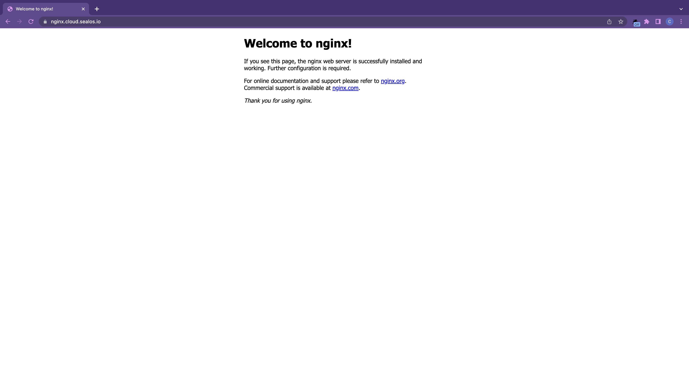

# Swiftly Install Applications with Terminal

For those proficient in Kubernetes and container basics, terminal command-line deployment presents an optimal solution. This document showcases Nginx as an example, elucidating the application deployment process via terminal.

Commence by opening the terminal application within the Sealos desktop environment.


Upon initializing the terminal application, a default terminal window is assigned, allowing the execution of various command-line operations.


① First, create a deployment manifest for Nginx Deployment:

```yaml
# deployment.yaml
apiVersion: apps/v1
kind: Deployment
metadata:
  name: nginx
  labels:
    app: nginx
spec:
  replicas: 1
  selector:
    matchLabels:
      app: nginx
  template:
    metadata:
      labels:
        app: nginx
    spec:
      containers:
      - name: nginx
        image: nginx:1.14.2
        ports:
        - containerPort: 80
        resources:
          requests:
            cpu: 0.2
            memory: 32Mi
          limits:
            cpu: 0.2
            memory: 32Mi
```

② Subsequently, construct a deployment manifest for Nginx Service:

```yaml
# service.yaml
apiVersion: v1
kind: Service
metadata:
  name: nginx
  labels:
    app: nginx
spec:
  type: ClusterIP
  ports:
    - port: 80
      targetPort: 80

  selector:
    app: nginx
```

③ Execute the following commands to generate Deployment and Service from the deployment manifest:

```bash
kubectl apply -f deployment.yaml
kubectl apply -f service.yaml
```

Assess if Nginx can be accessed normally:

```bash
$ kubectl get pod -l app=nginx
NAME                     READY   STATUS    RESTARTS   AGE
nginx-7546c75fb4-572x9   1/1     Running   0          5m37s

$ kubectl get svc -l app=nginx
NAME    TYPE        CLUSTER-IP      EXTERNAL-IP   PORT(S)   AGE
nginx   ClusterIP   10.64.204.173   <none>        80/TCP    5m36s

$ curl 10.64.204.173
<!DOCTYPE html>
<html>
<head>
<title>Welcome to nginx!</title>
<style>
    body {
        width: 35em;
        margin: 0 auto;
        font-family: Tahoma, Verdana, Arial, sans-serif;
    }
</style>
</head>
<body>
<h1>Welcome to nginx!</h1>
<p>If you see this page, the nginx web server is successfully installed and
working. Further configuration is required.</p>

<p>For online documentation and support please refer to
<a href="http://nginx.org/">nginx.org</a>.<br/>
Commercial support is available at
<a href="http://nginx.com/">nginx.com</a>.</p>

<p><em>Thank you for using nginx.</em></p>
</body>
</html>
```

④ If you desire to expose Nginx to the internet, enabling access via external network domain, you'll need to create an Ingress resource. Start by creating a deployment manifest:

```yaml
# ingress.yaml
apiVersion: networking.k8s.io/v1
kind: Ingress
metadata:
  annotations:
    kubernetes.io/ingress.class: nginx
    nginx.ingress.kubernetes.io/backend-protocol: HTTP
    nginx.ingress.kubernetes.io/client-body-buffer-size: 64k
    nginx.ingress.kubernetes.io/configuration-snippet: |
      if ($request_uri ~* \.(js|css|gif|jpe?g|png)) {
        expires 30d;
        add_header Cache-Control "public";
      }
    nginx.ingress.kubernetes.io/proxy-body-size: 32m
    nginx.ingress.kubernetes.io/proxy-buffer-size: 64k
    nginx.ingress.kubernetes.io/rewrite-target: /$2
    nginx.ingress.kubernetes.io/server-snippet: |
      client_header_buffer_size 64k;
      large_client_header_buffers 4 128k;
    nginx.ingress.kubernetes.io/ssl-redirect: "false"
  name: nginx
spec:
  rules:
  - host: nginx.cloud.sealos.io
    http:
      paths:
      - backend:
          service:
            name: nginx
            port:
              number: 80
        path: /()(.*)
        pathType: Prefix
  tls:
  - hosts:
    - nginx.cloud.sealos.io
    secretName: wildcard-cloud-sealos-io-cert
```

⑤ Execute the following command to create an Ingress resource from the deployment manifest:

```bash
$ kubectl apply -f ingress.yaml
```

⑥ Test if Nginx can be accessed normally through the external network domain:

