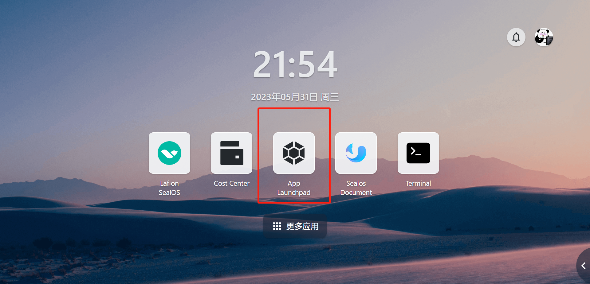
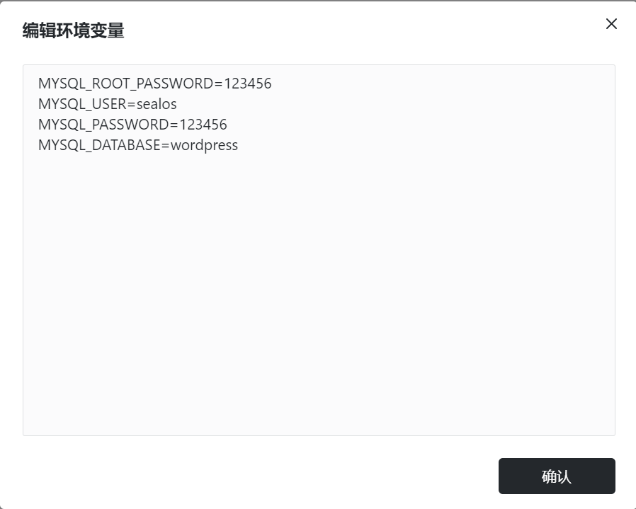
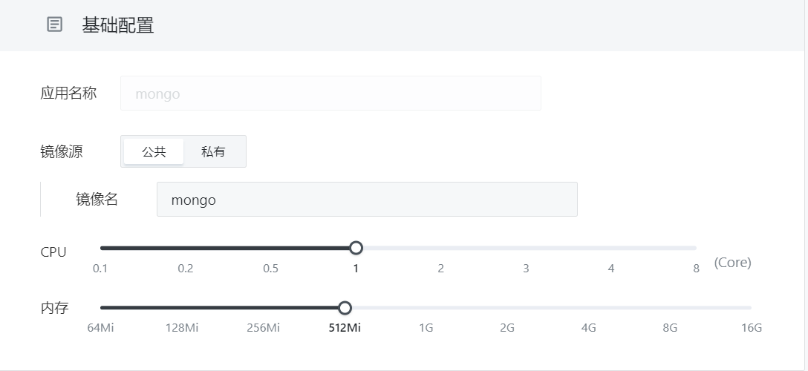
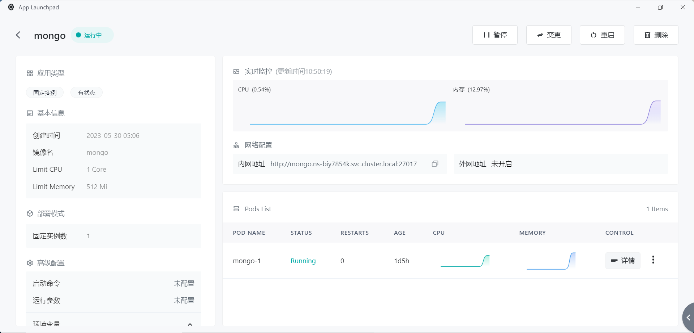

# Quickly Install MySQL & MongoDB

Databases are important tools for data management, used to efficiently store and access data. Both MySQL and MongoDB are important open source database management systems.

> Sealos has good configuration and fast deployment for databases. Below we will demonstrate how Sealos can quickly deploy MySQL and MongoDB respectively.

# Quickly Install MySQL

1. Click App Launchpad



2. Click "Create Application" to enter the application deployment configuration interface and complete the basic configuration settings.


3. Set the exposed port for the container's network configuration to 3306.


4. In the advanced configuration section, you need to configure the database environment variables and add data volumes.

> In the advanced configuration section, you need to configure the database environment variables and add data volumes.
>
> Recommend env setting:
>
> - MYSQL_ROOT_PASSWORD
> - MYSQL_USER
> - MYSQL_PASSWORD
> - MYSQL_DATABASE
>
> The data volume is mounted at `/var/lib/mysql` for the official MySQL image, though may differ for other images. With this option, you can configure the storage space allocated to the WordPress application
>
> Below, a configuration example is given.

It should be noted that the environment variables of the database instance are set when it is created and will not change with subsequent modification operations.

Below, a configuration example is given.

```Plain
MYSQL_ROOT_PASSWORD=123456    
MYSQL_USER=sealos
MYSQL_PASSWORD=123456
MYSQL_DATABASE=wordpress
```




5. After filling out the configuration form, click Application Deployment and wait for the application to deploy successfully.

   


# Quickly Install MongoDB

1. 基础配置设置，示例选用官方镜像，默认版本为 latest，CPU 推荐配置 1c 以上，内存配置 521Mi 以上。



2. In the network configuration, set the port number for MongoDB.


3. Configure MongoDB storage space.

   For MongoDB, the default data volume mount paths within the container are:

- `/data/db`: Used to store MongoDB data files (collections and documents)
- `/data/configdb`: Used to store configuration files for replicas and shards


4. Install MongoDB



MongoDB Install successfully

**Note: The environment variables for the database are only set when the instance is first created and cannot be modified through change operations. If needed, please re-create the database instance.**